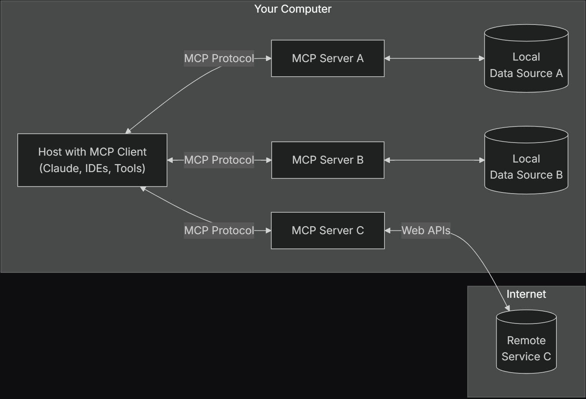

___

基本架构如下:
<<<<<<< HEAD

=======

>>>>>>> 87e5a30f10f459167b606ca3f54d04521fad0313

- MCP Hosts: 期望通过MCP使用工具或者获取数据的程序，如IDEs, Claude Desktop等
- MCP Clients: 协议客户端, 维持和服务端一对一连接
- MCP Servers: 通过MCP协议暴露特定能力的轻量级程序
- Local Data Sources: 本地文件, 数据库和服务等
- Remote Services: 其他系统可远程调用的服务

## core components

### Protocol Layer

协议层处理消息帧, 请求/响应连接, 以及高层级的通信pattern
实例类如下
```python
class Session(BaseSession[RequestT, NotificationT, ResultT]):
    async def send_request(
        self,
        request: RequestT,
        result_type: type[Result]
    ) -> Result:
        """Send request and wait for response. Raises McpError if response contains error."""
        # Request handling implementation

    async def send_notification(
        self,
        notification: NotificationT
    ) -> None:
        """Send one-way notification that doesn't expect response."""
        # Notification handling implementation

    async def _received_request(
        self,
        responder: RequestResponder[ReceiveRequestT, ResultT]
    ) -> None:
        """Handle incoming request from other side."""
        # Request handling implementation

    async def _received_notification(
        self,
        notification: ReceiveNotificationT
    ) -> None:
        """Handle incoming notification from other side."""
        # Notification handling implementation
```
### Transport Layer

传输层处理clients和servers间实际的通信, MCP支持多种通信机制

- Stdio Transport
	- 使用标准i/o通信, 适用于本地进程
- Streamable HTTP Transport
	- 使用HTTP的Server-Sent Events可选项
所有的通信方式都使用JSON-RPC 2.0来交换信息
### Message Types

- Requests: 向对方请求数据的消息
	```ts
	interface Request {
	  method: string;
	  params?: { ... };
	}
	```
- Results: 对与Requests成功的响应
	```ts
	interface Result {
	  [key: string]: unknown;
	}
	```
- Errors: 请求失败的响应
	```ts
	interface Error {
	  code: number;
	  message: string;
	  data?: unknown;
	}
	```
- Notifications: 单程通知消息, 不期望响应
  ```ts
	interface Notification {
	  method: string;
	  params?: { ... };
	}
	```

## connect lifecycle

### Initialization

- 客户端发送携带协议版本和能力的`initialize requests`
- 服务端响应协议版本和能力
- 客户端发送`initialized notification`作为确认
- 开始常规消息交换
### Message exchange

初始化后, 消息交换支持如下的模式
- Request-Response: client或者server发送请求并等待对方响应
- Notification: client或者server发送单程消息
### Termination

client和server都可以结束连接
- 通过`close()`关闭连接
- 传输层断开连接
- 错误情况

## 错误处理

MCP定义了如下的标准错误码
```ts
enum ErrorCode {
  // Standard JSON-RPC error codes
  ParseError = -32700,
  InvalidRequest = -32600,
  MethodNotFound = -32601,
  InvalidParams = -32602,
  InternalError = -32603,
}
```
SDKs和applications可以自定义-32000以上的错误码

错误会被如下方式传播:
- 对于请求的错误响应
- 消息传输的错误事件
- 协议层面的错误处理

## 最佳实践

### 传输方式选择

- 本地通信: 使用stdio, 进程管理简单, 同一机器通信高效
- 远程通信: 使用Streamable HTTP, 建议实现认证和鉴权
### 消息处理

- 请求处理: 仔细校验输入, 使用类型安全的schema, 优雅的处理异常, 实现timeouts
- 过程报告: 长耗时操作需使用进度令牌, 以增量方式持续报告响应, 当总量可知时包含总量
- 错误管理: 使用合适的错误码, 包含有效的错误消息, 清理错误上的资源
### 安全考虑

- 传输安全: 使用远程连接使用TLS, 校验连接来源, 需要是实现认证
- 消息校验: 校验所有的输入, 使消息无害化, 消息尺寸限制, 校验JSON-RPC格式
- 资源保护: 实现权限管理, 校验资源路径, 监控资源使用, 限制请求速率
- 错误处理: 不泄露敏感信息, 记录安全相关错误, 实现合适的清理, 处理DoS脚本
### Debugging and Monitoring
- 日志: 记录协议事件, 追踪消息流, 监控行为, 记录错误
- 诊断: 实现健康检测, 监控连接状态, 追踪资源使用, profile 性能
- 测试: 测试不同的通信方式, 校验错误处理, 检测边缘case, 加载测试服务