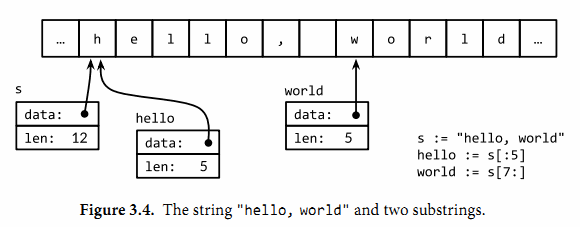

___

一个字符串是一个不可改变的字节序列。字符串可以包含任意的数据，包括byte值0，通常是用来包含人类可读的文本。文本字符串通常被解释为采用UTF8编码的Unicode码点（rune）序列。

内置的len函数可以返回一个字符串中的字节数目（不是rune字符数目），索引操作`s[i]` 返回第i个字节的字节值，i必须满足0 ≤ i< len(s)条件约束。如果试图访问超出字符串索引范围的字节将会导致panic异常

第i个字节并不一定是字符串的第i个字符，因为对于非ASCII字符的UTF8编码会要两个或多个字节。
子字符串操作`s[i:j]` 基于原始的s字符串的第i个字节开始到第j个字节（并不包含j本身）生成一个新字符串。生成的新字符串将包含j-i个字节。

+操作符将两个字符串连接构造一个新字符串
字符串可以用\==和<进行比较；比较通过逐个字节比较完成的，因此比较的结果是字符串自然编码的顺序
字符串的值是不可变的：一个字符串包含的字节序列永远不会被改变，因此尝试修改字符串内部数据的操作也是被禁止的

不变性意味着如果两个字符串共享相同的底层数据的话也是安全的，这使得复制任何长度的字符串代价是低廉的。同样，一个字符串s和对应的子字符串切片`s[7:]`的操作也可以安全地共享相同的内存，因此字符串切片操作代价也是低廉的。在这两种情况下都没有必要分配新的内存。 图3.4演示了一个字符串和两个子串共享相同的底层数据。

## 字符串面值

字符串值也可以用字符串面值方式编写，只要将一系列字节序列包含在双引号内即可：
```
"Hello, world"
```
因为Go语言源文件总是用UTF8编码，并且Go语言的文本字符串也以UTF8编码的方式处理，因此我们可以将Unicode码点也写到字符串面值中。

在一个双引号包含的字符串面值中，可以用以反斜杠`\`开头的转义序列插入任意的数据。下面的换行、回车和制表符等是常见的ASCII控制代码的转义方式：
```go
\a      响铃
\b      退格
\f      换页
\n      换行
\r      回车
\t      制表符
\v      垂直制表符
\'      单引号（只用在 '\'' 形式的rune符号面值中）
\"      双引号（只用在 "..." 形式的字符串面值中）
\\      反斜杠
```
可以通过十六进制或八进制转义在字符串面值中包含任意的字节。一个十六进制的转义形式是`\xhh`，其中两个h表示十六进制数字（大写或小写都可以）。一个八进制转义形式是`\ooo`，包含三个八进制的o数字（0到7），但是不能超过`\377`（译注：对应一个字节的范围，十进制为255）。每一个单一的字节表达一个特定的值。

一个原生的字符串面值形式是`...`，使用反引号代替双引号。在原生的字符串面值中，没有转义操作；全部的内容都是字面的意思，包含退格和换行，因此一个程序中的原生字符串面值可能跨越多行（译注：在原生字符串面值内部是无法直接写`字符的，可以用八进制或十六进制转义或+"`"连接字符串常量完成）。唯一的特殊处理是会删除回车以保证在所有平台上的值都是一样的，包括那些把回车也放入文本文件的系统（译注：Windows系统会把回车和换行一起放入文本文件中）。

原生字符串面值用于编写正则表达式会很方便，因为正则表达式往往会包含很多反斜杠。原生字符串面值同时被广泛应用于HTML模板、JSON面值、命令行提示信息以及那些需要扩展到多行的场景。
```go
const GoUsage = `Go is a tool for managing Go source code.

Usage:
    go command [arguments]
...`
```

## Unicode

Unicode收集了这个世界上所有的符号系统，包括重音符号和其它变音符号，制表符和回车符，还有很多神秘的符号，每个符号都分配一个唯一的Unicode码点，Unicode码点对应Go语言中的rune整数类型（译注：rune是int32等价类型）。

## UTF-8

UTF8是一个将Unicode码点编码为字节序列的变长编码。UTF8编码是由Go语言之父Ken Thompson和Rob Pike共同发明的，现在已经是Unicode的标准。UTF8编码使用1到4个字节来表示每个Unicode码点，ASCII部分字符只使用1个字节，常用字符部分使用2或3个字节表示。每个符号编码后第一个字节的高端bit位用于表示编码总共有多少个字节。如果第一个字节的高端bit为0，则表示对应7bit的ASCII字符，ASCII字符每个字符依然是一个字节，和传统的ASCII编码兼容。如果第一个字节的高端bit是110，则说明需要2个字节；后续的每个高端bit都以10开头。更大的Unicode码点也是采用类似的策略处理。

变长的编码无法直接通过索引来访问第n个字符，但是UTF8编码获得了很多额外的优点。首先UTF8编码比较紧凑，完全兼容ASCII码，并且可以自动同步：它可以通过向前回朔最多3个字节就能确定当前字符编码的开始字节的位置。它也是一个前缀编码，所以当从左向右解码时不会有任何歧义也并不需要向前查看（译注：像GBK之类的编码，如果不知道起点位置则可能会出现歧义）。没有任何字符的编码是其它字符编码的子串，或是其它编码序列的字串，因此搜索一个字符时只要搜索它的字节编码序列即可，不用担心前后的上下文会对搜索结果产生干扰。同时UTF8编码的顺序和Unicode码点的顺序一致，因此可以直接排序UTF8编码序列。同时因为没有嵌入的NUL(0)字节，可以很好地兼容那些使用NUL作为字符串结尾的编程语言。

Go语言的源文件采用UTF8编码，并且Go语言处理UTF8编码的文本也很出色。unicode包提供了诸多处理rune字符相关功能的函数（比如区分字母和数字，或者是字母的大写和小写转换等），unicode/utf8包则提供了用于rune字符序列的UTF8编码和解码的功能。

有很多Unicode字符很难直接从键盘输入，并且还有很多字符有着相似的结构；有一些甚至是不可见的字符（译注：中文和日文就有很多相似但不同的字）。Go语言字符串面值中的Unicode转义字符让我们可以通过Unicode码点输入特殊的字符。有两种形式：`\uhhhh`对应16bit的码点值，`\Uhhhhhhhh`对应32bit的码点值，其中h是一个十六进制数字；一般很少需要使用32bit的形式。每一个对应码点的UTF8编码。

## Byte切片

标准库中有四个包对字符串处理尤为重要：bytes、strings、strconv和unicode包。strings包提供了许多如字符串的查询、替换、比较、截断、拆分和合并等功能。

bytes包也提供了很多类似功能的函数，但是针对和字符串有着相同结构的`[]byte`类型。因为字符串是只读的，因此逐步构建字符串会导致很多分配和复制。在这种情况下，使用bytes.Buffer类型将会更有效，稍后我们将展示。

strconv包提供了布尔型、整型数、浮点数和对应字符串的相互转换，还提供了双引号转义相关的转换。

unicode包提供了IsDigit、IsLetter、IsUpper和IsLower等类似功能，它们用于给字符分类。每个函数有一个单一的rune类型的参数，然后返回一个布尔值。而像ToUpper和ToLower之类的转换函数将用于rune字符的大小写转换。所有的这些函数都是遵循Unicode标准定义的字母、数字等分类规范。strings包也有类似的函数，它们是ToUpper和ToLower，将原始字符串的每个字符都做相应的转换，然后返回新的字符串。

## 数字的转换

除了字符串、字符、字节之间的转换，字符串和数值之间的转换也比较常见。由strconv包提供这类转换功能。

将一个整数转为字符串，一种方法是用fmt.Sprintf返回一个格式化的字符串；另一个方法是用strconv.Itoa(“整数到ASCII”)：

`x := 123 y := fmt.Sprintf("%d", x) fmt.Println(y, strconv.Itoa(x)) // "123 123"`

FormatInt和FormatUint函数可以用不同的进制来格式化数字：
`fmt.Println(strconv.FormatInt(int64(x), 2)) // "1111011"`

fmt.Printf函数的%b、%d、%o和%x等参数提供功能往往比strconv包的Format函数方便很多，特别是在需要包含有附加额外信息的时候：

`s := fmt.Sprintf("x=%b", x) // "x=1111011"`

如果要将一个字符串解析为整数，可以使用strconv包的Atoi或ParseInt函数，还有用于解析无符号整数的ParseUint函数：

```go
x, err := strconv.Atoi("123")             // x is an int 
y, err := strconv.ParseInt("123", 10, 64)// base 10, up to 64 bits
```

ParseInt函数的第三个参数是用于指定整型数的大小；例如16表示int16，0则表示int。在任何情况下，返回的结果y总是int64类型，你可以通过强制类型转换将它转为更小的整数类型。

有时候也会使用fmt.Scanf来解析输入的字符串和数字，特别是当字符串和数字混合在一行的时候，它可以灵活处理不完整或不规则的输入。