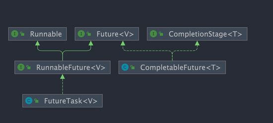

> 多线程异步任务编排， 将原串行操作的调用优化成并行执行，从而提高效率
___
## Future

`Future` 类是异步思想的典型运用，主要用在一些需要执行耗时任务的场景，避免程序一直原地等待耗时任务执行完成，执行效率太低。执行某一耗时的任务时，可以将这个耗时任务交给一个子线程执行，主线程执行其余操作，等到需要时获取结果

`Feature` 可以看作是一种异步变成的设计思想，在Java中是一个泛型接口，位于`java.util.concurrent`包下，主要包含以下四种功能

- 取消任务
- 判断任务是否取消
- 判断任务是否完成
- 获取任务执行结果

```Java
// V 代表了Future执行的任务返回值的类型
public interface Future<V> {
    // 取消任务执行
    // 成功取消返回 true，否则返回 false
    boolean cancel(boolean mayInterruptIfRunning);
    // 判断任务是否被取消
    boolean isCancelled();
    // 判断任务是否已经执行完成
    boolean isDone();
    // 获取任务执行结果
    V get() throws InterruptedException, ExecutionException;
    // 指定时间内没有返回计算结果就抛出 TimeOutException 异常
    V get(long timeout, TimeUnit unit) throws InterruptedException, ExecutionException, TimeoutExceptio
}
```

局限性
- 不支持异步任务的编排
- 获取结果的方法get为阻塞调用

## CompletableFuture

类似于Future，但更为强大且支持函数式编程、异步任务编排(串联组装多个异步任务)等

```Java
public class CompletableFuture<T> implements Future<T>, CompletionStage<T> {
}
```



`CompletionStage` 接口描述了一个异步计算的阶段。很多计算可以分成多个阶段或步骤，此时可以通过它将所有步骤组合起来，形成异步计算的流水线。

###  常见操作

#### 创建

- new创建: 此时可以作为Future使用
	```Java
CompletableFuture<RpcResponse<Object>> resultFuture = new CompletableFuture<>();
	```
	- `resultFuture.complete(rpcResponse);` : 通过complete方法写入结果，只调用一次，后续忽略
	- `isDone()` : 判断是否完成
	- `rpcResponse = completableFuture.get();` 获取结果
- 静态工厂方法
	```Java
static <U> CompletableFuture<U> supplyAsync(Supplier<U> supplier);
// 使用自定义线程池(推荐)
static <U> CompletableFuture<U> supplyAsync(Supplier<U> supplier, Executor executor);
static CompletableFuture<Void> runAsync(Runnable runnable);
// 使用自定义线程池(推荐)
static CompletableFuture<Void> runAsync(Runnable runnable, Executor executor);
	```
	- `runAsync()` 方法接受的参数是 `Runnable` ，这是一个函数式接口，不允许返回值。当你需要异步操作且不关心返回结果的时候可以使用 `runAsync()` 方法。
	- `supplyAsync()` 方法接受的参数是 `Supplier<U>` ，这也是一个函数式接口，`U` 是返回结果值的类型。
#### 处理异步调用结果

- `thenApply()` 方法接受一个 `Function` 实例，用它来处理结果。可以流式调用
	```Java
public CompletableFuture<Void> thenAccept(Consumer<? super T> action) {
    return uniAcceptStage(null, action);
}

public CompletableFuture<Void> thenAcceptAsync(Consumer<? super T> action) {
    return uniAcceptStage(defaultExecutor(), action);
}

public CompletableFuture<Void> thenAcceptAsync(Consumer<? super T> action,
                                               Executor executor) {
    return uniAcceptStage(screenExecutor(executor), action);
}

// 使用示例
CompletableFuture<String> future = CompletableFuture.completedFuture("hello!")
        .thenApply(s -> s + "world!");
assertEquals("hello!world!", future.get());
// 这次调用将被忽略。get只能执行一次，后续忽略
future.thenApply(s -> s + "nice!");
assertEquals("hello!world!", future.get());
	```
	- 如果你不需要从回调函数中获取返回结果，可以使用 `thenAccept()` 或者 `thenRun()`。这两个方法的区别在于 `thenRun()` 不能访问异步计算的结果。
	- thenAccept()
	- thenRun()
		```Java
public CompletableFuture<Void> thenAccept(Consumer<? super T> action) {
	return uniAcceptStage(null, action); 
} 
public CompletableFuture<Void> thenAcceptAsync(Consumer<? super T> action) {
	return uniAcceptStage(defaultExecutor(), action); 
} 
public CompletableFuture<Void> thenAcceptAsync(Consumer<? super T> action, Executor executor) {
	return uniAcceptStage(screenExecutor(executor), action); 
}

// 顾名思义，`Consumer` 属于消费型接口，它可以接收 1 个输入对象然后进行“消费”。
@FunctionalInterface
public interface Consumer<T> {

    void accept(T t);

    default Consumer<T> andThen(Consumer<? super T> after) {
        Objects.requireNonNull(after);
        return (T t) -> { accept(t); after.accept(t); };
    }
}

public CompletableFuture<Void> thenRun(Runnable action) {
    return uniRunStage(null, action);
}

public CompletableFuture<Void> thenRunAsync(Runnable action) {
    return uniRunStage(defaultExecutor(), action);
}

public CompletableFuture<Void> thenRunAsync(Runnable action,
                                            Executor executor) {
    return uniRunStage(screenExecutor(executor), action);
}

// 使用示例
CompletableFuture.completedFuture("hello!")
        .thenApply(s -> s + "world!").thenApply(s -> s + "nice!").thenAccept(System.out::println);//hello!world!nice!

CompletableFuture.completedFuture("hello!")
        .thenApply(s -> s + "world!").thenApply(s -> s + "nice!").thenRun(() -> System.out.println("hello!"));//hello!
		```
#### 异常处理

- 通过`handle()`处理任务过程中可能抛出的异常
	```Java
public <U> CompletableFuture<U> handle(
    BiFunction<? super T, Throwable, ? extends U> fn) {
    return uniHandleStage(null, fn);
}

public <U> CompletableFuture<U> handleAsync(
    BiFunction<? super T, Throwable, ? extends U> fn) {
    return uniHandleStage(defaultExecutor(), fn);
}

public <U> CompletableFuture<U> handleAsync(
    BiFunction<? super T, Throwable, ? extends U> fn, Executor executor) {
    return uniHandleStage(screenExecutor(executor), fn);
}

// 示例代码
CompletableFuture<String> future
        = CompletableFuture.supplyAsync(() -> {
    if (true) {
        throw new RuntimeException("Computation error!");
    }
    return "hello!";
}).handle((res, ex) -> {
    // res 代表返回的结果
    // ex 的类型为 Throwable ，代表抛出的异常
    return res != null ? res : "world!";
});
assertEquals("world!", future.get());

// 让CompleteFuture的返回结果是异常
CompletableFuture<String> completableFuture = new CompletableFuture<>();
// ...
completableFuture.completeExceptionally(
  new RuntimeException("Calculation failed!"));
// ...
completableFuture.get(); // ExecutionException
	```
#### 组合

使用 `thenCompose()` 按顺序链接两个 `CompletableFuture` 对象，实现异步的任务链。它的作用是将前一个任务的返回结果作为下一个任务的输入参数，从而形成一个依赖关系。

```Java
public <U> CompletableFuture<U> thenCompose(
    Function<? super T, ? extends CompletionStage<U>> fn) {
    return uniComposeStage(null, fn);
}

public <U> CompletableFuture<U> thenComposeAsync(
    Function<? super T, ? extends CompletionStage<U>> fn) {
    return uniComposeStage(defaultExecutor(), fn);
}

public <U> CompletableFuture<U> thenComposeAsync(
    Function<? super T, ? extends CompletionStage<U>> fn,
    Executor executor) {
    return uniComposeStage(screenExecutor(executor), fn);
}

// 使用示例
CompletableFuture<String> future
        = CompletableFuture.supplyAsync(() -> "hello!")
        .thenCompose(s -> CompletableFuture.supplyAsync(() -> s + "world!"));
assertEquals("hello!world!", future.get());
```
#### 并行运行多个CompeletableFuture

并行执行并等待所有的完成
```Java
CompletableFuture<Void> task1 =
  CompletableFuture.supplyAsync(()->{
    //自定义业务操作
  });
......
CompletableFuture<Void> task6 =
  CompletableFuture.supplyAsync(()->{
    //自定义业务操作
  });
......
 CompletableFuture<Void> headerFuture=CompletableFuture.allOf(task1,.....,task6);

  try {
    headerFuture.join();
  } catch (Exception ex) {
    ......
  }
System.out.println("all done. ");

// 任意一个完成就返回
CompletableFuture<Object> f = CompletableFuture.anyOf(future1, future2);
System.out.println(f.get());
```

## 使用注意事项

- 使用自定义线程池
	- `CompletableFuture` 默认使用全局共享的 `ForkJoinPool.commonPool()` 作为执行器，所有未指定执行器的异步任务都会使用该线程池。这意味着应用程序、多个库或框架（如 Spring、第三方库）若都依赖 `CompletableFuture`，默认情况下它们都会共享同一个线程池。
	- 虽然 `ForkJoinPool` 效率很高，但当同时提交大量任务时，可能会导致资源竞争和线程饥饿，进而影响系统性能。
	- 为避免这些问题，建议为 `CompletableFuture` 提供自定义线程池，带来以下优势：

	- **隔离性**：为不同任务分配独立的线程池，避免全局线程池资源争夺。
	- **资源控制**：根据任务特性调整线程池大小和队列类型，优化性能表现。
	- **异常处理**：通过自定义 `ThreadFactory` 更好地处理线程中的异常情况。
- 避免使用get()
	- get()是阻塞的，如果必须要用最好加超时时间