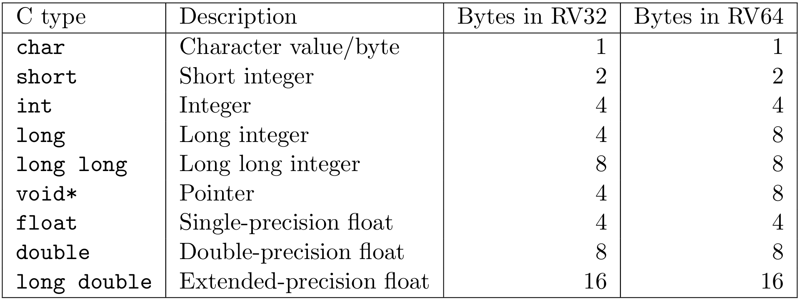
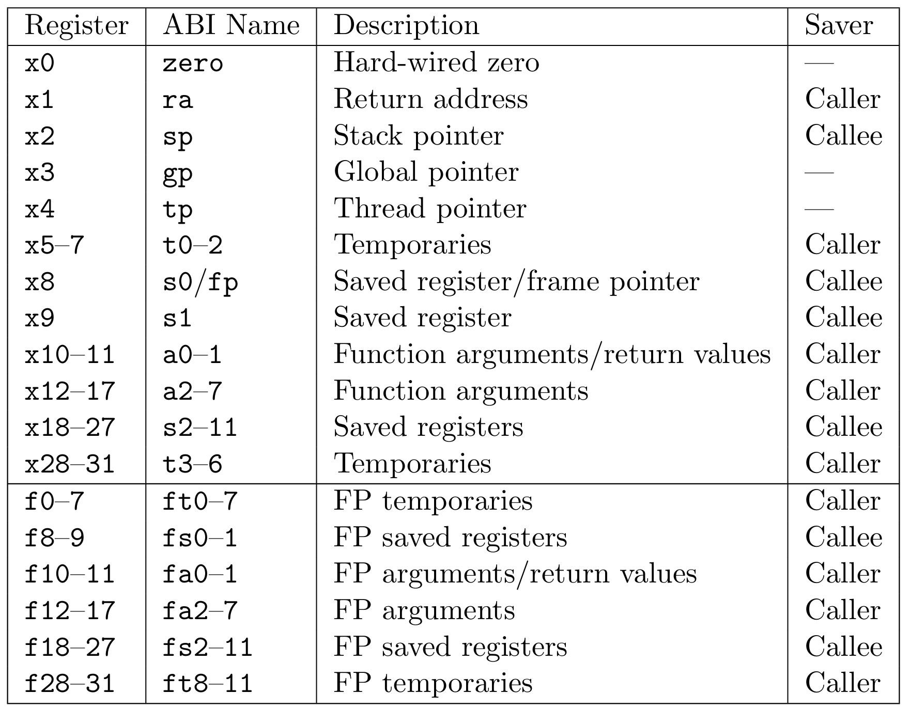
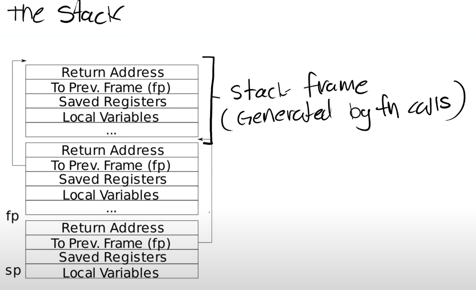
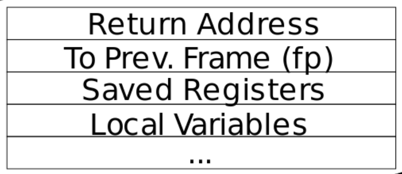
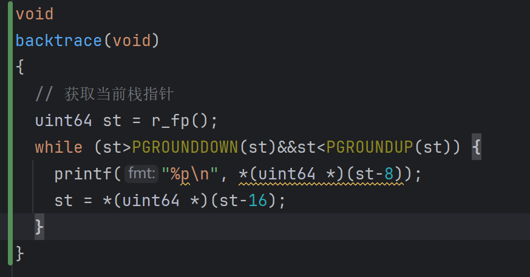
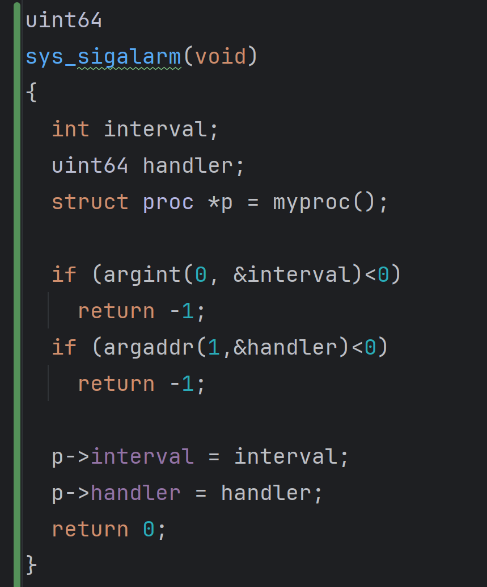
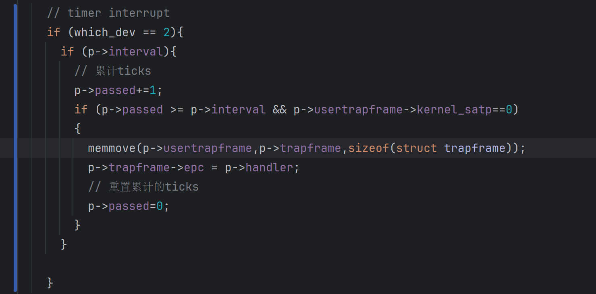
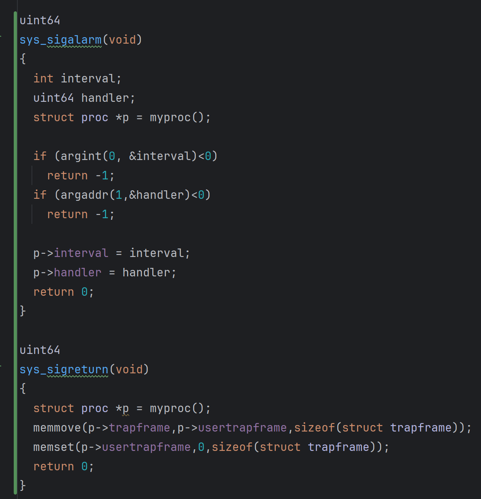

> This lab explores how system calls are implemented using traps. You will first do a warm-up exercises with stacks and then you will implement an example of user-level trap handling.

## Notes
### Calling conventions and stack frames RISC-V

#### calling conventions

#### c语言到汇编

每个处理器都有一个关联的ISA(Instruction Sets Architecture), 每条指令都有一个对应的二进制编码或Opcode决定处理器应该进行怎样的操作. 在编译C语言时, 编译器会生成汇编语言, 然后通过汇编语言生成可执行文件, 这里还涉及到链接等操作, 但是不是课程重点, 跳过

#### RISC-V vs x86

RISC-V 中RISC时精简指令集(Reduced Instruction Set Computer), 而x86是CISC复杂指令集, 两者有如下区别
- RISC-V的指令数量原少于x86, x86为了向后兼容有非常多的指令
- RISC-V的指令更为简单, 每个指令执行的任务更少
- RISC-V是开源的

如果查看RISC-V的文档，可以发现RISC-V的特殊之处在于：它区分了Base Integer Instruction Set和Standard Extension Instruction Set。Base Integer Instruction Set包含了所有的常用指令，比如add，mult。除此之外，处理器还可以选择性的支持Standard Extension Instruction Set。例如，一个处理器可以选择支持Standard Extension for Single-Precision Float-Point。这种模式使得RISC-V更容易支持向后兼容。 每一个RISC-V处理器可以声明支持了哪些扩展指令集，然后编译器可以根据支持的指令集来编译代码。

#### RISC-V寄存器
这个表里面是RISC-V寄存器, 寄存器是CPU或者处理器上, 预先定义的可以用来存储数据的位置. 寄存器之所以重要是因为汇编代码并不是在内存上执行，而是在寄存器上执行，也就是说，当我们在做add，sub时，我们是对寄存器进行操作。所以你们通常看到的汇编代码中的模式是，我们通过load将数据存放在寄存器中，这里的数据源可以是来自内存，也可以来自另一个寄存器。之后我们在寄存器上执行一些操作。如果我们对操作的结果关心的话，我们会将操作的结果store在某个地方。这里的目的地可能是内存中的某个地址，也可能是另一个寄存器。这就是通常使用寄存器的方法。
寄存器是用来进行任何运算和数据读取的最快的方式，这就是为什么使用它们很重要，也是为什么我们更喜欢使用寄存器而不是内存。
通常我们在谈到寄存器的时候，我们会用它们的ABI名字。不仅是因为这样描述更清晰和标准，同时也因为在写汇编代码的时候使用的也是ABI名字。

a0到a7寄存器是用来作为函数的参数。如果一个函数有超过8个参数，我们就需要用内存了。从这里也可以看出，当可以使用寄存器的时候，我们不会使用内存，我们只在不得不使用内存的场景才使用它。

表单中的第4列，Saver列，当我们在讨论寄存器的时候也非常重要。
- Caller Saved寄存器在函数调用的时候不会保存
- Callee Saved寄存器在函数调用的时候会保存
这里的意思是，一个Caller Saved寄存器可能被其他函数重写。假设我们在函数a中调用函数b，任何被函数a使用的并且是Caller Saved寄存器，调用函数b可能重写这些寄存器。我认为一个比较好的例子就是Return address寄存器（注，保存的是函数返回的地址），你可以看到ra寄存器是Caller Saved，这一点很重要，它导致了当函数a调用函数b的时侯，b会重写Return address。所以基本上来说，任何一个Caller Saved寄存器，作为调用方的函数要小心可能的数据可能的变化；任何一个Callee Saved寄存器，作为被调用方的函数要小心寄存器的值不会相应的变化。我经常会弄混这两者的区别，然后会到这张表来回顾它们。

#### Stack


每一次我们调用一个函数，函数都会为自己创建一个Stack Frame，并且只给自己用。函数通过移动Stack Pointer来完成Stack Frame的空间分配。
对于Stack来说，是从高地址开始向低地址使用。所以栈总是向下增长。当我们想要创建一个新的Stack Frame的时候，总是对当前的Stack Pointer做减法。一个函数的Stack Frame包含了保存的寄存器，本地变量，并且，如果函数的参数多于8个，额外的参数会出现在Stack中。所以Stack Frame大小并不总是一样，即使在这个图里面看起来是一样大的。不同的函数有不同数量的本地变量，不同的寄存器，所以Stack Frame的大小是不一样的。但是有关Stack Frame有两件事情是确定的：
- Return address总是会出现在Stack Frame的第一位
- 指向前一个Stack Frame的指针也会出现在栈中的固定位置
有关Stack Frame中有两个重要的寄存器，第一个是SP（Stack Pointer），它指向Stack的底部并代表了当前Stack Frame的位置。第二个是FP（Frame Pointer），它指向当前Stack Frame的顶部。因为Return address和指向前一个Stack Frame的的指针都在当前Stack Frame的固定位置，所以可以通过当前的FP寄存器寻址到这两个数据。

Stack Frame必须要被汇编代码创建，所以是编译器生成了汇编代码，进而创建了Stack Frame。所以通常，在汇编代码中，函数的最开始你们可以看到Function prologue，之后是函数的本体，最后是Epilogue。这就是一个汇编函数通常的样子。

### Xv6book:Chapter4 Traps and system calls

存在三种情况, 使得CPU停止执行现有命令而强制转移控制权到特定代码来处理事件, 这三种情况统称为trap
- system call: 用户程序执行ecall指令时, 内核处理系统调用
- exception: 指令执行非法操作, 如除零
- interrupt: 硬件信号中断
trap应该是透明的, 当一个trap到来时, 存储现在执行的状态, 转移到trap处理程序, 处理完并存储结果, 然后恢复刚刚执行的状态

#### RISC-V trap machinery

每个RISC-V CPU有着一些控制寄存器, kernel向这些寄存器中写入状态从而告知CPU如何处理traps, 或者从这些寄存器中读来发现trap.下面是最重要的寄存器的总结, 这些寄存器只有内核态可以read和write
- stvec(Supervisor Trap-Vector Base Address): kernel写入trap handler的地址, 然后RISC-V跳转到这个地址处理trap
- sepc(Supervisor Exception Program Counter): 当trap发生时, RISC-V将当前的pc保存在这个位置(执行trap处理时pc会指向处理程序), 然后当trap处理结束后会执行sret指令, 将sepc中的地址复制到pc中. kernel可以通过写sepc来控制sret返回的地址
- scause: RISC-V向其中写入触发trap的原因
- sscratch(Supervisor Scratch register): kernel向其中写入一个值, 在trap处理程序开始时起作用
- sstatus(Supervisor Status Register): sstatus中的SIE位控制了设备中断是否开启, 如果没有设置, 那RISC-V会推迟设备中断直到重新设置这个位置. SPP位则说明了中断来源于用户模式还是内核模式, 并控制了sret的模式.
- satp(supervisor address translation and protection): 存储页表的值
还有在machine mode模式下与这些寄存器等价的寄存器, 但xv6只有在特殊的timer interrupt情况下才会使用.
每个CPU的中断相关寄存器都是独立, 同一时刻可能有多个CPU在处理中断

当需要中断时, RISC-V硬件做了如下的事情
1. If the trap is a device interrupt, and the sstatus SIE bit is clear, don’t do any of the following. 
2. Disable interrupts by clearing SIE. 
3. Copy the pc to sepc. 
4. Save the current mode (user or supervisor) in the SPP bit in sstatus. 
5. Set scause to reflect the trap’s cause. 
6. Set the mode to supervisor. 
7. Copy stvec to the pc.
8. Start executing at the new pc.
CPU没有切换到内核页表, 也没有切换到内核栈或者保存任何寄存器. kernel必须要完成这些任务. CPU需要执行最少的任务来提高灵活性和性能

#### Traps from user space

用户代码的trap高层的路径是uservec -> usertrap -> usertrapret -> userret.
用户空间的trap由于pagetable中没有到kernel的map且栈里可能包含了非法或有害的值, 所以更为困难.
由于在trap中, RISC-V硬件没有切换页表, 所以用户页表必须包含一个到uservec(stvec指向的trap vector指令)的映射. uservec必须切换satp指向内核页表, 且为了切换后能继续执行指令 uservec必须映射到内核页表和用户页表中的相同地址.
为了实现这个要求, xv6用trampoline页存储uservec, 且将这一页映射到内核页表和每个用户页表中, 当用户模式执行时, stvec会指向uservec

当uservec开始执行时, 所有的32位寄存器中所有的值归被中断的代码所有, 但是uservec需要修改寄存器来设置satp和产生存储寄存器的地址, 所以RISC-V提供了sscratch寄存器来作为辅助空间.
- 首先, 交换a0和sscratch, 这样a0的值就被保存了, 有了一个可以使用的空间
- 然后, 下一步需要保存其他的用户寄存器. 在进入用户空间之前, 内核把sscratch指向了进程的trapframe, 这个trapframe有着充足的空间存储所有的用户寄存器. 因为satp仍然指向着用户页表, uservec需要被映射到用户空间的trapframe.在创建每个进程时, xv6给trapframe分配了一个页一直被分配到TRAPFRAME, p->trapframe页指向了这个页的物理地址, 内核也能通过内核页表访问到这个页.
- a0现在指向当前进程的trapframe, uservec可以将所有的用户寄存器保存到这里, trapframe中保存了现有进程的内核stack的指针, 当前CPU的haartid, usertrap的地址以及内核页表的地址. uservec取出这些值, 将satp切换到内核页表然后执行usertrap

usertrap的作用是确定trap的原因, 处理trap然后返回. 它首先更改stvec使得在kernel中的trap会被kernelvec处理, 然后保存sepc, 如果trap是system call, 则system call处理; 如果是设备中断则decintr处理; 否则是异常, 内核需要kill这个有问题的进程. 

返回的过程是, 首先回到用户空间, 调用usertrapret, 设置控制寄存器状态以准备之后的trap. 然后调用userret来交换页表

上述这一段非常难理解, 感觉有些东西是代码里有但是文章中没讲清楚的, 需要结合代码多看看. 最核心的思路应该是通过用户和内核都能访问的trapframe和tramponline来实现寄存器的存储和交换

#### Code: Calling system calls

用户代码将exec的参数放在a0和a1中, 然后将系统调用number放在a7中, ecall指令陷入到内核中然后执行uservec, usertrap然后syscall. syscall从trapframe中取出a7存储的系统调用number然后执行具体的调用, 然后将返回值存入a0

#### Code: System call arguments

用户空间调用的系统调用是被包装的函数, 实际系统调用的参数是在寄存器中然后被保存到trapframe中的. 在使用时如果是int之类的, 直接从trapframe中取出即可, 如果是地址, 则需要用walkaddr方法找到这个虚拟地址在对应的用户空间中的物理地址

#### Traps from kernel space

当内核状态时, stvec指向的是汇编代码kernelvec, 由于此时已经在内核空间中, 所以可以直接用内核对应线程的栈存储寄存器

kernelvec调用kerneltrap, 这个函数处理设备中断和异常. 通过调用devintr判断哪个设备触发的, 如果不是设备触发的就是异常, 内核应该退出

如果中断是timer interrupt引起的, 且一个进程的内核线程正在运行, kerneltrap会调用yield释放cpu

#### 缺页异常

xv6的异常处理很简单, 内核就panic, 用户就中断进程
常用缺页异常来实现copy-on-write
RISC-V中有三种缺页异常
- load page fault: load语句无法翻译虚拟地址
- store page fault: store语句无法翻译虚拟地址
- instruction page fault: 存储指令的的虚拟地址无法翻译
最基础的COW fork实现方式是, 父子进程更新物理页, 然后让他们只读, 当子进程或父进程执行store指令时, 内核复制这个页, 然后将这两个都设置成RW分别映射给两个进程, 然后内存继续执行之前的操作.

还可以用缺页异常实现lazy allocation, 只有实际使用sbrk要求的内存时才分配
以及可以用缺页异常实现paging from disk, 将一部分页换出到磁盘中实现比物理内存更大的内存

## Lab - traps

This lab explores how system calls are implemented using traps. You will first do a warm-up exercises with stacks and then you will implement an example of user-level trap handling.

Before you start coding, read Chapter 4 of the [xv6 book](https://pdos.csail.mit.edu/6.828/2021/xv6/book-riscv-rev2.pdf), and related source files:
- kernel/trampoline.S: the assembly involved in changing from user space to kernel space and back
- kernel/trap.c: code handling all interrupts

### RISC-V assembly (easy)

> It will be important to understand a bit of RISC-V assembly, which you were exposed to in 6.004. There is a file user/call.c in your xv6 repo. make fs.img compiles it and also produces a readable assembly version of the program in user/call.asm.
> 
> Read the code in call.asm for the functions g, f, and main. The instruction manual for RISC-V is on the [reference page](https://pdos.csail.mit.edu/6.828/2021/reference.html). Here are some questions that you should answer (store the answers in a file answers-traps.txt):

代码中的常见汇编命令
- addi rd,rsi,imm: 将立即数imm与寄存器rsi中的值相加存入rd
- sd rs2,offset(rs1): 将r2中的64位数据存储到rs1+offset内存处
- ld rd,offset(rs1): 将rs1+offset处的64位数据加载到rd
- ret: 伪指令, 实际上是 jar x0,ra,0, 返回到调用者, 即跳转到ra保存的地址
- auipc rd,imm: 将imm<<12与当前pc值相加, 结果存入rd, 用于地址计算
- jalr rd, offset(rs1): 跳转到rs1+offset, 并将返回地址(PC+4)存入rd, 省略rd时默认为ra
- li: 伪指令, 实际指令addi rd, x0, imm, 将立即数加载到寄存器

- Which registers contain arguments to functions? For example, which register holds 13 in main's call to printf?
	- 函数g中用a0存储了参数x
	- 函数f中用a0存储了参数x
	- main中a2存储了13, a1存储了12(没有调用f2而是直接算出来了)
	
- Where is the call to function f in the assembly code for main? Where is the call to g? (Hint: the compiler may inline functions.)
	- main中在26的位置本应该调用f的, 但是这里是固定值, 所以直接优化出结果了
	- f中也本应该调用g的, 但是直接内联了g的函数体, 将参数+3

- At what address is the function printf located?
	- 从main来看, print的地址是0x630
	- 0x30处, 将pc赋值给了ra, 然后0x34处跳转到了ra+1536, 计算得0x630
- What value is in the register ra just after the jalr to printf in main?
	- jalr会将ra设置为pc+4即0x38处

- Run the following code.
	unsigned int i = 0x00646c72;
	printf("H%x Wo%s", 57616, &i);
	What is the output? [Here's an ASCII table](http://web.cs.mun.ca/~michael/c/ascii-table.html) that maps bytes to characters.
	- 输出为He110 World, 57616转换为十六进制是110, 然后将0x00646c72作为字符串输出, 由于是小端法, 一个ASCII一个字节, 所以依次是112, 108, 100, \0, 即rld
	
 - The output depends on that fact that the RISC-V is little-endian. If the RISC-V were instead big-endian what would you set `i` to in order to yield the same output? Would you need to change `57616` to a different value?
- [Here's a description of little- and big-endian](http://www.webopedia.com/TERM/b/big_endian.html) and [a more whimsical description](http://www.networksorcery.com/enp/ien/ien137.txt).
	- 如果是大端法, i需要反着设置即从00000000011001000110110001110010更换成0100111000110110001001100000000, 再转换为16进制0x4e362600, 而57616不需要改变
- In the following code, what is going to be printed after `'y='`? (note: the answer is not a specific value.) Why does this happen?
	printf("x=%d y=%d", 3);
	- 会输出x=3 y=一个随机值, 因为内存中数据是位置的

### Backtrace (moderate)

>For debugging it is often useful to have a backtrace: a list of the function calls on the stack above the point at which the error occurred.
>Implement a backtrace() function in kernel/printf.c. Insert a call to this function in sys_sleep, and then run bttest, which calls sys_sleep. Your output should be as follows:
>backtrace:
>0x0000000080002cda
>0x0000000080002bb6
>0x0000000080002898
>After bttest exit qemu. In your terminal: the addresses may be slightly different but if you run addr2line -e kernel/kernel (or riscv64-unknown-elf-addr2line -e kernel/kernel) and cut-and-paste the above addresses as follows:
>	$ addr2line -e kernel/kernel
>	0x0000000080002de2
>	0x0000000080002f4a
>	0x0000000080002bfc
>	Ctrl-D
>You should see something like this:
>	kernel/sysproc.c:74
>	kernel/syscall.c:224
>	kernel/trap.c:85
>
>The compiler puts in each stack frame a frame pointer that holds the address of the caller's frame pointer. Your backtrace should use these frame pointers to walk up the stack and print the saved return address in each stack frame.

Some hints:
- Add the prototype for backtrace to kernel/defs.h so that you can invoke backtrace in sys_sleep.
- The GCC compiler stores the frame pointer of the currently executing function in the register s0. Add the following function to kernel/riscv.h:
    static inline uint64
    r_fp()
    {
      uint64 x;
      asm volatile("mv %0, s0" : "=r" (x) );
      return x;
    }
    and call this function in backtrace to read the current frame pointer. This function uses [in-line assembly](https://gcc.gnu.org/onlinedocs/gcc/Using-Assembly-Language-with-C.html) to read s0.
- These [lecture notes](https://pdos.csail.mit.edu/6.828/2021/lec/l-riscv-slides.pdf) have a picture of the layout of stack frames. Note that the return address lives at a fixed offset (-8) from the frame pointer of a stackframe, and that the saved frame pointer lives at fixed offset (-16) from the frame pointer.
- Xv6 allocates one page for each stack in the xv6 kernel at PAGE-aligned address. You can compute the top and bottom address of the stack page by using PGROUNDDOWN(fp) and PGROUNDUP(fp) (see kernel/riscv.h. These number are helpful for backtrace to terminate its loop.
Once your backtrace is working, call it from panic in kernel/printf.c so that you see the kernel's backtrace when it panics
#### 分析

在kernel/printf.c中实现backtrace()函数, 然后再sys_sleep中插入这个函数的调用, 最后通过bttest测试.
编译器向每个栈帧存放一个指向调用者的指针(s0存储当前栈帧的指针), backtrace利用这些指针来向上遍历栈然后打印返回地址
xv6分配一个完整的page存储栈, return addr和prev fram相对于栈指针固定偏移-8和-16, 通过PGROUNDDOWN(fp)和PGROUNDUP(fp)可以计算栈帧开始和结束的位置
具体需要做的步骤如下
- 在defs.h中完善backtrace的定义, 向sys_sleep中插入这个函数的调用
- 在riscv.h中添加r_fp函数来获取当前栈地址
- 栈的内存分布
- 唯一需要注意的是从一个地址处取出值时, 需要先将这个地址转型成指针然后再取值, 其余的都很简单


### Alarm (hard)

>In this exercise you'll add a feature to xv6 that periodically alerts a process as it uses CPU time. This might be useful for compute-bound processes that want to limit how much CPU time they chew up, or for processes that want to compute but also want to take some periodic action. More generally, you'll be implementing a primitive form of user-level interrupt/fault handlers; you could use something similar to handle page faults in the application, for example. Your solution is correct if it passes alarmtest and usertests.

You should add a new sigalarm(interval, handler) system call. If an application calls sigalarm(n, fn), then after every n "ticks" of CPU time that the program consumes, the kernel should cause application function fn to be called. When fn returns, the application should resume where it left off. A tick is a fairly arbitrary unit of time in xv6, determined by how often a hardware timer generates interrupts. If an application calls sigalarm(0, 0), the kernel should stop generating periodic alarm calls.

You'll find a file user/alarmtest.c in your xv6 repository. Add it to the Makefile. It won't compile correctly until you've added sigalarm and sigreturn system calls (see below).

alarmtest calls sigalarm(2, periodic) in test0 to ask the kernel to force a call to periodic() every 2 ticks, and then spins for a while. You can see the assembly code for alarmtest in user/alarmtest.asm, which may be handy for debugging. Your solution is correct when alarmtest produces output like this and usertests also runs correctly:
```
$ alarmtest
test0 start
........alarm!
test0 passed
test1 start
...alarm!
..alarm!
...alarm!
..alarm!
...alarm!
..alarm!
...alarm!
..alarm!
...alarm!
..alarm!
test1 passed
test2 start
................alarm!
test2 passed
$ usertests
...
ALL TESTS PASSED
$
```
When you're done, your solution will be only a few lines of code, but it may be tricky to get it right. We'll test your code with the version of alarmtest.c in the original repository. You can modify alarmtest.c to help you debug, but make sure the original alarmtest says that all the tests pass.
#### test0: invoke handler

Get started by modifying the kernel to jump to the alarm handler in user space, which will cause test0 to print "alarm!". Don't worry yet what happens after the "alarm!" output; it's OK for now if your program crashes after printing "alarm!". Here are some hints:

- You'll need to modify the Makefile to cause alarmtest.c to be compiled as an xv6 user program.
- The right declarations to put in user/user.h are:
    
        int sigalarm(int ticks, void (*handler)());
        int sigreturn(void);
    
- Update user/usys.pl (which generates user/usys.S), kernel/syscall.h, and kernel/syscall.c to allow alarmtest to invoke the sigalarm and sigreturn system calls.
- For now, your sys_sigreturn should just return zero.
- Your sys_sigalarm() should store the alarm interval and the pointer to the handler function in new fields in the proc structure (in kernel/proc.h).
- You'll need to keep track of how many ticks have passed since the last call (or are left until the next call) to a process's alarm handler; you'll need a new field in struct proc for this too. You can initialize proc fields in allocproc() in proc.c.
- Every tick, the hardware clock forces an interrupt, which is handled in usertrap() in kernel/trap.c.
- You only want to manipulate a process's alarm ticks if there's a timer interrupt; you want something like
    
        if(which_dev == 2) ...
    
- Only invoke the alarm function if the process has a timer outstanding. Note that the address of the user's alarm function might be 0 (e.g., in user/alarmtest.asm, periodic is at address 0).
- You'll need to modify usertrap() so that when a process's alarm interval expires, the user process executes the handler function. When a trap on the RISC-V returns to user space, what determines the instruction address at which user-space code resumes execution?
- It will be easier to look at traps with gdb if you tell qemu to use only one CPU, which you can do by running
    
        make CPUS=1 qemu-gdb
    
- You've succeeded if alarmtest prints "alarm!".

#### test1/test2(): resume interrupted code

Chances are that alarmtest crashes in test0 or test1 after it prints "alarm!", or that alarmtest (eventually) prints "test1 failed", or that alarmtest exits without printing "test1 passed". To fix this, you must ensure that, when the alarm handler is done, control returns to the instruction at which the user program was originally interrupted by the timer interrupt. You must ensure that the register contents are restored to the values they held at the time of the interrupt, so that the user program can continue undisturbed after the alarm. Finally, you should "re-arm" the alarm counter after each time it goes off, so that the handler is called periodically.
As a starting point, we've made a design decision for you: user alarm handlers are required to call the sigreturn system call when they have finished. Have a look at periodic in alarmtest.c for an example. This means that you can add code to usertrap and sys_sigreturn that cooperate to cause the user process to resume properly after it has handled the alarm.

Some hints:
- Your solution will require you to save and restore registers---what registers do you need to save and restore to resume the interrupted code correctly? (Hint: it will be many).
- Have usertrap save enough state in struct proc when the timer goes off that sigreturn can correctly return to the interrupted user code.
- Prevent re-entrant calls to the handler----if a handler hasn't returned yet, the kernel shouldn't call it again. test2 tests this.
Once you pass test0, test1, and test2 run usertests to make sure you didn't break any other parts of the kernel.

#### 分析

需要实现的功能
- 添加一个系统调用sigalarm(interval, handler), 作用是程序使用了interval个ticks CPU时间后, 内核需要调用函数handler, 当handler结束后, 程序回到调用前的状态. 类似于trap, 只不过是处理函数是定义在用户空间的
- 如果参数是0,0 , 内核需要停止产生周期性的alarm调用
- 需要能通过alarmtest和usertests
- 在proc.h中增加存储interval, handler以及距离上次过去多长ticks的字段, 在allocproc中初始化字段
- 每个tick, 硬件都会强制触发中断, 然后在usertrap()中处理, 此时which_dev\==2
- 修改usertrap, 当interval达到时, 执行handler
- handler中必须调用sigreturn, 通过修改sys_sigreturn和usertrap来实现正确恢复

具体步骤
- test 0
	- 将alarmtest.c添加到Makefile中
	- 将sigalarm和sigreturn的定义添加到user.h中
	- 更新usys.pl, kernel/syscall.h以及kernel/syscall.c来添加上述两个的系统调用
	- sys_sigreturn暂时只需要返回0
- test 1/2: resume interrupted code
	- 寄存器的内容需要被保存,  中断结束后再恢复
	- 需要重置alarm counter再每次调用后, 然后可以周期性调用

#### 分析

函数定义等前面的实验都做过了, 这里不予赘述

对于test0, 我们需要实现的是能够成功的执行handler
对于系统调用sys_sigalarm, 我们做的事情非常简单, 只需要将传入的alarm配置存储到proc的字段中即可

核心是修改usertrap, 根据提示, 我们需要做的是在which_dev=2时添加调用handler的逻辑, 已经ticks的管理逻辑
ticks的管理非常简单, 每一次触发就将passed+1, 然后调用了handler就将passed清零, 实现周期性调用
而调用handler, 我们第一时间想到的肯定是调用这个函数, 也就是利用p->handler中存储的函数指针来调用. 但是这里有一个很容易被忽略的问题, 执行trap时, 整体处于内核态, 使用的是kernel的页表, 直接调用是找不到这个函数的, 只能通过间接的方式来实现调用. 阅读usertrap的代码, 很容易发现, trap结束后用户程序继续的位置是由trapframe中的epc决定的, 在usertrapret中, 会将sepc寄存器设置为trapframe中的epc的值, 然后用户空间从这个位置开始继续执行, 所以这里直接将epc的值改为handler的地址就可以了

在test0中, 我们成功实现了调用handler, 但是目前的实现方式是破坏性的, 原本保存的pc值被覆盖了, 没法重新回到原来的位置执行. 注意到每一个handler中必须调用sigreturn, 很明显, 这个系统调用的作用就是重新回到原来应该在的位置. 
提示里要求保存需要的寄存器, 这里我换了个思考的方式, 加入没有新的这个feature, 所有的状态都存在trapframe中, 然后usertrapret. 如果我们要回到这个状态的话, 只需要用一个页来存调用handler前的trapframe即可, 作为副本在执行sigreturn的时候再拷贝回来就行.
于是在proc.c中初始化进程和释放进程时都额外管理一个usertrapframe用作副本
test2要求, 在handler返回前不可重入, 第一想法是锁, 但是想了想发现这个不可重入是为了避免当个进程多次调用handler导致先前的状态被覆盖了, 不存在多个进程的竞态条件没必要用锁. 前面用到了usertrapframe, 那么正好可以利用一下这个, 如果这个副本是空的, 说明没有调用过handler或者已经结束了, 而不为空则不行. 怎么判断是否为空呢? trapframe里存了一些和内核相关的字段, 如内核页表, 选一个不可能是0的作为条件即可. 不过要记得每次sigreturn和proc初始化时需要将usertrapframe设置为全空

