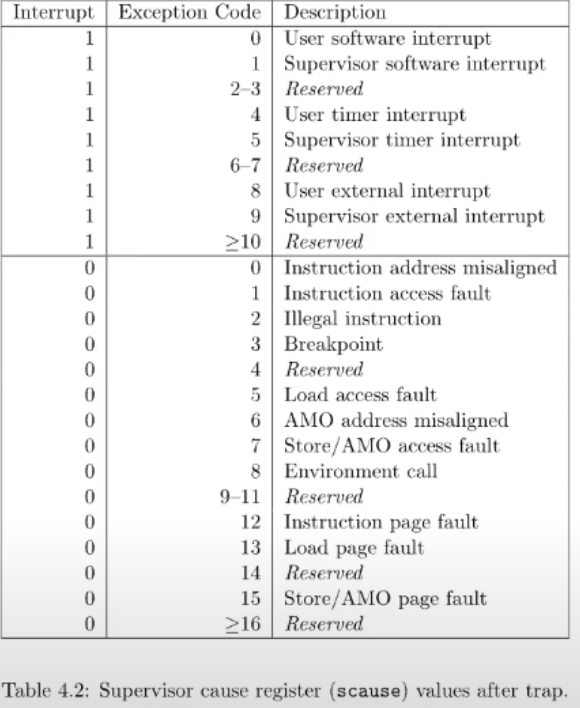
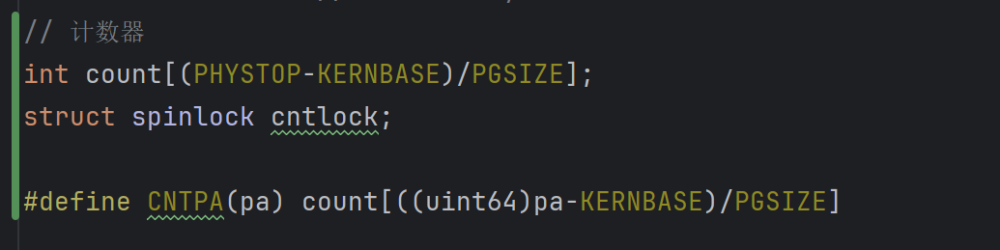
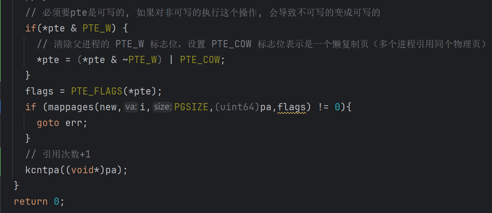
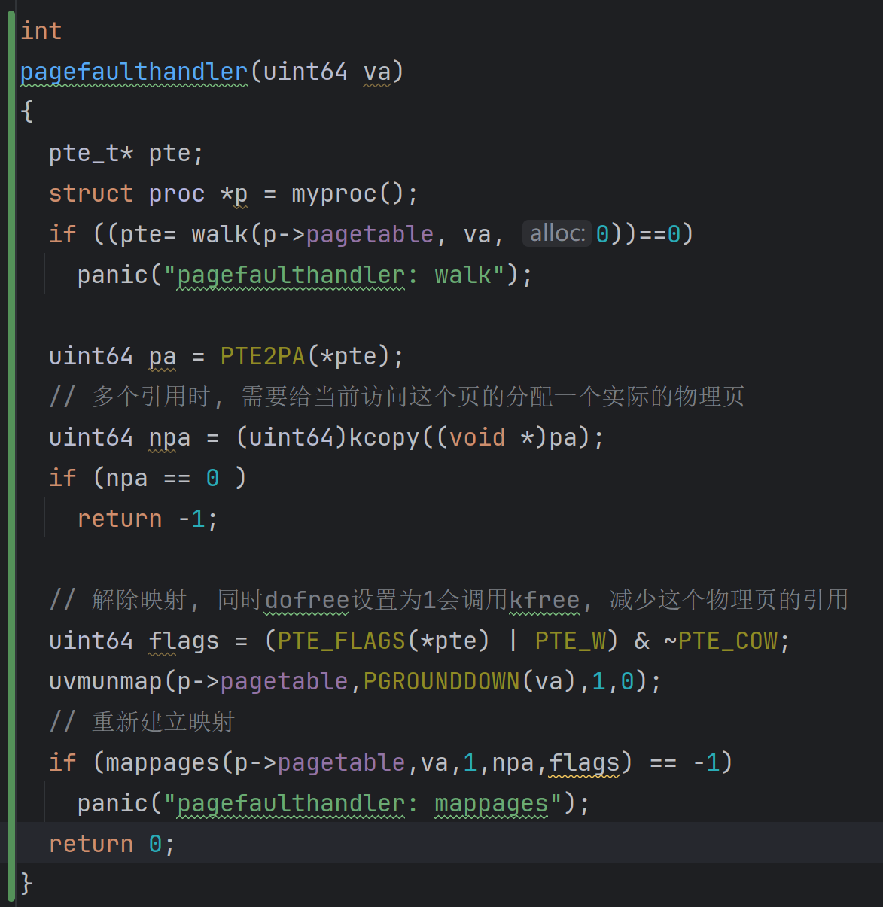
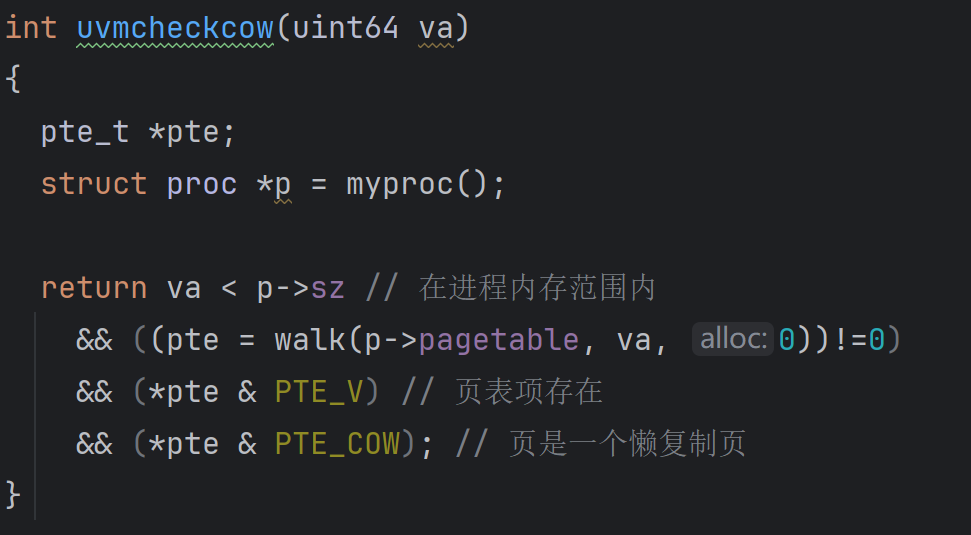
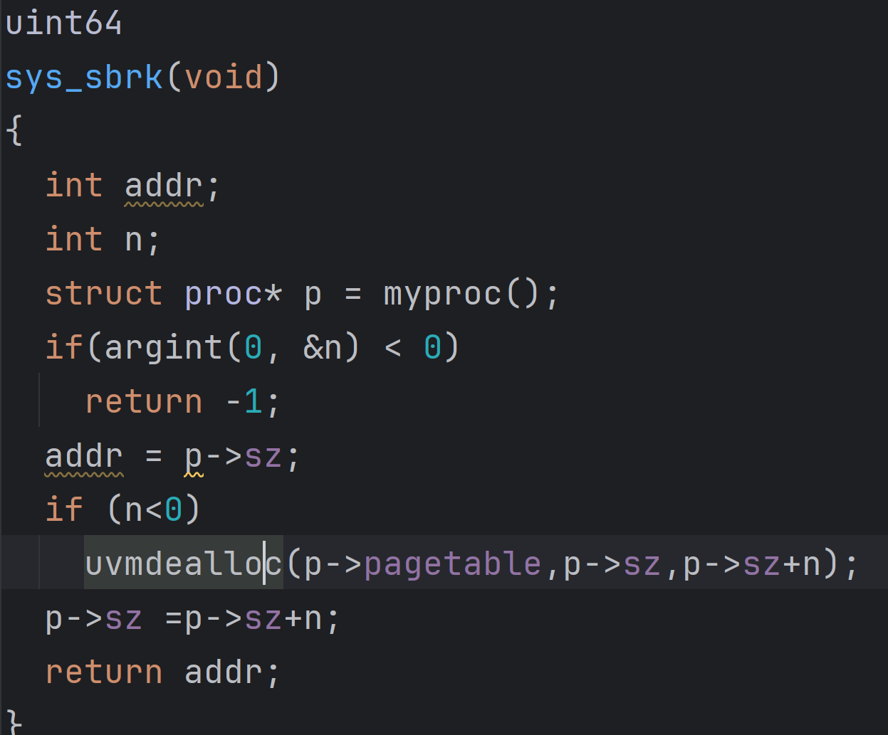
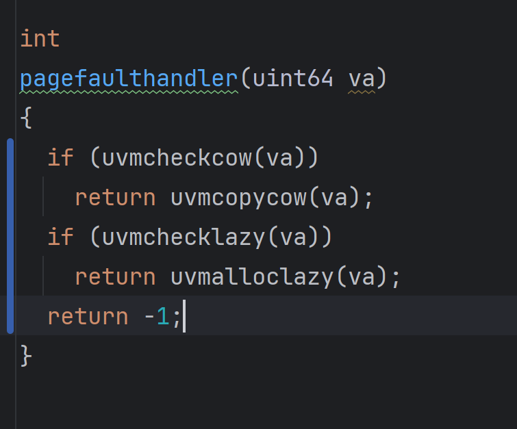
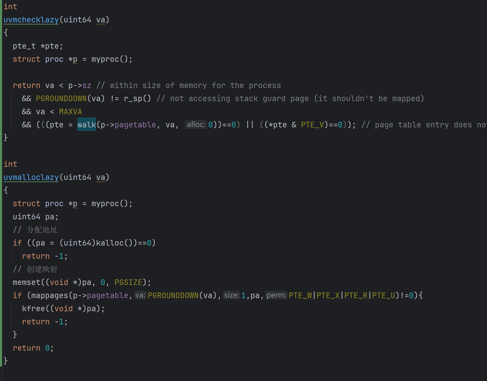

___

## Notes

目前xv6遇到page fault后会直接将进程kill掉, 是一个比较保守的处理方式, 通过虚拟内存能实现的特性如lazy allocation, copy-on-write fork, demand paging, memory mapped files一个都没有. 但通过page table 和 page fault能够实现许多有趣的功能, 也能给内核带来更多的灵活性

当发生page falut时, 内核需要什么样的信息才能响应page fault?
- 首先, 需要出错的虚拟地址. 目前, page fault时, xv6内核会打印错误的虚拟地址并保存在寄存器STVAL中. 当一个用户进程触发了page fault会进入trap机制
- 还需要出错的原因, 对于不同场景需要有不同的响应, 如load page fault, store page fault或者jump page fault. SCAUSE(supervisor cause)寄存器存储了进入trap的原因, 对应关系如下
- 最后需要知道的是触发page fault的指令地址, 这个地址存放在SEPC寄存器中, 同时保存在trapframe->epc中

### Lazy page allocation

内存allocation, 或者更具体的说系统调用sbrk, 使得用户程序能扩大自己的heap, sbrk指向的是heap的最低端也是stack的最顶端, 这个位置通过proc中sz字段表示.
当调用sbrk时, 会根据传入的参数(字节数)扩展heap的上边界. 也就是说, sbrk调用时, 内核会分配一些物理内存, 然后将这些内存映射到用户空间, 然后将这些内存内容初始化为0, 在返回sbrk调用. 这样应用程序就可以通过多次sbrk系统调用来增加它所需要的内存. (参数是负数也能减少内存)

xv6中的sbrk的实现默认是eager allocation, 一旦调用就会立即分配程序需要的物理内存, 但实际上, 应用程序很难预测需要多少, 通常会申请更多, 导致内存浪费. 使用虚拟内存和page fault handler就可以实现lazy allocation来减少内存浪费. sbrk系统调用基本不做任何事情, 唯一需要做的事情就是p->sz+n, 其中n是需要新分配的page数量, 但是此时内核不会分配任何物理内存, 在之后的某个时间点, 应用程序使用到新分配的内存时才会触发page fault, 因为新内存还没有映射到page table, 如果解析一个大于旧的p->sz, 但小于新的p->sz的虚拟地址时, 内核再为之分配地址, 然后重新执行指令

### Zeor Fill On Demand

用户地址空间中存在text区域(程序的指令), data区域(初始化的全局或静态变量), 同时还有一个BSS区域(包含了未被初始化或初始化为0的全局或静态变量). 在编译器生成二进制文件时, 编译器会填入这三个区域, 但是对于BSS区域中的变量, 编译器将其都设置为0, 那实际上我们不需要为其分配实际的地址, 将所有的全为零的page映射到一个特殊的全为0的物理页上就行. 然后将其设置为只读, 当程序尝试修改BSS中的page时, 为其分配一个页, 调整映射, 然后重新执行. 这样能够节省许多的内存, 同时exec需要做的工作变少, 启动更快.
不过page fault的代价比store要高很多, update和write会慢不少(但其实也就限于第一次)

### Copy On Write Fork

shell执行命令时, 会通过fork创建子进程, 然后子进程第一件事就是调用exec运行其他程序, 那么对于子进程来说fork时复制父进程地址, 然后马上用exec丢弃会浪费很多时间. 对于这个场景, 我们可以在创建子进程时, 先直接共享父进程的物理内存(设置为只读), 然后当某个进程想要修改这些内存的内容时, 会触发page fault, 需要先复制一份page, 然后拷贝响应的物理内存, 将原本和副本都设置为可读写然后分配给两个进程.

此外, 还需要对物理内存的引用进行计数, 只有所有指向这个物理页的虚拟页都被释放后, 这个物理页才应该被释放

### Demand Paging

加载应用程序时, 操作系统会加载程序内存的text, data区域, 并以eager的方式保存进page table, 如果参考前面的方式, 可以使用lazy的方式加载, 将text和data分配好地址段, 但是不分配实际物理内存, 然后将这些PTE的valid位设置为0.

text区域从0开始向上增加, 所以位于地址0的指令会第一个触发page fault, 这些page是on-demand page(按需分配). 我们需要在某个位置记录page对于的程序文件, 然后在page fault handler中从程序文件中读取page数据加载到内存中, 在映射到page table后重新执行. 如果text和data区域大于物理内存, 或者多个程序总使用内存大于物理内存, 此时会出现OOM, 如果再出现一个page fault就没有内存可以分配了, 需要选择evict page来腾出空间.

那么什么样的page可以被evict, 使用什么样的策略来evict?
最常用的是LRU, 此外还会有别的优化, 如果要evict一个page, 需要在dirty page和non-dirty page中选择, 通常选择non-dirty page, 因为直接抛弃这个页, 然后将PTE标记为non-valid就行, 如果选择dirty page, 那么需要写回文件后, 再抛弃页, 产生了额外的IO
PTE通过bit7来表示dirty. 通过dirty和access可以来实现LRU策略

### Memory Mapped Files

将一个完整或部分文件加载到内存中, 通过内存地址相关的load或者store指令来操作文件. 为了支持这个功能, 现代操作系统会提供一个叫做mmap的系统调用, 接受一个虚拟地址, 长度, protection, 标志位, 文件描述符和偏移量, 语义是从文件描述符对应的文件的偏移量的位置开始，映射长度为len的内容到虚拟内存地址VA，同时我们需要加上一些保护，比如只读或者读写。
如果用eager的方式, 那么就是全部拷贝进内存, 修改后, 在unmap时将dirty的部分写回文件
如果使用lazy的方式, 则不立即拷贝, 而是记录下这个PTE属于的文件描述符, 相应信息通常在VMA中保存, VMA全称是Virtual Memory Area。例如对于这里的文件f，会有一个VMA，在VMA中我们会记录文件描述符，偏移量等等，这些信息用来表示对应的内存虚拟地址的实际内容在哪，这样当我们得到一个位于VMA地址范围的page fault时，内核可以从磁盘中读数据，并加载到内存中

## Lab: Copy-On-Write Fork

cow fork的目的是推迟allocating和copying physical memory page的时机到实际使用时.
cow fork只为子进程创建一个所有的PTE都指向父进程物理地址的page table, 然后将父子进程的PTE都标记为不可写. 当某个进程尝试写时, 会触发页中断, 然后page fault handler 会处理中断, 分配一个新的物理页, 分别映射到父子进程的PTE, 且允许可写. 同时需要维护一个计数器, 只用没有PTE引用这个物理地址时才能释放物理地址

> Your task is to implement copy-on-write fork in the xv6 kernel. You are done if your modified kernel executes both the cowtest and usertests programs successfully.

提示
- 修改uvmcopy(), 来映射父进程的物理地址到子进程, 而不是分配新的页, 同时需要清除PTE_W
- 修改usertrap()来识别发生在写时复制上的page fault, 通过kalloc分配新的物理页, 复制老的页面到新的页面, 然后将新的页面映射到PTE中, 同时设置PTE_W
- 在kalloc.c中维护每个物理页的引用计数, 只有0引用的物理页才能释放. 在kalloc分配页时设置一个引用计数器, fork时引用计数加1, PTE中释放这个页时引用计数-1
- 修改copyout, 当遇到了一个cow page 使用和page faults相同的模式
- 可以用RSW位来记录这是否是一个cow page
- 当page fault发生, 且没有空闲内存时, 需要kill这个proc

### 分析
>[参考博客](https://blog.miigon.net/posts/s081-lab6-copy-on-write-fork/)

思路:
- 引用计数
	维护一个数组来维护引用计数, 用自旋锁来避免竞态条件
	这里一开始只写了一个数组, 没有想到用锁, 参考了博客后才想到多个cpu时, 可能会多个进程同时操作一个物理地址, 所以要使用锁.
	此外, 一开始数组的增删都是使用的函数, 没想到用宏, 对于C语言来说, 用宏能很大程度上简化代码
	另外就是, 引用为1或0的特殊情况一开始都是由外部函数判断然后分支处理的, 这里不如博客中写的好, 在kalloc中用一个函数包装一下能减少外部调用的代码
	
- 页表拷贝
	这里的逻辑很简单, 很容易就想到了, 但是有个值得注意的地方, 只有是可写的页才应该用写时复制, 复制会让原本不可写的页进过写时复制后导致可写
- 写时复制
	这里的做的事情是判断是否需要新的物理页, 如果需要则拷贝新的, 然后重新映射pte. 这里博客的思路很好, 封装后, 即使不需要新的页, 也可以用一样的逻辑, 简化了代码.	
- cow页判断
	一开始的cow页判断只判断了cow位, 其实这是不够的, 因为还必须要在sz范围内, 然后需要页表项存在, 否则非法访问页可能也会进入cow处理导致安全漏洞

整体的逻辑感觉和参考博客写的没有太大的区别, 但是一直没有通过测试, 连simple的输出都没有, 对照着博客也没有找到不同. 最后是对着博客修改类型才通过的, 这里初步怀疑是地址在void*, uint等类型转换时有类型设置的不合理, 导致了错误的逻辑, 然后把每个页中断的进程都kill了, 包括init进程.

## Lab: lazy allocation

这个实验在2021年以后就没有了, 但是看到cow实验的可选挑战里有, 就想着将两个实验合并在一起做了
[原实验网页](https://pdos.csail.mit.edu/6.828/2020/labs/lazy.html)
[测试代码](https://github.com/suirui17/xv6-labs-2020/blob/lazy/user/lazytests.c)
新建lazytest文件加入makefile编译后, 按照实验网页要求做完后执行lazytest测试即可
同时, 如果需要兼容前面写的cow的话, 就不能完全按照原实验的要求来, 需要有些修改
### Eliminate allocation from sbrk() 

把growproc函数调用注释掉, 只修改sz大小就行, 这里就不附代码了

### Lazy allocation (moderate)

> Modify the code in trap.c to respond to a page fault from user space by mapping a newly-allocated page of physical memory at the faulting address, and then returning back to user space to let the process continue executing. You should add your code just before the printf call that produced the "usertrap(): ..." message. Modify whatever other xv6 kernel code you need to in order to get echo hi to work.

hints
- You can check whether a fault is a page fault by seeing if r_scause() is 13 or 15 in usertrap().
- r_stval() returns the RISC-V stval register, which contains the virtual address that caused the page fault.
- Steal code from uvmalloc() in vm.c, which is what sbrk() calls (via growproc()). You'll need to call kalloc() and mappages().
- Use PGROUNDDOWN(va) to round the faulting virtual address down to a page boundary.
- uvmunmap() will panic; modify it to not panic if some pages aren't mapped.
- If the kernel crashes, look up sepc in kernel/kernel.asm
- Use your vmprint function from pgtbl lab to print the content of a page table.
- If you see the error "incomplete type proc", include "spinlock.h" then "proc.h".
- Handle negative sbrk() arguments.
- Kill a process if it page-faults on a virtual memory address higher than any allocated with sbrk().
- Handle the parent-to-child memory copy in fork() correctly.
- Handle the case in which a process passes a valid address from sbrk() to a system call such as read or write, but the memory for that address has not yet been allocated.
- Handle out-of-memory correctly: if kalloc() fails in the page fault handler, kill the current process.
- Handle faults on the invalid page below the user stack.

#### 分析

sysproc中的修改是简单的, 正数直接加, 负数直接释放

trap.c中为了兼容cow, 做了个封装, 当信号是13或十五时, 用pagefaulthandler统一处理

vm.c中类似于cow添加一个检测是否为lazy页的函数, 以及一个分配lazy页的函数

比cow还要简单一些, 但是有些细节容易忽略, 首先是copyin和copyout都可能访问到lazy的页需要用同样的方法处理一下. 以及题目说某些页不需要unmap是panic, 想了很久的条件, 没想到是直接把panic改成continue就可以过...

与之矛盾的是, usertests中有个测试点是sbrk8000, 如果只有cow可以过, lazy后会一直在walk处panic, 导致一直过不去. 初步判断是前面的条件给的太松了, 但是其实也不应该超过MAXVA的, 整不明白