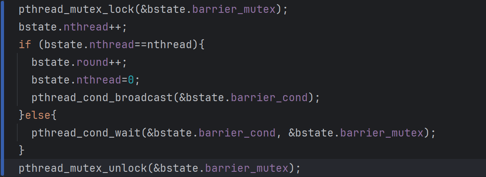

___
## Lock
### xv6 book

多处理器系统或者单处理器但多线程系统, 可能会出现同时操作一个内存的情况, 并发情况下产生数据不一致. 需要用并发控制技术来确保代码运行顺序的正确性

xv6使用了lock来实现并发控制, lock提供了互斥性, 确保了只有一个时间只有一个CPU可以持有锁.

### Race condition

并发执行时导致内存数据不一致的情况叫做竞态条件, 为了避免并发错误的发送, 需要用锁来保证critical section(临界区)中的代码的互斥.

锁虽然能序列化并发操作, 但是会降低多处理器的性能, 操作系统有部分需要做的是通过精心设计的数据结构避免锁的使用

### Code: Locks

xv6有两种锁: spinlocks and sleep-locks.

要正确的获取和释放锁需要原子性操作, 大部分的指令集都提供了CAS的原子操作. 在RISC-V中这个指令是amoswap r,a , 读取地址a中的值, 将寄存器r中的值写入a, 然后将读取出a的值写入r, 也就是原子性的交换a和r中的值.

acquire使用了可移植的C library call__sync_lock_test_and_set(底层也是用了amoswap指令), 调用的返回值是交换前的值. acquire 将swap包装在了循环中, 一直重试直到成功获取到锁, 每次循环都交换1的值到lk->locked中, 然后判断先去的值是否是0, 如果是则获取到锁, 如果不是则继续等待.

具体逻辑如下:
- 假设一开始没有人持有锁, 调用__sync_lock_test_and_set(&lk->locked,1), 将锁的locked状态设置为1, 返回先前的值0, 退出循环, 此时成功获取到锁, 继续向后执行
- 假设一开始有人持有锁, 调用__sync_lock_test_and_set(&lk->locked,1), 锁的状态保持1, 获取锁的人获取锁, 现在的程序返回值为1, 没有获取到锁, 继续循环

释放锁的过程更加简单, 清除lk->cpu字段, 然后将lk->locked字段设置为0. 不过由于C标准运行赋值有多条store语句, 所以直接赋值不是原子的, 需要用__sync_lock_release(底层也是atomswap)

### Code: Using locks

使用锁有如下的一些准则
- 一个变量可能被两个CPU同时读写需要用锁
- 锁保护的了不变量, 如果不变量中包含了多个内存地址, 通常需要lock确保不变量的维持

锁会导致并行效率降低, 但是如果并行不重要其实应该用单线程而不是并行

设计良好的细粒度的锁会有更高的性能
### Deadlock and lock ordering

如果一段代码中有多个锁, 所有的代码路径按照相同的顺序获取锁非常重要, 否则可能产生死锁问题.

中断和thread都使用同一个锁时, 非常容易出现死锁问题. 所以当spinlock被一个中断处理程序使用时, CPU不应该在允许中断时持有这个锁. xv6更加保守, cpu acquire一个锁时会关闭中断. 在没有持有spinlock时重新打开中断, 同时xv6必须做一些记录, 以处理嵌套的临界区代码.
acquire会调用push_off, release会调用pop_off来追踪锁的嵌套层级. 当锁的嵌套层级为0时, pop_off恢复到最外层临界区的interrupt enable state.
必须要先调用push_off, 来关闭中断, 在获取锁, 倒过来可能会有一段有锁的可中断区. pop_off同理.

### Instruction and memory ordering

许多编译器和CPU并不是按照代码语句顺序执行, 以期获得更高的性能, 例如一个指令需要很多循环才能完成, CPU可能会提前执行这个指令, 避免cpu停机.
重排序指令时, 编译器和CPU会确保不改变正确编写的顺序代码的结果. 但是如果是并发代码缺不能保证.
CPU的顺序规则称为memory model
xv6使用了__sync_synchronize(), 这是一个内存屏障, 告知CPU和编译器不要重排两个屏障之间的load或者stores指令.

### Sleep locks

有时vx6需要长期持有锁, 如果是spinlock会浪费许多等待这个锁的进程的CPU时间. 并且spinlock没法在持有锁的情况下主动释放CPU. 如果一个持有spinlock的进程释放了CPU, 一旦另一个进程acquire同一个锁就会死锁. 并且有锁时释放CPU会违反持有自旋锁时不可中断的限制
我们希望实现有锁的情况下也能让其他的进程使用CPU, 也就是实现一个等待acquire时能释放CPU, 持有锁时也能释放CPU的锁.
sleeplock能实现这样的功能. acquiresleep在等待时释放CPU. 一个sleep-lock用一个自旋锁来保护locked字段, 然后通过调用sleep来原子的释放CPU和spinlock. 这样就实现了sleeplock等待时执行其他thread.
sleep locks是允许中断开启的, 所以不能用在中断处理函数中, 同时acquiresleep可能释放CPU, 所以也不能用在spinlock的临界区中.

spinlock适用于短临界区, 而sleeplocks适用于长操作

### lecture

从两千年开始CPU的时钟频率几乎没有再增加了, 单线程的性能到达了极限, 但另一方面, CPU中的晶体管再持续增加, 所以要继续提高性能只能选择增加处理器的核数

之所以要使用锁, 是为了确保并发情况下的数据正确性, 但是锁也限制了性能

锁的作用
- 避免更新丢失
- 原子地执行多个操作
- 维护数据结构的不变性

## Scheduling

一个操作系统如果希望运行超过CPU数的进程, 就必须要使用分时的方式来共享CPU. 最理想的情况, CPU的共享对用户来说是透明的, 一种常见的实现方式是通过multiplexing给每个进程提供一个持有独有的虚拟CPU的错觉

### xv6 book
#### Multiplexing

xv6通过在在以下两种情况下将CPU从一个process切换到另一个来实现multiplexing
- 当一个进程等待设备或pipe I/O, 或者等待子进程完成, 或者等待sleep时, xv6通过sleep和wakeup机制来交换进程, 
- xv6周期性的强制切换长时间没有sleep的processes.
通过这种方式使得每个process都认为自己有一个cpu.

实现multiplexing会产生一些问题:
- 如何从一个proc切换到另一个?
- 如何以一种对用户来说透明的方式实现强制切换
- 许多CPU可能在多个进程中并发的切换, 需要合适的加锁来避免竞态条件
- 进程的内存和其他资源必须要在进程exit的时候释放, 但是进程没法自己完成这个(因为没法在运行的时候释放栈)
- 每个核都需要记住自己在这些哪个进程, 这样system call才会作用于正确的process kernel state
- sleep 和 wakeup使得进程能放弃CPU然后sleep等待事件, 并且允许其他的进程唤醒它. 所以需要避免wakeup 消息的并发

#### Code: Context switching

切换的步骤: 
- 老进程上的kernel thread触发一个用户空间到内核空间的转换(系统调用或中断)
- context切换到当前CPU的scheduler thread
- context切换到新进程的kernel thread
- trap return 到用户空间的进程
xv6 scheduler在每个CPU上都有一个专门的线程(存储register和stack), 因为scheduler在老进程的内核栈上运行是不安全的, 其他的核可能唤醒这个process并且运行它, 而两个不同的核用用一个栈是灾难性的
swtch函数为一个内核线程交换实现了保存和恢复, 这个函数不直接知道线程, 只是保存和恢复context中的寄存器. 当process需要放弃CPU时, 进程的内核线程调用swtch来保存context并且return to shecduler context.
swtch只保存被调用者保存寄存器, 不保存pc, 但是保存ra(持有调用switch的位置)
在sched()中, swtch保存p->context并恢复mycpu()->context, 分别是老的thread上下文和scheduler上下文

#### Code: Scheduling

每个CPU都有特殊的thread运行scheduler选择合适的process来执行. 一个进程放弃CPU时会acquire进程锁, 然后释放所有其他的它持有的锁, 更新它自己的状态, 并调用sched. 然后sched调用swtch切换到scheduler context 选择合适的进程执行, 然后不断循环.

这里的机制比较复杂, 按照book中的讲, 感觉很容易就混乱了. 我理解的逻辑如下(新旧进程分别称为proc1和proc0)
- 当proc0调用yied是, 会给lock0加锁, 然后执行swtch(&p->context, &c->context), 此时proc0的上下文被保存, 然后恢复c->context, 也就是scheduler的上下文, 由于c->context中的ra执行scheduler, 当swtch执行ret指令时会回到scheduler函数
- 此时, 在scheduler上下文中并不是第一次执行了(第一次执行的情况后续单独说), 而是从swtch后开始执行, 释放proc0的锁, 然后在for循环中找到第一个能调度的proc1, 获取它的锁lock1, 然后执行swtch
- 回到sched中, 然后回到yield, 释放lock1. 当proc1需要释放时, 重复上面的过程
难理解的地方在于一个代码段中, 获取锁和释放锁, 这两个锁不是同一个proc的锁
- 刚分配这个proc时, 会先获取这个进程的锁, 然后将这个进程的ra设置为forkret, 当这个进程第一次被调度时, 由于先去没有到过yield, 也就没有到过sched, 那么scheduler返回后也不会回到yield中来释放进程锁, 所以需要先指定进入forkret, 释放这个检测的锁

#### Code: mycpu and myproc

xv6用一个数组存储所有的cpu信息, 每个cpu维护自己的scheduler上下文和正在执行的线程. 而正在执行的cpu的hartid则存储在寄存器tp中

#### Sleep and wakeup

sleep and wakeup 使得一个进程可以sleep等待一个事件, 当事件发生时另一个进程可以wake up等待的进程. 这种机制通常称为sequence coordination或conditional synchronization(条件同步)

实现如下
sleep
- 获取当前进程锁, 释放在等待的锁lk, 记录等待的chan, 切换线程状态为SLEEPING. 调用sched()
- 当被唤醒后, 等待的chan设置为0, 释放线程锁, 获取等待的锁lk
wakeup
- 遍历进程, 找到在等待该chan且是SLEEPING状态的进程, 切换为RUNABLE

#### Pipes

每个pipe保护一个锁, 一个数据缓冲区, nread和nwrite统计还有多少字节的数据等待读或者写.
pipewrite和piperead都acquire pipe的锁, 一次只有一个能执行, 如果数据缓冲区满了就会wakeup所有等待piperead, 数据缓冲区不为空, read就会开始进入for循环执行copyin, copyin再wakeup所有的write

#### wait, exit, kill

wait
首先获取wait_lock(确保waiting中的父进程不会丢失), 然后遍历进程列表, 如果是当前进程的子进程, 就标记havechild
如果这个子进程是zombie状态, 则释放这个子进程以及相关的锁然后返回它的pid
如果不是, 则继续等待

exit
释放fd等文件系统相关操作后, 获取wait_lock, 将进程的子进程都托管给init进程, 唤醒进程的父进程, 获取当前进程的锁, 将进程状态改变成zombie然后sched调度

kill
将pid对应的进程的kill设置为1, 如果是sleep状态则设置为RUNNABLE, 当被kill的进程进入或者退出内核时就会被释放

## Lab: Multithreading

### Uthread: switching between threads (moderate)

>In this exercise you will design the context switch mechanism for a user-level threading system, and then implement it. To get you started, your xv6 has two files user/uthread.c and user/uthread_switch.S, and a rule in the Makefile to build a uthread program. uthread.c contains most of a user-level threading package, and code for three simple test threads. The threading package is missing some of the code to create a thread and to switch between threads.
>
>Your job is to come up with a plan to create threads and save/restore registers to switch between threads, and implement that plan. When you're done, make grade should say that your solution passes the uthread test.
>
>You will need to add code to thread_create() and thread_schedule() in user/uthread.c, and thread_switch in user/uthread_switch.S. One goal is ensure that when thread_schedule() runs a given thread for the first time, the thread executes the function passed to thread_create(), on its own stack. Another goal is to ensure that thread_switch saves the registers of the thread being switched away from, restores the registers of the thread being switched to, and returns to the point in the latter thread's instructions where it last left off. You will have to decide where to save/restore registers; modifying struct thread to hold registers is a good plan. You'll need to add a call to thread_switch in thread_schedule; you can pass whatever arguments you need to thread_switch, but the intent is to switch from thread t to next_thread.

hints:
- thread_switch needs to save/restore only the callee-save registers. 
- You can see the assembly code for uthread in user/uthread.asm, which may be handy for debugging.
- To test your code it might be helpful to single step through your thread_switch using riscv64-linux-gnu-gdb. You can get started in this way:
    (gdb) file user/_uthread
    Reading symbols from user/_uthread...
    (gdb) b uthread.c:60
    This sets a breakpoint at line 60 of uthread.c. The breakpoint may (or may not) be triggered before you even run uthread. How could that happen?
    Once your xv6 shell runs, type "uthread", and gdb will break at line 60. Now you can type commands like the following to inspect the state of uthread:
      (gdb) p/x *next_thread
    With "x", you can examine the content of a memory location:
      (gdb) x/x next_thread->stack
    You can skip to the start of thread_switch thus:
       (gdb) b thread_switch
       (gdb) c
    You can single step assembly instructions using:
       (gdb) si
    On-line documentation for gdb is [here](https://sourceware.org/gdb/current/onlinedocs/gdb/).

#### 分析

核心任务是补完uthread.c和uthread_switch.S

首先分析uthread.c中的代码
- 一个struct thread, 结构很简单, 一个大小为两PGSIZE的stack, 一个标识线程状态的state. 然后是一个全局数组, 存储所有的thread, 以及一个thread指针指向当前的thread. 一个汇编中定义的函数thread_switch用于切换线程状态
- thread_init: 线程初始化函数, 只做了将current_thread指向thread0和将其状态设置为RUNNING. 从注释可以知道, 这里的思路是把main作为线程0, main中需要调用thread_schedule()来进行第一次调度, 并且也需要一个栈来存储main中的信息, 同时main的状态设置为RUNNING, 那么就永远不会被schedule调度.
- thread_schedule: 调度函数, 循环遍历thread数组, 找到下一个可以调度的线程. 如果没有可以调度的线程了, 则执行exit;  如果当前线程就是下一个要调度的线程, 则不做任何操作, 直接退出thread_schedule; 若不是, 则需要进行线程切换, 而这也就是要实现的核心部分
- thread_create: 创建thread函数, 遍历thread列表找到一个可以分配的线程, 设置状态为RUNNABLE然后又是一个需要我们完成的部分, 很明显这里要做的应该是初始化这个线程的栈
- thread_yield: 将线程状态切换为RUNNABLE, 然后进入调度
- 剩余的则是需要执行的函数, 函数的最后需要显示的切换线程状态为FREE然后进入调度
再结合题目和提示, 可以得出需要完成的几个具体任务
- 修改struct thread, 来存储寄存器
	- 这里因为要保存也都是rs, sp和被调用者保存寄存器, 直接抄proc.h中的context就行
- 完成thread_switch函数, 存储寄存器, 恢复寄存器, 同时对于第一次调用需要特殊处理, 确定进入的位置
	- thread_switch((uint64)&t->context, (uint64)&next_thread->context);
	- 调用这个保存和恢复就行
- 完成线程创建函数
	- t->context.ra = (uint64)func;
	- t->context.sp = (uint64)t->stack+(STACK_SIZE-1);
	- 将ra指向fuc, 这样第一次调度时会进入需要执行的函数处
	- sp指向线程独有的栈, 需要注意的是栈是倒着生长的, 需要指向最后一个位置, 这里一直没注意到卡了很久
#### Using threads (moderate)

这个实验需要在一台多核的linux系统上执行
This assignment uses the UNIX pthread threading library. You can find information about it from the manual page, with man pthreads, and you can look on the web, for example [here](https://pubs.opengroup.org/onlinepubs/007908799/xsh/pthread_mutex_lock.html), [here](https://pubs.opengroup.org/onlinepubs/007908799/xsh/pthread_mutex_init.html), and [here](https://pubs.opengroup.org/onlinepubs/007908799/xsh/pthread_create.html).

Why are there missing keys with 2 threads, but not with 1 thread? Identify a sequence of events with 2 threads that can lead to a key being missing. Submit your sequence with a short explanation in answers-thread.txt

这里的哈希表是用链表组织的, 并发的修改链的结构会导致某些结构丢失, 和kalloc中的例子差不多

Don't forget to call pthread_mutex_init(). Test your code first with 1 thread, then test it with 2 threads. Is it correct (i.e. have you eliminated missing keys?)? Does the two-threaded version achieve parallel speedup (i.e. more total work per unit time) relative to the single-threaded version?

There are situations where concurrent put()s have no overlap in the memory they read or write in the hash table, and thus don't need a lock to protect against each other. Can you change ph.c to take advantage of such situations to obtain parallel speedup for some put()s? Hint: how about a lock per hash bucket?

Modify your code so that some put operations run in parallel while maintaining correctness. You're done when make grade says your code passes both the ph_safe and ph_fast tests. The ph_fast test requires that two threads yield at least 1.25 times as many puts/second as one thread.

整体思路很简单, 并发导致链的结构不对从而导致key的丢失, 给每个桶设置一个锁, 然后insert这个桶前需要锁, insert后不需要. 并且由于是先put再get, 其实get都不需要加锁

#### Barrier(moderate)

In this assignment you'll implement a barrier: a point in an application at which all participating threads must wait until all other participating threads reach that point too. You'll use pthread condition variables, which are a sequence coordination technique similar to xv6's sleep and wakeup.
You should do this assignment on a real computer (not xv6, not qemu).
The desired behavior is that each thread blocks in barrier() until all nthreads of them have called barrier().
Your goal is to achieve the desired barrier behavior. In addition to the lock primitives that you have seen in the ph assignment, you will need the following new pthread primitives; look here and here for details.
pthread_cond_wait(&cond, &mutex);  // go to sleep on cond, releasing lock mutex, acquiring upon wake up
pthread_cond_broadcast(&cond);     // wake up every thread sleeping on cond
Make sure your solution passes make grade's barrier test.
pthread_cond_wait releases the mutex when called, and re-acquires the mutex before returning.
We have given you barrier_init(). Your job is to implement barrier() so that the panic doesn't occur. We've defined struct barrier for you; its fields are for your use.
There are two issues that complicate your task:
- You have to deal with a succession of barrier calls, each of which we'll call a round. bstate.round records the current round. You should increment bstate.round each time all threads have reached the barrier.
- You have to handle the case in which one thread races around the loop before the others have exited the barrier. In particular, you are re-using the bstate.nthread variable from one round to the next. Make sure that a thread that leaves the barrier and races around the loop doesn't increase bstate.nthread while a previous round is still using it.
Test your code with one, two, and more than two threads.

进入barrier时, 先获取bstate的锁, 然后增加进入barrier的线程数, 如果不是所有的都到来就进入wait, 如果所有的都到了, 则增加轮数, 然后清零等待的, 并唤醒所有在等待.
最核心的地方在于, wait处不能用while循环, 因为这里不是抢占资源, 所以不会存在虚假唤醒的情况, 被唤醒了就是说明所有的都到了, 该继续执行了, 如果用了while循环, 很可能出现这样的情况: threadn到达时, 所有的都到了, 唤醒所有在等待的, 然后继续执行到下一个round, nthread++然后进入wait状态; 这时其他的被唤醒的, 在while中检查, 发现不是所有的都到了(nthread\==0)继续等待, 这样就会一直等待下去.