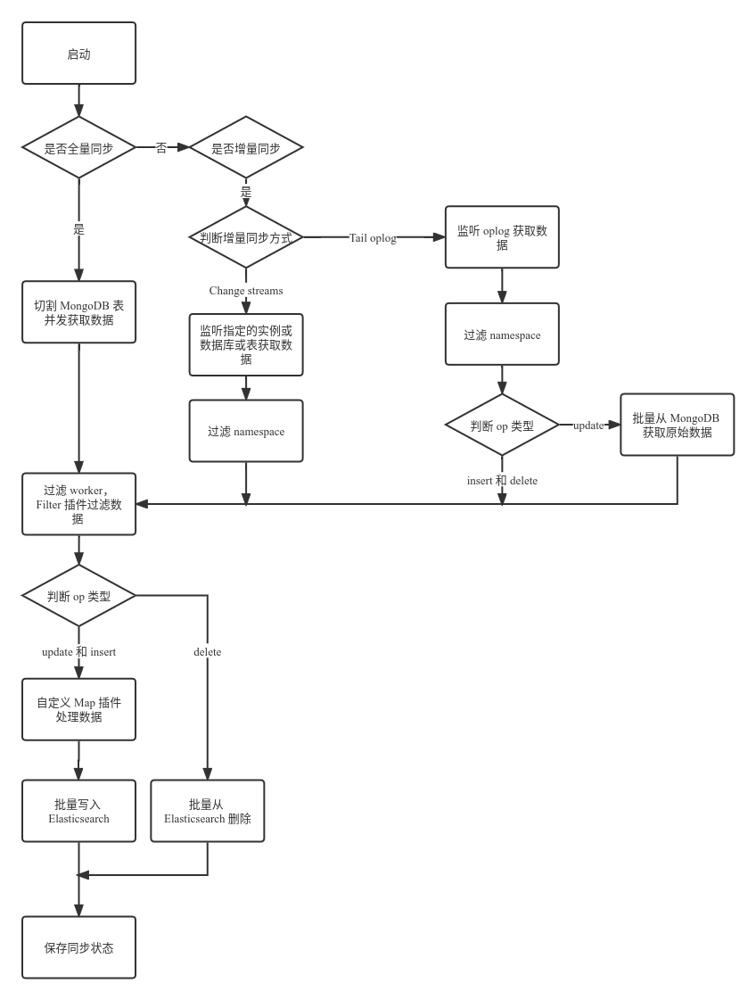

> [monstache](https://github.com/rwynn/monstache/)
> [monstache原理分析](https://zhuanlan.zhihu.com/p/571762195)
___

Monstache 是一个用 Go 语言编写的同步工具，用来将 MongoDB 中的数据同步到 Elasticsearch 中，支持全量同步、增量同步，提供丰富的配置参数并支持使用 Go、JavaScript 编写插件来自定义处理数据的逻辑。

### 全量同步

直接读取MongoDB中指定表的全部数据并写入到es中, 常用配置参数为 `direct-read-namespaces`、`direct-read-concur`、`direct-read-split-max`、`direct-read-stateful`，分别指定全量同步哪些表、同时同步的表的数量、每张表切分的最大次数、是否保存同步状态。

### 获取数据

Monstache 启动时，会执行 [startListen 方法](https://link.zhihu.com/?target=https%3A//github.com/rwynn/monstache/blob/v6.7.7/monstache.go%23L4707)，根据配置文件构建调用 [gtm](https://link.zhihu.com/?target=https%3A//github.com/rwynn/gtm)（go tail mongo）的参数，然后执行 `gtm.StartMulti()` 从 MongoDB 获取数据。

为了提高获取效率，Monstache 会将表切分（split）成多段（segment），默认最多切分 9 次，可以通过 `direct-read-split-max` 设置最大的切分次数。切分时 Monstache 会先获取表的总数据量，然后通过 [${表的总数据量} /（direct-read-split-max + 1）](https://link.zhihu.com/?target=https%3A//github.com/rwynn/gtm/blob/v2.1.0/gtm.go%23L1464) 计算出 `segmentSize`（每个 segment 的数据量）。当 `segmentSize < 5000` 时，不会执行切分（意味着过大的 `direct-read-split-max` 值可能导致表不被切分），否则 Monstache 执行 `db.collection.aggregate(["$match": sel, {"$sort": {"_id": 1}}, {"$skip": segmentSize}, {"$limit": 1}, {"$project": {"_id": 1}}])` 命令（首次执行时 `sel = {}`，第二次开始 `sel = {$gte: segment.min}`），得到 `segmentSize + 1` 处的 doc ID，将其赋给 `segment.max`，这样就确定了该段数据的范围（`segment = { splitKey: "_id", max: doc.Id, min: ${上一次切分后的 segment.max}}`），然后以 goroutine 的方式执行 [DirectReadSegment](https://link.zhihu.com/?target=https%3A//github.com/rwynn/gtm/blob/v2.1.0/gtm.go%23L1518) 方法读取该段数据，然后再将 `segment` 重置为 `{ splitKey: "_id", min: segment.max }`，继续执行 aggregate 方法切分表，每切分一次都会起一个 goroutine 去执行 `DirectReadSegment` 方法，当达到 `direct-read-split-max` 的值时停止切分，再起一个 goroutine 去执行 `DirectReadSegment` 方法读取最后一段数据，通过这种方式实现对表分段并发读取。

`DirectReadSegment` 方法执行时，通过 [(2 * 1024 * 1024) / stats.AvgObjectSize](https://link.zhihu.com/?target=https%3A//github.com/rwynn/gtm/blob/v2.1.0/gtm.go%23L1096) 计算出每次读取时的 batch size。另外根据 `segment` 的值构建[查询条件](https://link.zhihu.com/?target=https%3A//github.com/rwynn/gtm/blob/v2.1.0/gtm.go%23L1114)（首段数据查询条件为 `{ _id: {$lt: segment.max} }`，最后一段数据查询条件为 `{ _id: {$gte: segment.min}}`，其余段查询条件为 `{ _id: {$gte: segment.min}, {$lt: segment.max}}`），然后将他们作为 `db.collection.find()` 参数获取数据，然后通过获取到的数据构建好 op（operation，对所有写操作的抽象），根据 op ID 过滤出处理该 op 的 worker（详情见后文的说明），最后写入到 [OpC channel（用于存放获取到的 MongoDB 数据的 channel，Monstache 从其中获取 op 进行处理）中](https://link.zhihu.com/?target=https%3A//github.com/rwynn/gtm/blob/v2.1.0/gtm.go%23L1730)。
## 增量同步

增量同步是指 Monstache 使用 MognoDB change streams watch 表或者 tail oplog 的方式实时的将 MongoDB 数据的更新同步到 Elasticsearch 中。无论哪种方式，本质都是基于 MongoDB 复制集的 oplog 功能实现的。

### Change Streams
最新版本的 Monstache 默认使用 MongoDB change streams 功能（要求 MongoDB 版本至少是 3.6）来增量同步数据，通过 change-stream-namespaces 参数指定监听的范围，可以是实例级别，也可以是数据库或者表级别。

####  获取数据

当 change stream 监听多张表时，会分别 watch 每一张表，默认情况下，change stream 会从最新的 oplog 时间处启动，同时可以接受 startAt、startAfter、resumeAfter 等参数控制 watch 开始的时间点（从哪个时间的 op 开始），启动后相应表有任何写操作（增、删、改）都可以实时从 stream 上获取到，然后会根据 change doc 的类型分别构建好 op 数据，然后根据 op ID 过滤出处理该 op 的 worker，最后写入到 OpC channel 中，当遇到 invalidate 类型的 event 时，Monstache 会设置 startAfter = changeDoc.Id 然后重新启动新的 change stream 继续 watch，如果在 watch 过程中由于 MongoDB oplog 空间不足导致 stream 未处理的时间范围内的 oplog 丢失，change stream 会从当前时间点重新启动继续 watch。

#### 处理并同步数据

同全量同步一样，Monstache 轮询 OpC channel 获取 op，然后根据 op 的类型分别对其处理，如果是 drop collection 或者 drop database，默认情况下 Monstache 会删除 Elasticsearch 中对应的索引，可以通过设置 `dropped-collections = false` 和 `dropped-databases = false` 关闭这种行为。如果是 delete 类型，Monstache 会根据 `delete-strategy` 设置的删除策略来处理，默认为 0，即仅当在 Elasticsearch 中查询到该文档且只有一个时才会执行删除，如果是 update、insert 类型的 op，其处理逻辑同全量同步时一样。

### Tail oplog

可通过设置 `enable-oplog = true` 启用对 oplog 的 tail，设置该参数后，会关闭 change streams 功能，默认 tail 整个 MongoDB 实例的 insert、update、delete 以及 drop collection、drop database 类型的 op，可以通过 `namespace-regex` 参数过滤出指定表的 oplog。

#### 获取数据

Monstache 启动时，默认会获取 MongoDB 最新一条 oplog 的时间戳，然后将其作为查询条件，并设置 cursor type 为 TailableAwait 以从该时间开始持续 tail oplog，Monstache 会遍历所有指定时间后的 oplog，并根据所设置的 namespace-regex 以及其它条件过滤出需要被同步的 oplog，然后根据 oplog 构建好 op，根据 op ID 过滤出处理该 op 的 worker。如果是非 update 类型的 op 则直接写入到 OpC channel 中，如果是 update 类型的 op，由于 oplog 本身只包含被更新的字段，无法直接同步（每次同步都是对 Elasticsearch 中整个文档的更新），Monstache 会将这些 op 先放入单独的 channel 中，通过 FetchDocuments 方法去轮询该 channel，该方法先从 channel 中获取 op，然后将 op 添加到自己的 channel 中，当达到 gtm-settings 中设置的 buffer-size 或者 buffer-duration 后批量去 MongoDB 中获取这些 op 所对应的文档的最新完整版然后写入到 OpC channel 中，如果 tail 过程中由于 MongoDB oplog 空间不足导致未处理的时间范围内的 oplog 丢失，Monstache 会从当前第一条 oplog 的时间戳处继续 tail。

在获取到数据后，其后续的处理逻辑同 change streams 完全一样。