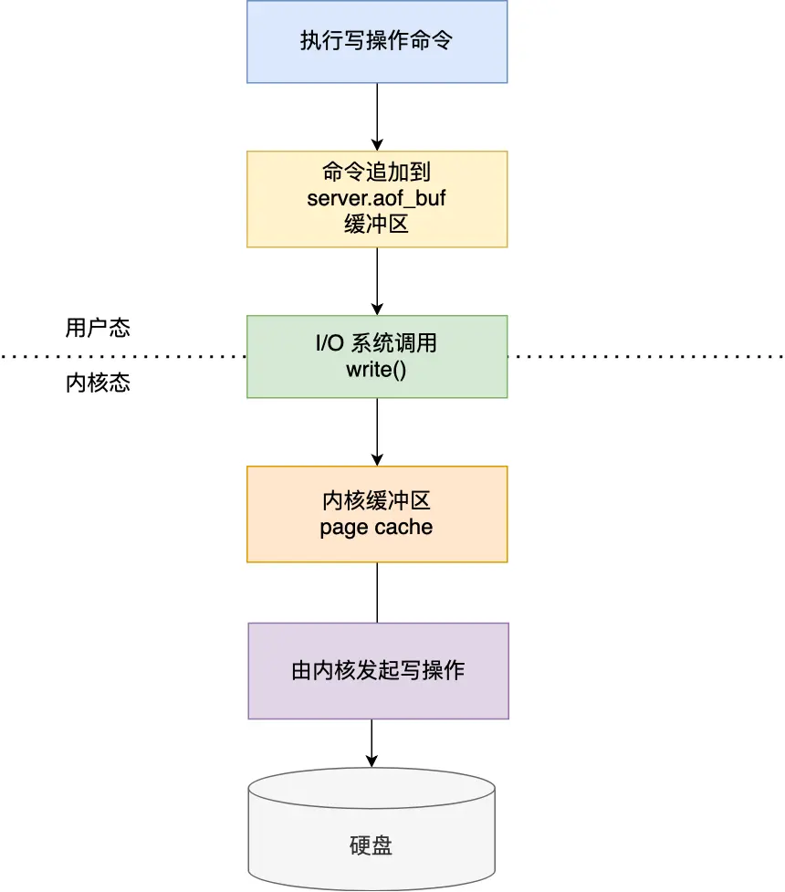
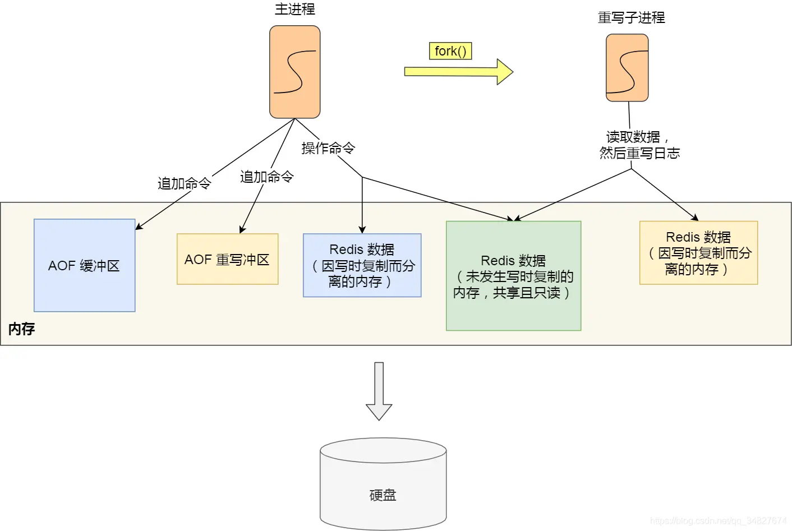

___

Redis共有三种持久化方式:
- AOF日志: 每执行一条写操作，就把该命令以追加的方式写入到一个文件里
- RDB快照: 将某一时刻的内存数据，以二进制的方式写入磁盘
- 混合持久化方式: Redis4.0新增方式，集成AOF和RDB的优点

## AOF

Redis在执行完一条写操作命令后，就会把该命令以追加的方式写入到一个文件里，然后Redis重启时，就会读取该文件记录的命令，然后逐一执行命令来进行数据恢复

默认不开启, 开启需要修改redis.conf配置文件中的appendonly参数

文件内容格式, 以set name test为例
```
# 表示命令有三个部分
*3
# 每个部分的长度
$3
# 每个部分的具体内容
set
$4
name
$7
set
```

Redis是先执行写操作命令后，再把命令记录到AOF日志里的
- 优点
	- 避免额外的检查开销: 如果先记录写操作，再实现命令的话，如果不进行语法命令检查且语法有问题，那么恢复时就可能出错
	- 不会阻塞当前写操作命令的执行: 因为当写操作命令执行成功后，才会将命令记录到日志中
- 风险
	- 数据可能丢失: 执行写操作命令和记录日志是两个过程，当Redis在还没来得及将命令写入磁盘时，如果服务器宕机了，则该数据就会丢失
	- 阻塞其他操作: 由于写操作命令执行成功后才记录到AOF日志，所以不会阻塞当前命令的执行，但是AOF也是在主线程中执行，当Redis把日志写入磁盘时，会阻塞后续操作


### AOF写入过程

1. Redis执行完写操作命令后，会将命令追加到server.aof_buf缓冲区
2. 然后通过write()系统调用, 将aof_buf缓冲区的数据写入到AOF文件，此时数据并没有写入到硬盘，而是拷贝到了内核缓冲区page cache，等待内核将数据写入
3. 内核缓冲区具体什么时候写入硬盘由内核决定

### AOF写入策略

fsync()函数,将内核缓冲区数据强制写入硬盘, 不同策略就是不同位置调用fsync函数

- Always 同步写回, 每次执行写操作后都同步AOF日志数据
	- 优点: 可靠性高，最大程度保证不会丢失
	- 缺点: 每个命令都要写回硬盘, 性能开销大
	- fsync: 每次都调用
- Everysec 每秒写回, 每次执行写操作后将命令写入AOF文件的内核缓冲区，每隔一秒将缓冲区里的内容写会到磁盘
	- 优点: 性能适中
	- 缺点: 宕机时会丢失1s内的数据
	- fsync: 异步任务, 每秒执行一次
- No 异步写回, 交由操作系统控制写回的时机，写操作后命令写入内核的缓冲区，由操作系统决定何时写回硬盘
	- 优点: 性能好
	- 缺点: 宕机时丢失的数据会更多
	- fsync: 永不执行fsync


### AOF 重写机制

AOF日志是一个文件，随着执行的写操作命令越来越多，文件的大小会越来越大，从而影响性能，如文件过大，重启后恢复过程慢。当AOF文件的大小超过设定的阈值后，Redis会启用AOF重写机制来压缩AOF文件。

AOF重写只会保留每个键最新的值, 忽略了历史记录, 从而实现压缩AOF文件目的

AOF重写机制是在重写时，读取当前数据库中的所有键值对，然后将每一个键值对用命令记录到新的AOF文件。

重写由bgwriteaof进程完成，不影响主线程。这样有两个好处
- 子进程重写AOF期间, 主进程可以继续除了命令, 避免阻塞主进程
- 子进程带有主进程的数据副本(若使用线程会共享内存, 需要加锁导致性能降低)

主进程在fork生成bgwriteaof子进程时, 操作系统会把主进程的页表复制一份给子进程, 有着相同的虚拟地址和物理地址映射关系, 但是不复制物理内存.
页表对应的物理内存为只读. 当父进程或子进程向这个位置发起写操作时, 会触发写保护中断, 随后操作系统会在中断处理函数中进行物理内存的复制, 重写设置映射关系与读写权限, 即写时复制.

页表复制开销远小于批量物理内存复制, 所以写时复制减少了fork过程的阻塞时间. 父进程阻塞位置有
- 页表拷贝
- 物理内存写时复制


为了避免重写时主线程数据修改导致的数据不一致, Redis会设置一个AOF重写缓冲区，新的命令会被同时写入AOF缓冲区和AOF重写缓冲区。当子进程完成AOF重写工作后会向主进程发送一条信号，主进程收到信号后会调用一个信号处理函数，然后将AOF重写缓冲区的内容追加到新的AOF文件中，并用新的AOF文件覆盖现有文件

## RDB快照

记录某一个瞬间的内存数据(全量快照)，恢复时效率更高

Redis提供了两个命令来主动生成RDB文件
- save: 主线程生成RDB文件，阻塞
- bgsave: 子进程来生成RDB文件，不阻塞

配置文件的规则触发RDB快照
```
save 900 1
save 300 10
save 60 10000
```
只要满足上面条件的任意一个，就会执行 bgsave，它们的意思分别是：
- 900 秒之内，对数据库进行了至少 1 次修改；
- 300 秒之内，对数据库进行了至少 10 次修改；
- 60 秒之内，对数据库进行了至少 10000 次修改。

RDB生成时，执行写操作，数据会写时复制，最终保存的都是fork那一刻的数据，不会不一致。

RDB加载工作在服务器启动时自动执行

执行快照是一个较重的操作, 过于频繁会导致性能下降, 且宕机时RDB丢失的数据相对AOF更多
## 混合持久化

需要通过配置文件开启

混合持久化工作在AOF日志重写过程，当开启了混合持久化后，AOF重写日志时，子进程会先将共享数据以RDB方式写入到AOF文件中，然后主线程的增量命令会以AOF的方式写入文件，子进程写入结束后将含有RDB格式和AOF格式的AOF文件替换旧的AOF文件
- 优点: 结合RDB和AOF的优点，启动快，降低大量数据丢失的风险
- 缺点: AOF可读性变差，兼容性差不支持4.0以前版本

## 大key对持久化的影响

对AOF来说:
- Always: 阻塞时间长, 降低性能
- Everysc: 异步执行fsync函数, 不怎么影响
- No: 不影响主线程

对AOF重写与RDB快照

大key占用页表多, 写时复制时间也更长

我们可以执行 `info` 命令获取到 latest_fork_usec 指标，表示 Redis 最近一次 fork 操作耗时。
```
# 最近一次 fork 操作耗时
latest_fork_usec:315
```
如果 fork 耗时很大，比如超过1秒，则需要做出优化调整：
- 单个实例的内存占用控制在 10 GB 以下，这样 fork 函数就能很快返回。
- 如果 Redis 只是当作纯缓存使用，不关心 Redis 数据安全性问题，可以考虑关闭 AOF 和 AOF 重写，这样就不会调用 fork 函数了。
- 在主从架构中，要适当调大 repl-backlog-size，避免因为 repl_backlog_buffer 不够大，导致主节点频繁地使用全量同步的方式，全量同步的时候，是会创建 RDB 文件的，也就是会调用 fork 函数。