___
## 键值对数据库是如何实现的

Redis使用一个哈希表存储所有的键值对, 哈希桶中存储的是指向键值对value的指针(dictEnrty*), 键值对的数据结构中并不是直接保存值本身，而是保存了 void * key 和 void * value 指针，分别指向了实际的键对象和值对象
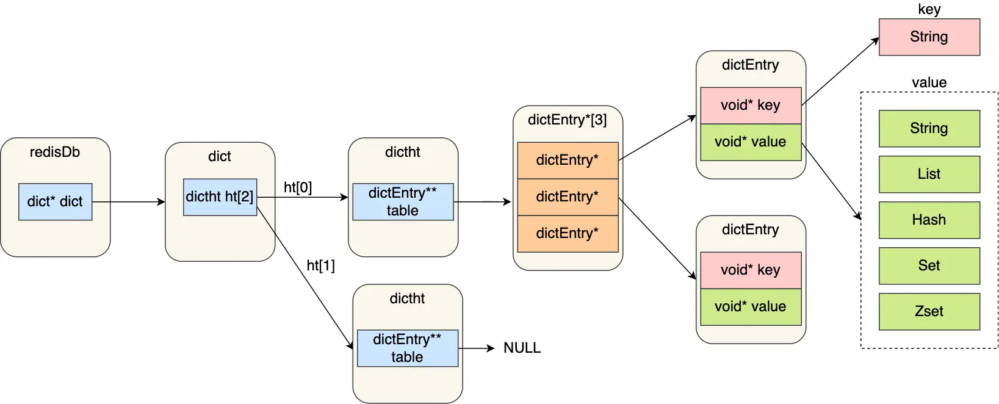
- redisDb 结构，表示 Redis 数据库的结构，结构体里存放了指向了 dict 结构的指针；
- dict 结构，结构体里存放了 2 个哈希表，正常情况下都是用「哈希表1」，「哈希表2」只有在 rehash 的时候才用，具体什么是 rehash，本文的哈希表数据结构会讲；
- ditctht 结构，表示哈希表的结构，结构里存放了哈希表数组，数组中的每个元素都是指向一个哈希表节点结构（dictEntry）的指针；
- dictEntry 结构，表示哈希表节点的结构，结构里存放了 void \*key 和 void \*value 指针， key 指向的是 String 对象，而 value 则可以指向 String 对象，也可以指向集合类型的对象，比如 List 对象、Hash 对象、Set 对象和 Zset 对象。

void * key 和 void * value 指针指向的是 Redis 对象，Redis 中的每个对象都由 redisObject 结构表示，如下图：
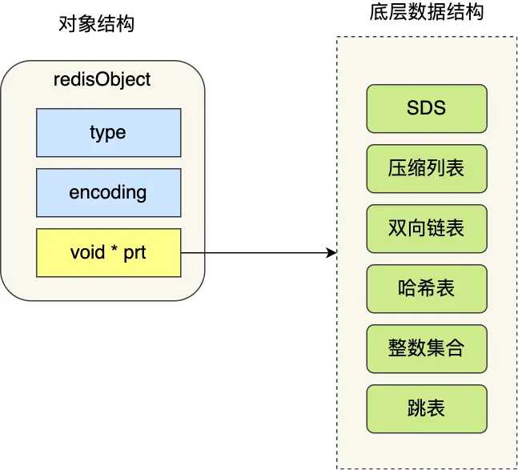
- type，标识该对象是什么类型的对象（String 对象、 List 对象、Hash 对象、Set 对象和 Zset 对象）；
- encoding，标识该对象使用了哪种底层的数据结构；
- **ptr，指向底层数据结构的指针**。

## 数据类型

| 结构类型   | 结构存储的值          | 结构的读写能力                                 |
| ------ | --------------- | --------------------------------------- |
| String | 字符串、整数、浮点数      | 对字符串进行操作，对整数或浮点数进行自增自减操作                |
| List   | 一个链表，每个节点上包含字符串 | 对链表的两端进行push和pop操作，读取单个或多个元素，根据值查找或删除元素 |
| Set    | 包含字符串的无序集合      | 字符串的集合，查找、获取、添加、删除外还能计算交集、并集、差集         |
| Hash   | 包含键值对的无序散列表     | 添加、获取、删除单个元素                            |
| Zset   | 和散列一样，存储简直对     | 字符串成员与浮点数分数之间的有序映射；元素排列顺序由分数大小决定；       |
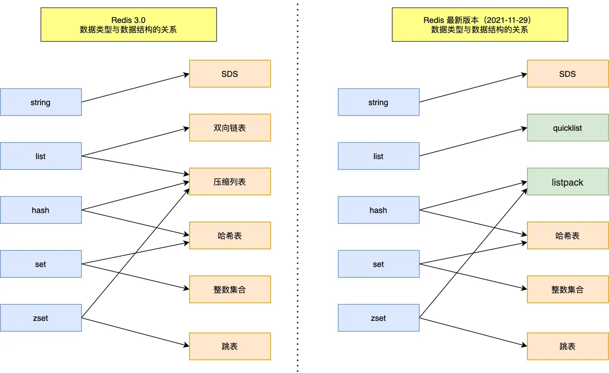
## String

最基本的key-value结构, key时唯一标识, value是值, 最多可容纳数据为512M
### 内部实现 

底层数据结构基于int 和 SDS(简单动态字符串)

- C语言字符串的缺陷
	- 本质是字符数组, 由空字符'\0'结尾, 导致不能存储空字符串(不能保存二进制数据)
	- 获取字符串长度时间复杂度高, 拼接字符串效率也低
	- 不记录本身的缓冲区大小, 容易造成溢出, 不安全
- SDS数据结构
	- 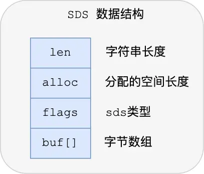
	- **len，记录了字符串长度**。这样获取字符串长度的时候，只需要返回这个成员变量值就行，时间复杂度只需要 O（1）。
	- **alloc，分配给字符数组的空间长度**。这样在修改字符串的时候，可以通过 `alloc - len` 计算出剩余的空间大小，可以用来判断空间是否满足修改需求，如果不满足的话，就会自动将 SDS 的空间扩展至执行修改所需的大小，然后才执行实际的修改操作，所以使用 SDS 既不需要手动修改 SDS 的空间大小，也不会出现前面所说的缓冲区溢出的问题。
	- **flags，用来表示不同类型的 SDS**。一共设计了 5 种类型，分别是 sdshdr5、sdshdr8、sdshdr16、sdshdr32 和 sdshdr64，后面在说明区别之处。
	- **buf[]，字节数组，用来保存实际数据**。不仅可以保存字符串，也可以保存二进制数据。
- SDS优势
	- O(1)复杂度获取字符串长度
	- 不使用'\0', 二进制安全
	- alloc管理, 不会发生缓冲区溢出, 缓冲区大小不够时自动扩容
	- 节省内存空间, flags有不同的五种值sdshdr5、sdshdr8、sdshdr16、sdshdr32 和 sdshdr64, 且使用编译优化, 避免了字节对齐, 减少了内存碎片
	- 扩容规则, 有效减少内存分配次数
```c
hisds hi_sdsMakeRoomFor(hisds s, size_t addlen)
{
    ... ...
    // s目前的剩余空间已足够，无需扩展，直接返回
    if (avail >= addlen)
        return s;
    //获取目前s的长度
    len = hi_sdslen(s);
    sh = (char *)s - hi_sdsHdrSize(oldtype);
    //扩展之后 s 至少需要的长度
    newlen = (len + addlen);
    //根据新长度，为s分配新空间所需要的大小
    if (newlen < HI_SDS_MAX_PREALLOC)
        //新长度<HI_SDS_MAX_PREALLOC 则分配所需空间*2的空间
        newlen *= 2;
    else
        //否则，分配长度为目前长度+1MB
        newlen += HI_SDS_MAX_PREALLOC;
       ...
}
// 如果所需的 sds 长度小于 1 MB，那么最后的扩容是按照翻倍扩容来执行的，即 2 倍的newlen
// 如果所需的 sds 长度超过 1 MB，那么最后的扩容长度应该是 newlen + 1MB。
```


string编码方式有三种int, raw, embstr


- int: 若存储整数值, 且可以用long表示, 数据会存在字符串对象结构的ptr中
	- 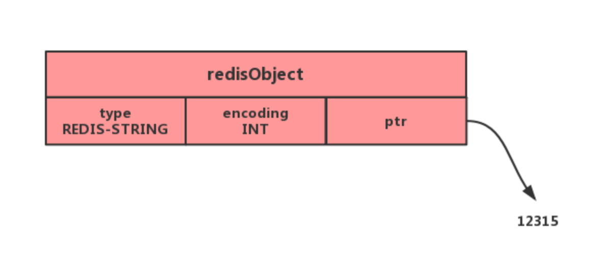
-  embstr: 若存储较短的字符串(不同版本边界不一致), 字符串对象将使用一个简单动态字符串SDS来保存. 一次内存分配函数分配一块连续的内存空间来保存redisObject和SDS.
	- 优势: 减少内存分配次数和释放次数. 空间局部性, 提升缓存性能
	- 缺点: embstr实际上是只读的, 长度增加时需要重新分配内存.所以修改时都是先转换成raw, 再执行修改
	- 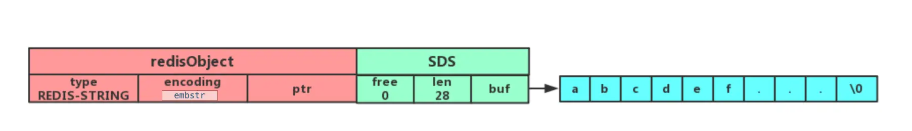
- raw: 若存储较长字符串, prt指向一个SDS
	- 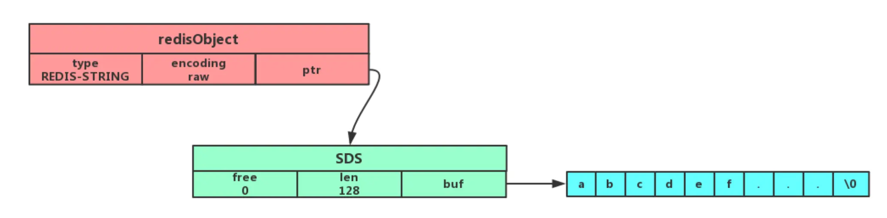
### 常用命令
```shell
-- 普通字符串操作
# 设置值
SET name value
# 不存在时插入
SETNX key value
# 获取值
GET name
# 判断是否存在
EXISTS name
# 返回字符串长度
STRLEN name
# 删除key
DEL

-- 批量字符串操作
# 批量设置
MSET key1 value1 key2 value2
# 获取多个key
MGET key1 key2
1) "value1"
2) "value2"

-- 计数器, 字符串内容为整数时使用
# 将key的值加一
INCR key
# 增加指定值
INCRBY key num
# 值减一
DECR key
# 减指定值
DECRBY key num

-- 设置过期, 默认永不过期
# 设置time秒后过期
EXPIRE key time
# 创建时设置过期
SET key value EX time
```

### 常见场景: 
- 缓存对象
	- 直接缓存JSON
	- 通过key分离成user:ID:属性
- 常规计数
	- Redis处理命令是单线程的, 所有操作过程是原子的, 适合用于计数, 如访问次数, 点赞, 转发, 库存数量等
- 分布式锁
	- SET命令有NX参数可以实现不存在才插入, 可以用来实现分布式锁
	- 若key不存在, 插入成功, 即加锁成功
	- 若key存在, 插入失败, 加锁失败
	- ```SET lock_key unique_value NX PX 10000```
		- lock_key 就是key
		- unique_value是客户端的唯一标识
		- NX标识不存在时才操作
		- PX设置过期时间, 单位ms, 避免客户端异常无法释放锁
	- 释放锁就是删除key, 要保证执行操作的客户端就是加锁的客户端, 所以解锁前需要先判断unique_value是否正确. 解锁有两个操作需要用Lua脚本保证原子性
```
// 释放锁时，先比较 unique_value 是否相等，避免锁的误释放
if redis.call("get",KEYS[1]) == ARGV[1] then
    return redis.call("del",KEYS[1])
else
    return 0
end
```
- 共享session信息
	- 分布式系统保存用户会话状态需要多个服务间共享

## List

### 内部实现

底层数据结构由双向链表或压缩列表实现
- 如果列表的元素小于512个, 每个元素都小于64字节, 则使用压缩列表(ziplist)
- 不满足上述条件, 则使用双向链表(linkedlist)
- 但是在Redis3.2之后只使用quicklist实现
- 7.0版本后使用listpack代替zipllist

#### 双端链表 linkedlist

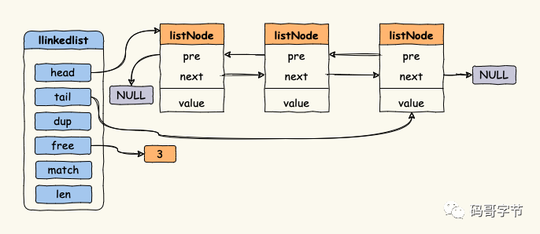

```c
typedef struct listNode {
    // 前驱节点
    struct listNode *prev;
    // 后驱节点
    struct listNode *next;
    // 指向节点的值
    void *value;
} listNode;

typedef struct list {
    // 头指针
    listNode *head;
    // 尾指针
    listNode *tail;
    // 节点值的复制函数
    void *(*dup)(void *ptr);
    // 节点值释放函数
    void (*free)(void *ptr);
    // 节点值比对是否相等
    int (*match)(void *ptr, void *key);
    // 链表的节点数量
    unsigned long len;
} list;
```
优点:
- 双向无环链表, 可以双向遍历
- 获取头尾也是O(1)
- 链表节点可以保存不同的类型
问题: 
- 对于小数据而言, 指针占用空间比数据占用空间大, 内存开销大
- 内存中不连续, 遍历速度慢

#### 压缩列表 ziplist

连续内存块组成的顺序型数据结构
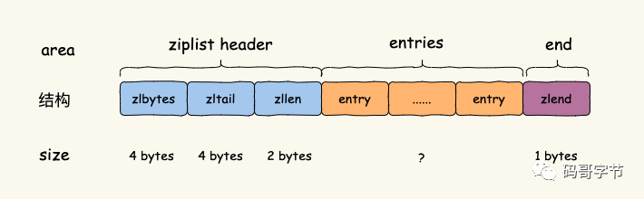
- zlbytes，占用 4 个字节，记录了整个 ziplist 占用的总字节数。
- zltail，占用 4 个字节，指向最后一个 entry 偏移量，用于快速定位最后一个 entry。
- zllen，占用 2 字节，记录 entry 总数。
- entry，列表元素。
- zlend，ziplist 结束标志，占用 1 字节，值等于 255。
查找首尾元素时均为O(1), 查找中间元素是为O(n)

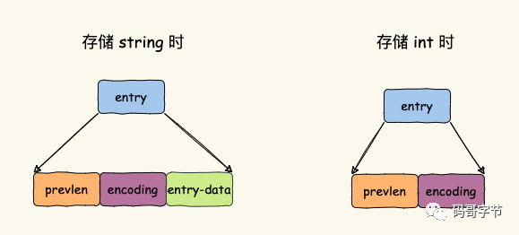
- prevlen:记录前一个 entry 占用字节数，能实现逆序遍历就是靠这个字段确定往前移动多少字节拿到上一个 entry 首地址。
	这部分会根据上一个 entry 的长度进行变长编码（为了节省内存操碎了心），变长方式如下。
	- 前一个 entry 的字节大小小于 254（255 用于 zlend），prevlen 长度为 1 字节，值等于上一个 entry 的长度。
	- 前一个 entry 的字节大小大于等于 254，prevlen 占用 5 字节，第一个字节设置为 254 作为一个标识，后面四字节组成一个 32 位的 int 值，用于存放上一个 entry 的字节长度。
- encoding: 简言之用于表示当前 entry 的类型和长度，当前 entry 的长度和值是根据保存的是 int 还是 string 以及数据的长度共同来决定。前两位用于表示类型，当前两位值为 “11” 则表示 entry 存放的是 int 类型数据，其他表示存储的是 string。
- entry-data: 实际存放数据的区域，需要注意的是，如果 entry 中存储的是 int 类型，encoding 和 entry-data 会合并到 encoding 中，没有 entry-data 字段。
- 优势: 内存连续, 查询快; 不同长度采用不同的编码, 节省内存开销
- 劣势: 不能保存过大的元素, 否则查询效率低. 新增或修改某个元素时会有连锁更新问题

连锁更新问题:
每个 entry 都用 prevlen 记录了上一个 entry 的长度，从当前 entry B 前面插入一个新的 entry A 时，会导致 B 的 prevlen 改变，也会导致 entry B 大小发生变化。entry B 后一个 entry C 的 prevlen 也需要改变。以此类推，就可能造成了连锁更新。
连锁更新问题会导致多次分配内存, 导致插入性能变差

#### quicklist

结合了ziplist和linkedlist, 本质上还是链表不过每个节点是一个ziplist

```c
typedef struct quicklist {
    //quicklist的链表头
    quicklistNode *head;      //quicklist的链表头
    //quicklist的链表尾
    quicklistNode *tail; 
    //所有压缩列表中的总元素个数
    unsigned long count;
    //quicklistNodes的个数
    unsigned long len;       
    ...
} quicklist;

typedef struct quicklistNode {
    //前一个quicklistNode
    struct quicklistNode *prev;     //前一个quicklistNode
    //下一个quicklistNode
    struct quicklistNode *next;     //后一个quicklistNode
    //quicklistNode指向的压缩列表
    unsigned char *zl;              
    //压缩列表的的字节大小
    unsigned int sz;                
    //压缩列表的元素个数
    unsigned int count : 16;        //ziplist中的元素个数 
    ....
} quicklistNode;
```
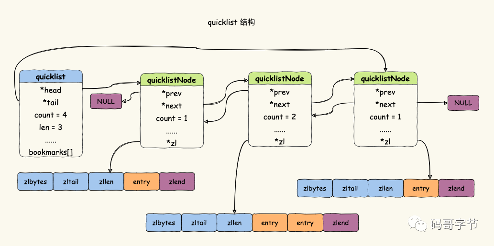
- 优化的关键是每个节点的大小, 过小的话退化成linkedlist, 碎片多, 过大的话退化成ziplist, 连续更新问题
- 添加元素时, 不直接创建节点, 而是判断添加位置的压缩列表是否有空余
- 没有完全解决连锁更新问题
#### listpack

代替ziplist, 不在包含前一个节点的长度

仍然使用连续的内存空间保存数据, 不同大小数据使用不同的编码方式
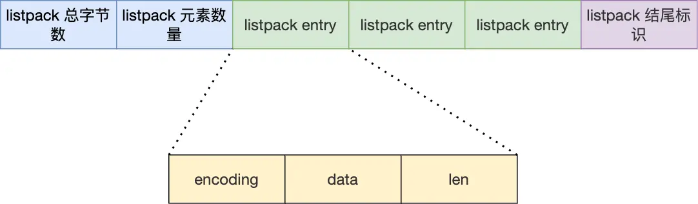
- encoding，定义该元素的编码类型，会对不同长度的整数和字符串进行编码；
- data，实际存放的数据；
- len，encoding+data的总长度；
### 常用命令

```Lua
# 依次将一个或多个值value插入到key列表的左侧, 最后的值在最前面
LPUSH key value [value...]
# 依次将一个或多个值value插入到key列表的末尾
RPUSH key value [value...]
# 移除头元素
LPOP key
# 移除为元素
RPOP key
# 获取指定区间的元素
LRANGE key start stop
# 从列表头弹出一个元素, 没有则阻塞timeout秒, timeout=0则一直阻塞
BLPOP key [key...] timeout
# 从列表尾弹出一个元素, 没有则阻塞timeout秒, timeout=0则一直阻塞
BRPOP kye [key...] timeout
```
### 常见场景:
- 消息队列
	- 消息队列获取消息时必须满足三个需求: 
	- 消息保序
		- List本身就是先进先出, 且处理读写是单线程的, 所以消息一定有序
		- 不过无法主动通知消费者有新的消息, 所以消费者必须不断调用RPOP轮询, 除非使用BRPOP命令阻塞
	- 处理重复消息
		- 消费者要实现重复消息的判断, 每个消息要有一个全局ID, 消费者要记录处理过的所有消息ID, 每当收到一条消息后, 消费者可以判断ID是否处理过
		- 但是List不会自动生成ID号, 所以必须自行生成
	- 保证消息可靠性
		- List读取消息后就不会保存了, 如果处理失败就会导致消息丢失.
		- BRPOPLPUSH命令, 让消费者从List读取消息, 同时Redis将消息插入备份List留存. 即使处理失败也可以重新读取消息并进行处理
	- 缺陷: List无法实现多个消费者消费同一条消息, 即不支持消费组

## Hash

### 底层实现
- 底层数据结构由压缩列表或哈希表实现
- 若元素小于512个, 所有值小于64字节, 则使用压缩列表
- 若不满足, 则使用哈希表
- 7.0中压缩列表被listpack替换

- 优点: 用O(1)查询
- 缺点: 数据变多后, 哈希冲突的可能性会变大

```c
typedef struct dictht {
    //哈希表数组
    dictEntry **table;
    //哈希表大小
    unsigned long size;  
    //哈希表大小掩码，用于计算索引值
    unsigned long sizemask;
    //该哈希表已有的节点数量
    unsigned long used;
} dictht;

typedef struct dictEntry {
    //键值对中的键
    void *key;
  
    //键值对中的值
    union {
        void *val;
        uint64_t u64;
        int64_t s64;
        double d;
    } v;
    //指向下一个哈希表节点，形成链表
    struct dictEntry *next;
} dictEntry;
```
使用链式hash解决hash冲突
但是随着数据的增加, 耗时会越来越长, 所以会有rehash
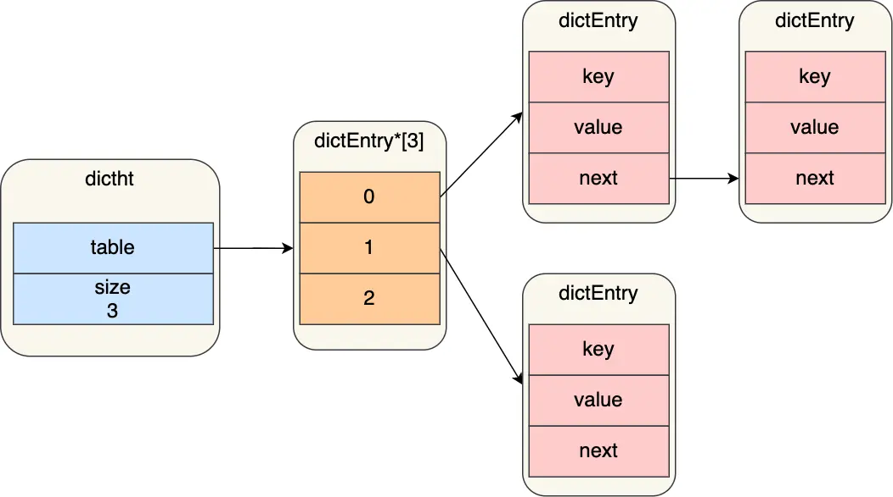

#### rehash

解决链式hash太长导致查询效率变低的缺点
dict中有两个hash表, 正常请求阶段, 插入的数据都会写入hash1, hash2没有分配空间.
随着数据增多会触发rehash操作, 过程分为三步
- 给hash2分配空间, 一般是hash1的两倍
- 将hash1中的数据迁移到hash2中
- 释放hash1的空间, 将hash1指向hash2, hash2恢复空白, 等待下一次refresh
缺陷: hash中数据较多时, 迁移数据可能会造成较长时间的阻塞

#### 渐进式rehash

为了避免rehash过程中, 因拷贝数据的耗时影响redis, 所以Redis采用了渐进式hash, 将数据拆分为多次. 步骤如下
- hash2分配空间
- rehash期间, 每次hash元素进行新增, 删除, 查找或者更新操作时, Redis除了会执行对应操作外, 还会顺序将hash1中所有位置上所有的key-value迁移到hash2上
- 随着客户端发起的hash操作请求数量增加, 最终会把hash1的所有kv迁移到hash2上
此时每次查找都会在hash1和hash2中进行, 一定程度上降低了性能, 但是不多

#### rehash触发条件

负载因子 = 已保存节点数量 / 哈希表大小

- 当负载因子大于等于1, 且Redis没有执行bgsave命令和bgrewriteaof命令就会执行
- 当负载因子大于5时, 说明哈希冲突非常严重了, 强制执行rehash

### 常用命令

```lua
# 设置一个哈希表的键值对
HSET key field value
# 获取哈希表field对应的值
HGET key field
# 设置多个键值对
HMSET key field value [field value...]
# 获取多个值
HMGET key field [filed...]
# 删除一个或多个键值对
HDEL key field [field...]
# 返回键值对数量
HLEN key
# 返回所有的键值对
HGETALL key
# 将field对应的值增量n
HINCRBY key field n
```

### 常见场景:
- 缓存对象: 一个对象作为一个哈希表, 用来存储属性变化频繁的对象
- 购物车: 用户作为key, 商品id时field, 数量为value

## Set

无序且唯一的键值集合, 存储顺序和插入顺序无关, 最多存储2^32-1个元素, 可以进行集合运算

### 底层实现

哈希表或整数集合实现的
- 元素都是整数且小于512个使用整数集合
- 不满足上述条件则使用哈希表

#### 整数集合

(整数集合好像没法O(1)的判断是否存在, 应该是保证有序性然后二分查找的)
本质上一块连续的存储空间, contents存储元素的类型由encoding属性决定
```c
typedef struct intset {
    //编码方式
    uint32_t encoding;
    //集合包含的元素数量
    uint32_t length;
    //保存元素的数组
    int8_t contents[];
} intset;
```

整数集合的升级

当新元素加入到整数集合里, 如果新元素的类型比整数集合现有的所有元素类型都要长时, 整数集合需要先进行升级, 也就是所有的元素都按新元素扩展contents的空间大小, 然后再插入新元素. 升级的过程也需要保证元素的有序.
升级时, 不会分配新的数组, 而是在原数组上扩展空间, 然后将每个元素按间隔类型大小分割
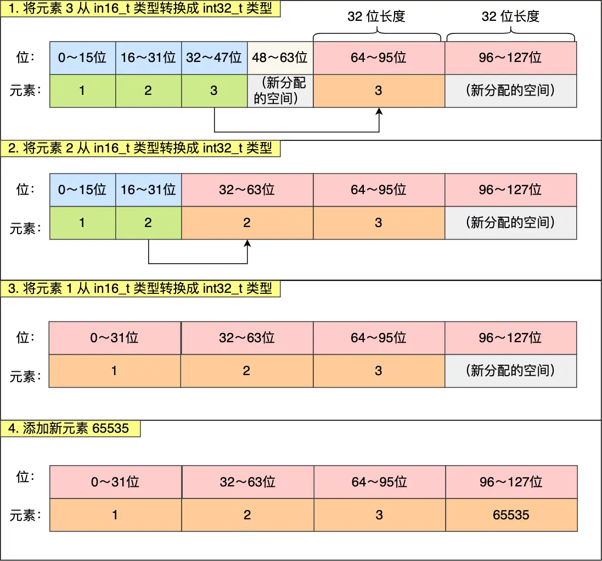
- 作用: 节省内存, 在需要时才升级
- 但是不支持降级


### 常用命令

```lua
# 存入元素
SADD key member [member ...]
# 删除元素
SREM key member [member ...]
# 获取集合中的所有元素
SMEMBERS key
# 获取集合中元素个数
SCARD key
# 判断是否存在
SISMEMBER key member
# 从集合key中随机选择count个元素, 不删除
SRANDMEMBER key [count]
# 从集合key中随机选择count个元素, 删除
SPOP key [count]

-- 集合运算
# 交集运算
SINTER key [key ...]
# 交集的结果存入destination中
SINTERSTORE destination key [key ...]
# 并集运算
SUNION key [key ...]
# 并集结果存入destination
SUNIONSTORE destination key [key ...]
# 差集运算
SDIFF key [key ...]
# 差集结果存入destination
SDIFFSTORE destination key [key ...]
```
### 常见场景:
- 集合用于适合保障数据的唯一性和去重, 还可以进行集合运算. 但是集合运算复杂度较高, 数据量大时容易阻塞
- 点赞: 一个用户只点一个赞
- 共同关注: 集合运算出共同关注等
- 抽奖活动, 去重避免重复中奖(SPOP)

## Zset

有序集合, 相比Set多了个排序属性score, 每个存储元素有两个值组成, 一个有序集合的元素值, 一个排序值.
元素值不能重复, 但是排序值可以重复

### 底层实现

由压缩列表或跳表实现
- 元素个数小于128个且元素值小于64字节时, 使用压缩列表
- 不满则时, 则使用跳表

#### 跳表

Redis中只有Zset用到了跳表, 优势是能平均O(logN)的查找
zset中由一个hash表和一个跳表, 既能高效的范围查询, 也能高效的单点查询(获取权重)
```c
typedef struct zset {
    dict *dict;
    zskiplist *zsl;
} zset;
```

zset对象在插入数据或更新数据时, 会依次在跳表和hash表中执行相应操作.

跳表是多层的有序链表, 能通过高层的遍历大幅缩短时间
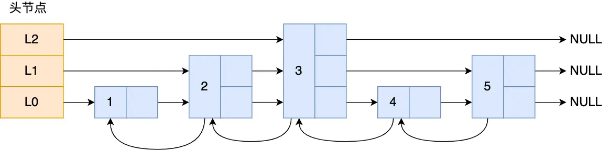

```c
typedef struct zskiplistNode {
    //Zset 对象的元素值
    sds ele;
    //元素权重值
    double score;
    //后向指针, 便于倒序遍历
    struct zskiplistNode *backward;
  
    //节点的level数组，保存每层上的前向指针和跨度
    struct zskiplistLevel {
        struct zskiplistNode *forward;
        // 跨度用于计算这个节点的排位(遍历时累加)
        unsigned long span;
    } level[];
} zskiplistNode;

typedef struct zskiplist {
    struct zskiplistNode *header, *tail;
    unsigned long length;
    int level;
} zskiplist;
```

- 跳表的头尾节点，便于在O(1)时间复杂度内访问跳表的头节点和尾节点；
- 跳表的长度，便于在O(1)时间复杂度获取跳表节点的数量；
- 跳表的最大层数，便于在O(1)时间复杂度获取跳表中层高最大的那个节点的层数量；

查询过程
从头节点最高层开始, 遍历某层的一个节点时, 会进行判断
- 若权重小于target权重, 则查询该层下一个节点
- 若等于target权重且当前SDS类型数据小于要查找的数据时, 访问该层的下一个节点
如果上面两个条件都不满足，或者下一个节点为空时，跳表就会使用目前遍历到的节点的 level 数组里的下一层指针，然后沿着下一层指针继续查找，这就相当于跳到了下一层接着查找。

层数设置
相邻层的节点数量比会影响查询性能, 最理想的是1/2, 复杂度为O(logN)
如果采用新增节点或者删除节点时，来调整跳表节点以维持比例的方法的话，会带来额外的开销。

Redis 则采用一种巧妙的方法是，**跳表在创建节点的时候，随机生成每个节点的层数**，并没有严格维持相邻两层的节点数量比例为 2 : 1 的情况。

具体的做法是，**跳表在创建节点时候，会生成范围为[0-1]的一个随机数，如果这个随机数小于 0.25（相当于概率 25%），那么层数就增加 1 层，然后继续生成下一个随机数，直到随机数的结果大于 0.25 结束，最终确定该节点的层数**。

为什么不使用平衡树
- **从内存占用上来比较，跳表比平衡树更灵活一些**。平衡树每个节点包含 2 个指针（分别指向左右子树），而跳表每个节点包含的指针数目平均为 1/(1-p)，具体取决于参数 p 的大小。如果像 Redis里的实现一样，取 p=1/4，那么平均每个节点包含 1.33 个指针，比平衡树更有优势。
- **在做范围查找的时候，跳表比平衡树操作要简单**。在平衡树上，我们找到指定范围的小值之后，还需要以中序遍历的顺序继续寻找其它不超过大值的节点。如果不对平衡树进行一定的改造，这里的中序遍历并不容易实现。而在跳表上进行范围查找就非常简单，只需要在找到小值之后，对第 1 层链表进行若干步的遍历就可以实现。
- **从算法实现难度上来比较，跳表比平衡树要简单得多**。平衡树的插入和删除操作可能引发子树的调整，逻辑复杂，而跳表的插入和删除只需要修改相邻节点的指针，操作简单又快速
### 常用命令

```lua
# 往有序集合key中加入带分值元素
ZADD key score member [score member]...

# 往有序集合key中删除元素
ZREM key member [member...]                 
# 返回有序集合key中元素member的分值
ZSCORE key member
# 返回有序集合key中元素个数
ZCARD key 
# 为有序集合key中元素member的分值加上increment
ZINCRBY key increment member 
# 正序获取有序集合key从start下标到stop下标的元素
ZRANGE key start stop [WITHSCORES]
# 倒序获取有序集合key从start下标到stop下标的元素
ZREVRANGE key start stop [WITHSCORES]
# 返回有序集合中指定分数区间内的成员，分数由低到高排序。
ZRANGEBYSCORE key min max [WITHSCORES] [LIMIT offset count]
# 返回指定成员区间内的成员，按字典正序排列, 分数必须相同。
ZRANGEBYLEX key min max [LIMIT offset count]
# 返回指定成员区间内的成员，按字典倒序排列, 分数必须相同
ZREVRANGEBYLEX key max min [LIMIT offset count]
# 并集计算(相同元素分值相加)，numberkeys一共多少个key，WEIGHTS每个key对应的分值乘积
ZUNIONSTORE destkey numberkeys key [key...] 
# 交集计算(相同元素分值相加)，numberkeys一共多少个key，WEIGHTS每个key对应的分值乘积
ZINTERSTORE destkey numberkeys key [key...]
```

- 常见场景:
	- 适用于需要排序的场景
	- 排行榜: 各类排行榜
	- 实现电话号码或者姓名等的排序

## Bitmap

位图, 连续的二进制数组, 通过偏移量来定位元素.
### 内部实现
Bitmap本身用string类型作为底层数据结构实现的一种二值状态数据类型
String类被保存为二进制的字节数组, Bitmap就是此基础上实现的bit数组
### 常用命令
```lua
# 设置值，其中value只能是 0 和 1
SETBIT key offset value
# 获取值
GETBIT key offset
# 获取指定范围内值为 1 的个数
# start 和 end 以字节为单位
BITCOUNT key start end
# BitMap间的运算
# operations 位移操作符，枚举值
  AND 与运算 &
  OR 或运算 |
  XOR 异或 ^
  NOT 取反 ~
# result 计算的结果，会存储在该key中
# key1 … keyn 参与运算的key，可以有多个，空格分割，not运算只能一个key
# 当 BITOP 处理不同长度的字符串时，较短的那个字符串所缺少的部分会被看作 0。返回值是保存到 destkey 的字符串的长度（以字节byte为单位），和输入 key 中最长的字符串长度相等。
BITOP [operations] [result] [key1] [keyn…]

# 返回指定key中第一次出现指定value(0/1)的位置
BITPOS [key] [value]
```
### 常见场景:
- 二值状态统计
- 签到统计: 用0或者1标识是否签到
- 判断用户登录态
- 连续签到用户总数

## HyperLogLog

用于基数统计的类型, 统计一个集合中不重复的元素个数
HyperLogLog是统计规则基于概率完成的, 有一定的的误差率(不精确的去重计数)
输入的元素数量或体积非常大时, 计算计数所需的内存空间是固定的且很小的.每个HyperLogLog键只需要花费12KB内存就可以统计2^64个不同元素的基数

### 内部实现

偏数学...

### 常见命令
```lua
# 添加指定元素到 HyperLogLog 中
PFADD key element [element ...]

# 返回给定 HyperLogLog 的基数估算值。
PFCOUNT key [key ...]

# 将多个 HyperLogLog 合并为一个 HyperLogLog
PFMERGE destkey sourcekey [sourcekey ...]
```

### 常见场景:
- 海量数据基数统计场景, 百万级以上的网页UV统计

## GEO

存储地理位置信息, 并对存储的信息进行操作

### 内部实现
直接使用的Sorted Set类型, 使用GeoHash编码方式实现经纬度到SortedSet中元素权重分数转换.

### 常用命令
```lua
# 存储指定的地理空间位置，可以将一个或多个经度(longitude)、纬度(latitude)、位置名称(member)添加到指定的 key 中。
GEOADD key longitude latitude member [longitude latitude member ...]

# 从给定的 key 里返回所有指定名称(member)的位置（经度和纬度），不存在的返回 nil。
GEOPOS key member [member ...]

# 返回两个给定位置之间的距离。
GEODIST key member1 member2 [m|km|ft|mi]

# 根据用户给定的经纬度坐标来获取指定范围内的地理位置集合。
GEORADIUS key longitude latitude radius m|km|ft|mi [WITHCOORD] [WITHDIST] [WITHHASH] [COUNT count] [ASC|DESC] [STORE key] [STOREDIST key]
```

### 常见场景:
- 存储地理位置信息的场景，如滴滴叫车

## Stream

专门为消息队列设计的数据类型
在Stream前, 消息队列的实现有着各自的缺陷:
- 发布订阅模式, 不能持久化, 不能可靠的保存消息, 对于离线重连的客户端也不能读取历史消息
- List实现消息队列不能重复消费, 没有全局唯一ID
Stream消息可能会丢, 也不适合消息堆积
### 常见命令
- XADD：插入消息，保证有序，可以自动生成全局唯一 ID；
- XLEN ：查询消息长度；
- XREAD：用于读取消息，可以按 ID 读取数据；
- XDEL ： 根据消息 ID 删除消息；
- DEL ：删除整个 Stream；
- XRANGE ：读取区间消息
- XREADGROUP：按消费组形式读取消息；
- XPENDING 和 XACK：
    - XPENDING 命令可以用来查询每个消费组内所有消费者「已读取、但尚未确认」的消息；
    - XACK 命令用于向消息队列确认消息处理已完成；
```lua
# 创建一个名为 group1 的消费组，0-0 表示从第一条消息开始读取。
XGROUP CREATE mymq group1 0-0
# 创建一个名为 group2 的消费组，0-0 表示从第一条消息开始读取。
XGROUP CREATE mymq group2 0-0
```
**不同消费组的消费者可以消费同一条消息（但是有前提条件，创建消息组的时候，不同消费组指定了相同位置开始读取消息）**
### 常见场景
- 消息队列，相比于基于List的消息队列，有自动生成全局唯一消息ID和支持以消费组形式消费数据
- Streams 会自动使用内部队列（也称为 PENDING List）留存消费组里每个消费者读取的消息，直到消费者使用 XACK 命令通知 Streams“消息已经处理完成”。
- 消费确认增加了消息的可靠性，一般在业务处理完成之后，需要执行 XACK 命令确认消息已经被消费完成，整个流程的执行如下图所示：

