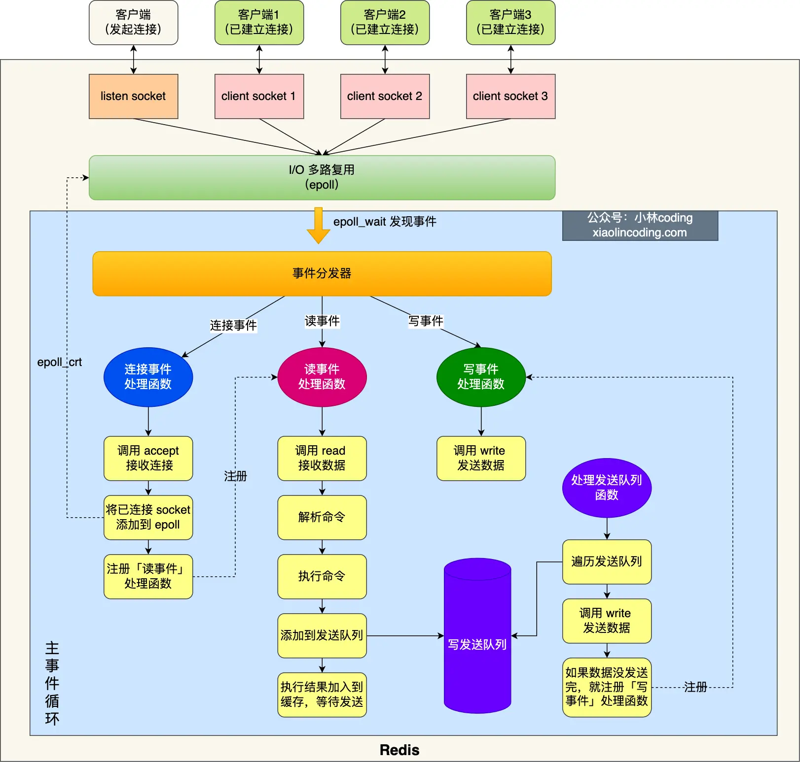

___

## Redis是单线程吗?

Redis单线程指的是\[接收客户端请求 -> 解析请求 -> 进行数据读写等操作 -> 发送数据给客户端\] 这个过程由一个线程来完成。
但Redis程序并不是单线程的，在启动时是会启动后台线程(BIO)的
- Redis在2.6版本，会启动两个后台线程分别处理关闭文件、AOF刷盘两个任务
- Redis在4.0版本后，增加一个新的后台线程，用来异步释放redis内存，也就是lazyfree线程。例如执行unlink key / flushdb async/ flushall async等命令，会把删除操作交给后台线程来执行，好处是不会导致Redis主线程卡顿。因此删除一个大key时最好不要使用del命令，因为del命令由主线程处理，造成阻塞

## 单线程模型

Redis6.0前的单线程模型如下图

图中蓝色部分是一个事件循环，由主线程负责，网络I/O和命令处理都是单线程。

- Redis初始化:
	- 调用epoc
	- epoll_create()创建epoll对象和调用socket()创建一个服务端socket
	- 然后，调用bind()绑定端口和调用listen()监听该socket
	- 最后，调用epoll_ctl()将listen socket加入到epoll同时注册连接事件处理函数
- 主事件循环:
	- 首先，调用处理发送队列函数，如果发送队列里有任务，则通过write函数将缓存区中的数据发送出去，若该轮未发送完，则注册写事件函数等待epoll_wait发现可写后再处理
	- epoll_wait函数等待事件到来
		- 若连接事件，则调用连接事件处理函数: 调用accpet获取已连接的socket -> 调用epoll_ctl将已连接的socket加入到epoll -> 注册读事件处理函数
		- 若读事件到来，调用读事件处理函数: 调用read获取客户端发送的数据 -> 解析命令 -> 处理命令 -> 将客户端对象添加到发送队列 -> 将执行结果写道缓存区等待发送
		- 若写事件到来, 调用写事件处理函数: 通过write将缓存区中数据发送， 若没有发送完，注册写事件处理函数，等待epoll_wait发现可写后处理

## Redis单线程高性能原因

- 内存操作: 大部分操作在内存中完成，采用了高效的数据结构，瓶颈是机器的内存或网络带宽而非CPU
- 单线程避免竞争: 单线程避免了多线程间的竞争，省去了多线程切换带来的时间和性能上的开销，而且不会导致死锁
- I/O多路复用: 一个线程处理多个I/O流，即select/poll机制。该机制运行内核中同时存在多个监听socket和已连接socket，内核一直监听这些socket，当有请求到达就交给redis线程处理。

## Redis 6.0后引入多线程

Redis的主要工作是网络I/O和执行命令，随着网络硬件的性能提升，Redis的性能瓶颈有时会出现在网络I/O的处理上，为了提高网络I/O的并行度，6.0以后对网络I/O采用多线程处理，但是命令处理仍然是单线程.