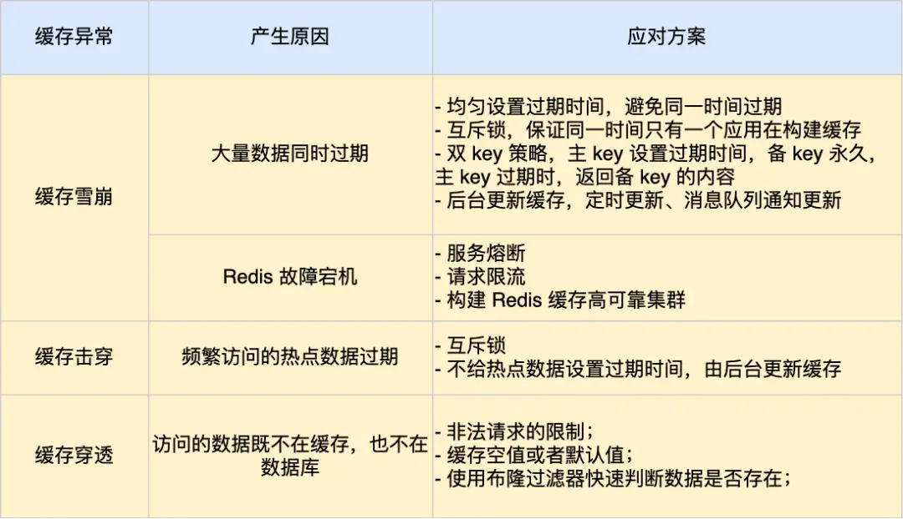

redis是内存数据库, 读写速度比磁盘IO高好几个数据量级, 作为数据库的缓存层能大幅提高系统性能. 作为缓存会有以下三种常见问题
- 缓存雪崩
- 缓存击穿
- 缓存穿透

## 缓存雪崩

为了保证缓存中的数据与数据库中的数据一致性, 会给redis中的数据设置过期时间, 当缓存过期后, 客户端访问的数据不在缓存里则会访问数据库并重新生成缓存.

当大量缓存数据在同一时间过期或者Redis故障宕机时, 如果有大量的用户请求, 这些请求都会直接访问数据库, 导致数据库压力骤增, 严重的可能导致数据库宕机, 从而形成一系列连锁反应, 造成系统崩溃

### 解决方案

#### 大量数据同时过期
- 均匀设置过期时间
	- 可以在设置过期时间时加上一个随机数, 保证不会同一时间过期
- 互斥锁
	- 访问数据不在Redis中时, 就加上一个互斥锁再访问数据, 保证同一时间就只有一个请求在访问数据库并构建缓存
	- 未能获取互斥锁的要么等待锁释放, 要么就返回空值或默认值
	- 这种情况下, 会一定程度上的降低性能
- 分段锁
	- 对于可以分区的数据, 如1000的库存拆成10个100, 这种场景可以每个区一个锁, 也即是分段锁, 来提高效率
- 后台缓存更新
	- 业务线程不再负责更新缓存，缓存也不设置有效期，而是**让缓存“永久有效”，并将更新缓存的工作交由后台线程定时更新**。事实上，缓存数据不设置有效期，并不是意味着数据一直能在内存里，因为**当系统内存紧张的时候，有些缓存数据会被“淘汰”**，而在缓存被“淘汰”到下一次后台定时更新缓存的这段时间内，业务线程读取缓存失败就返回空值，业务的视角就以为是数据丢失了。
	- 解决方法
		- 一: 后台线程不仅负责定时更新缓存，而且也负责**频繁地检测缓存是否有效**，检测到缓存失效了，原因可能是系统紧张而被淘汰的，于是就要马上从数据库读取数据，并更新到缓存。这种方式的检测时间间隔不能太长，太长也导致用户获取的数据是一个空值而不是真正的数据，所以检测的间隔最好是毫秒级的，但是总归是有个间隔时间，用户体验一般。
		- 二: 在业务线程发现缓存数据失效后（缓存数据被淘汰），**通过消息队列发送一条消息通知后台线程更新缓存**，后台线程收到消息后，在更新缓存前可以判断缓存是否存在，存在就不执行更新缓存操作；不存在就读取数据库数据，并将数据加载到缓存。这种方式相比第一种方式缓存的更新会更及时，用户体验也比较好。
	- 后台线程可以才业务刚上线时提前构建缓存, 实现缓存预热

#### Redis宕机

- 服务熔断或请求限流机制
	- 服务熔断: 暂停业务应用对缓存服务的访问, 直接返回错误, 不用再继续访问数据库, 从而降低对数据库的访问压力, 保证数据库系统的正常运行, 然后等到Redis恢复正常后, 再允许业务应用访问缓存服务
	- 请求限流: 允许少部分请求发送到数据库处理, 再多的请求就再入口直接拒绝服务, 等到Redis恢复正常并把缓存预热后再接触请求限流的机制
- 构建Redis缓存高可靠集群
	- 多个主从节点加上哨兵机制, 避免Redis缓存的完全不可用

## 缓存击穿

有部分数据会被频繁访问, 如秒杀活动, 这类数据被称为热点数据
如果某个热点数据过期了, 此时很可能有大量的请求访问该热点数据, 但是无法读到缓存, 直接访问数据库, 数据库就很可能被高并发请求打垮

### 解决方案

- 互斥锁, 单线程更新, 其他线程等待重建缓存的线程执行完，重新从缓存获取数据即可。
- 不设置过期时间, 由后台线程异步更新
	- 从缓存层面来看，确实没有设置过期时间，所以不会出现热点 key 过期后产生的问题，也就是“物理”不过期。
	- 从功能层面来看，为每个 value 设置一个逻辑过期时间，当发现超过逻辑过期时间后，会使用单独的线程去构建缓存
- 分散key: 在多个节点上有备份
- 本地缓存: 高频访问但是修改频率低的可以本地缓存一份

### 查找热点key
- 客户端: 调用时统计key
- 代理端: 代理客户端请求, 统计key
- 服务端: moniter命令监控redis, 但是可能对性能有比较大的影响

## 缓存穿透

当用户访问的数据即不再缓存中, 又不在数据库中, 导致请求每次都访问数据库, 但是又无法构建缓存, 导致大量请求直接到数据库

发生原因:
- 业务误操作
- 恶意攻击

### 解决方案

- 非法请求的限制: 在API入口处判断请求参数是否合理, 如果是非法请求就直接返回错误, 避免进一步访问数据库或缓存
- 缓存空值或默认值: 在缓存中设置一个空值或默认值, 避免频繁访问数据库
- 使用布隆过滤器: 在写入数据库数据时, 用布隆过滤器做个标记, 当用户请求来时, 判断是否在布隆过滤器中存在. 即使发生缓存穿透, 也只会访问Redis和布隆过滤器, 不会查询数据库

## 布隆过滤器

布隆过滤器由 初始值都为0的位图 和 N个哈希函数组成
写入数据库时, 按如下三个操作完成标记
- 使用N个哈希函数分别对数据做哈希计算, 得到N个哈希值
- 将N个哈希值对位图长度取模, 得到哈希值在位图中对应位置
- 将对应位置设为1

查询时, N个位置都为1则说明存在
虽然查找效率很很高, 但是存在哈希冲突的可能, 所以布隆过滤器说数据存在, 但是数据库中不一定真的存在这个数据.

## 保证缓存和数据库的数据一致性

- 最终一致性
	- 先写数据库再删缓存
		- 更新数据库比删除缓存慢得多, 如果先删缓存而数据库还没写, 请求过来会缓存不命中, 然后查数据库并构造缓存, 这样会出现一个脏数据
	- 删除缓存而不是更新缓存
		- 删除缓存比更新缓存步骤更少, 速度更快
- 强一致性
	- 不一致的原因通常如下
		- 缓存删除失败
		- 并发导致写入了脏数据
	- 有四种解决方案
		- 引入消息队列, 由专门的消费者保证缓存被删除
			- 缺点: 对业务代码有一定的侵入性
		- 数据库订阅+消息队列: 专门的服务监听binlog, 获取需要操作的数据, 然后公共服务订阅程序传来的消息, 进行缓存删除
			- 缺点: 侵入性低, 但是比较复杂
		- 延时双删防止脏数据: 第一次删除缓存后过一段时间再次删除
			- 针对缓存不存在但是写入了脏数据的情况
		- 设置缓存过期兜底

## 保证本地缓存和分布式缓存的一致性

- 设置本地缓存过期时间
- Pub/Sub机制, Redis缓存变化时发布消息, 本地缓存订阅这个消息, 然后删除本地缓存
- 引入消息队列, 更新本地缓存

## 缓存预热

系统启动时, 提前将一些预定义的数据加载到缓存中, 以避免系统运行初期由于缓存未命中导致的性能问题

- 系统启动时自动预热数据
- 设置定时任务, 周期性更新加载数据