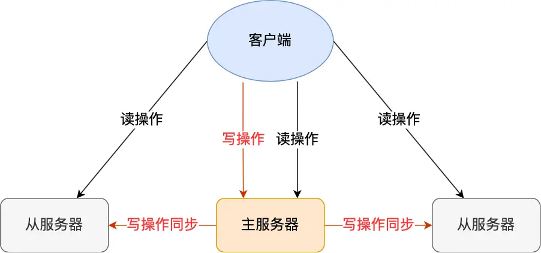
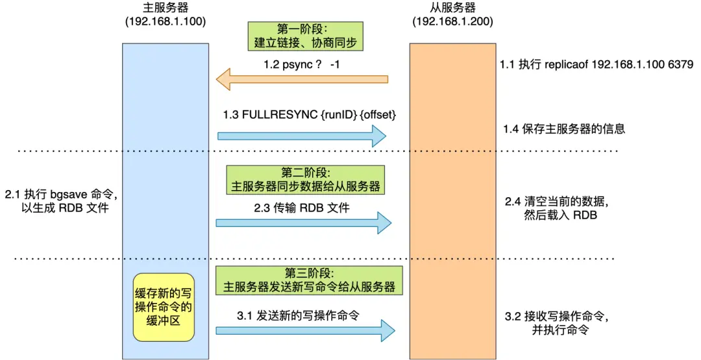
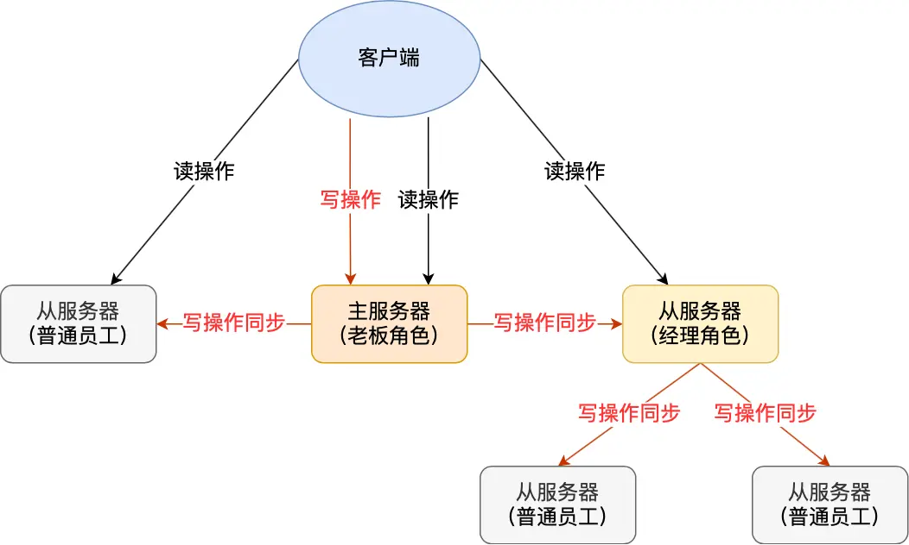
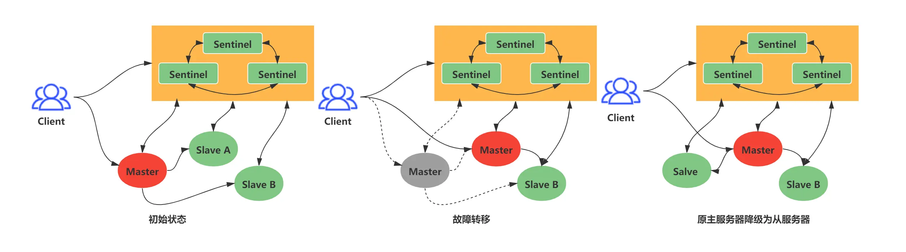
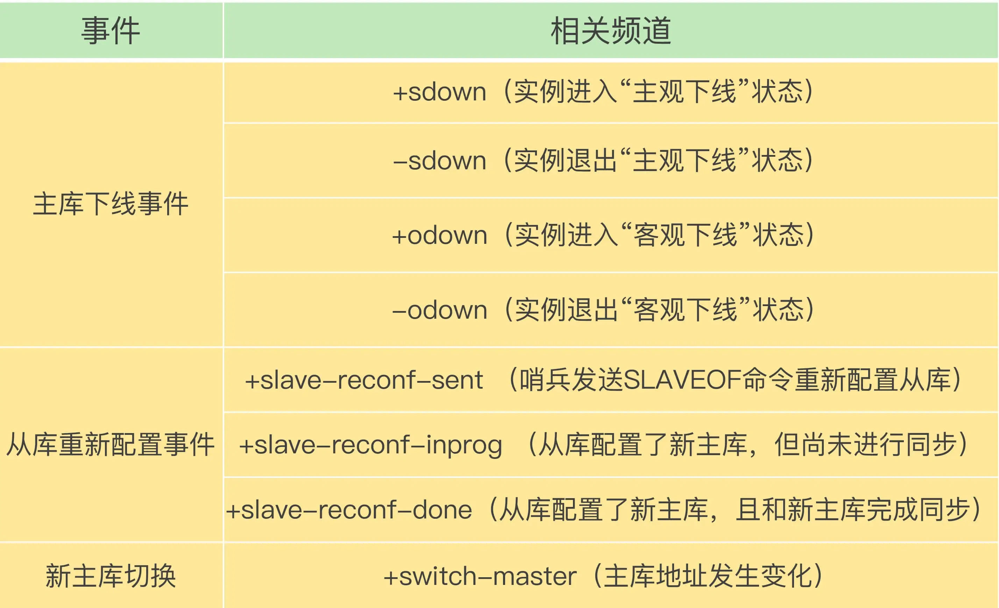
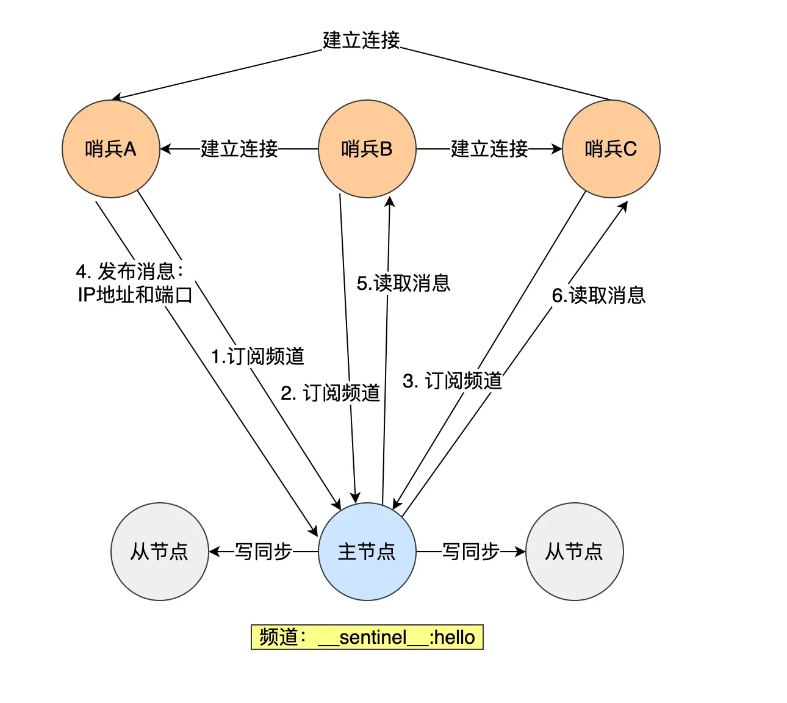

___

Redis集群有多种特征
- 主从复制
- 哨兵模式
- 切片集群

## 主从复制

### 引入原因:
单机模式下, 服务器宕机期间完全无法提供服务, 且如硬盘故障, 数据就完全丢失了, 容错率较低

### 概述

一台主服务器可以进行读写操作，当发生写操作时自动将写操作同步给从服务器。从服务器一般是只读，并接受主服务器同步过来的操作命令，然后执行这条命令。
命令复制是异步进行的，主服务器发送命令给从服务器后，主服务器并不会等到从服务器实际执行完命令后再返回给客户端，而是主服务器本地执行后就返回，没有实现主从同步，数据没有强一致性保证。


### 第一次同步

在通过如下命令从服务B上指定主服务器A
`replicaof <IpA> <PortA>`
然后B就会变成A的从服务器, 与主服务器进行第一次同步, 具体步骤如下
- 第一阶段是建立链接、协商同步；
- 第二阶段是主服务器同步数据给从服务器；
- 第三阶段是主服务器发送新写操作命令给从服务器。

- 建立连接, 协商同步
	- 从服务器向主服务器发送psync命令, 表示进行数据同步, 包含如下两个参数
		- 主服务器的runID: 每个Redis服务器在启动时会自动产生一个随机唯一ID作为标识, 第一次同步时不知道主服务器ID, 所以设置成?
		- 复制进度offset: 复制的进度, 第一次同步为-1
	- 主服务器收到命令后, 用`FULLRESYNC`作为响应, 说明采用全量同步, 包含两个参数
		- runID: 主服务器的runID
		- offset: 目前的复制进度
- 主从数据同步
	- 主服务器执行bgsave生成RDB并把文件发送给从服务器
	- 从服务器清空当前数据, 载入RDB
	- **主服务器生成RDB不阻塞主线程, 这期间可能还有写命令, 为了数据一致性, 以下三个间隔的写操作会写入replication buffer缓冲区中**
		- 主服务器生成RDB
		- 主服务器发送RDB
		- 从服务器加载RDB
- 主服务器发送新的写命令
	- 主服务器RDB文件发送完后, 会将replication buffer缓冲区中记录发送给从服务器
	- 从服务器根据发送的命令更新数据, 至此第一次同步完成

### 命令传播

主从服务器完成第一次同步后, 双方会维护一个TCP连接, 后续主服务器通过这个连接继续将写操作命令传播给从服务器, 然后从服务器执行这个命令, 保证数据的一致性
该TCP连接是长连接, 避免频繁的TCP建连断连开销

### 压力分担

如果从服务器数量多, 且都与主服务器全量同步, 会产生如下问题
- 主服务器频繁执行bgsave命令, 主线程忙于fork子线程, 若内存数据非常大, 阻塞时间会很长
- 传输RDB文件会占用主服务器带宽, 对命令响应产生影响

可以通过多级从节点实现压力的分担, 减少主节点的RDB与命令传播等操作
只需要指定replicaof时, 将目标服务器设置为某一个子节点


### 增量复制

若主从节点间的网络出现异常, 命令无法正确传播, 客户端就可能从从服务器获取到旧的数据.
如果网络重连后重新进行全量复制的话, 开销太大了, 所以选择采用增量复制的方式同步, 主要有三个步骤：
- 从服务器在恢复网络后，会发送 psync 命令给主服务器，此时的 psync 命令里的 offset 参数不是 -1；
- 主服务器收到该命令后，然后用 CONTINUE 响应命令告诉从服务器接下来采用增量复制的方式同步数据；
- 然后主服务将主从服务器断线期间，所执行的写命令发送给从服务器，然后从服务器执行这些命令。

相关数据结构
- repl_backlog_buffer: 一个环形缓冲区, 保存最近传播的写命令, 用于主从服务器断连后找到差异数据
- replication offset: 标记同步进度, 主从服务器有各自偏移量, master_repl_offset记录主服务器写到的位置, slave_repl_offset记录读到的位置

实现方式
- 主服务器进行命令传播时, 除了将写命令发送给从服务器, 还会将写命令写入repl_backlog_buff
- 网络断开重连后, 从服务器通过psync命令发送slave_repl_offset, 主服务器根据master_repl_offset和slave_repl_offset间的差距, 决定采取哪种同步操作
	- 判断出还在repl_backlog_buff中则采用增量同步
	- 否则, 断连太久了, 需要使用全量同步
- 当主服务器在 repl_backlog_buffer 中找到主从服务器差异（增量）的数据后，就会将增量的数据写入到 replication buffer 缓冲区. 

优化
- repl_backlog_buffer 缓行缓冲区的默认大小是 1M，并且由于它是一个环形缓冲区，所以当缓冲区写满后，主服务器继续写入的话，就会覆盖之前的数据。因此，当主服务器的写入速度远超于从服务器的读取速度，缓冲区的数据一下就会被覆盖。那么在网络恢复时，如果从服务器想读的数据已经被覆盖了，主服务器就会采用全量同步，这个方式比增量同步的性能损耗要大很多。
- 为了避免频繁使用全量同步的方式, 需要设定合理的repl_backlog_buffer缓冲区大小, 即修改配置文件中 repl-backlog-size命令大小
- 根据公式设定 `second * write_size_per_second`
	- second: 从服务器重连平均需要时间
	- write_size_per_second: 主服务器平均每秒写入命令数据量大小

### 相关面试题

- 如何判断某个节点是否正常工作
	- 通过相互ping-pong检测, 如果有一半以上节点ping时没有pong, 就认为节点挂了, 断开与其连接
	- 主从节点心跳间隔不同
		- redis主节点默认每隔10s向从节点发送一次ping
		- 从节点默认每隔1s发送replconf ack{offset}命令, 上报复制偏移量
			- 实时检测主从节点网络状态
			- 检测复制数据是否丢失, 若丢失则从复制缓存区中再次拉取
- 过期key如何处理
	- 主节点淘汰一个key时, 模拟一条del命令发送给从节点
- Redis主从复制是同步还是异步
	- 收到写命令后, 写入缓冲区, 然后异步发送给从节点
- 为什么会出现主从不一致
	- 主从节点的命令复制是异步的, 无法保证强一致性
- 如何处理主从不一致
	- 减少网络问题, 尽量在同一个机房等
	- 通过外部程序监控主从节点的复制进度
		- Redis 的 INFO replication 命令可以查看主节点接收写命令的进度信息（master_repl_offset）和从节点复制写命令的进度信息（slave_repl_offset），所以，我们就可以开发一个监控程序，先用 INFO replication 命令查到主、从节点的进度，然后，我们用 master_repl_offset 减去 slave_repl_offset，这样就能得到从节点和主节点间的复制进度差值了。
		- 如果某个从节点的进度差值大于我们预设的阈值，我们可以让客户端不再和这个从节点连接进行数据读取，这样就可以减少读到不一致数据的情况。不过，为了避免出现客户端和所有从节点都不能连接的情况，我们需要把复制进度差值的阈值设置得大一些。
- 什么时候会数据丢失
	- 异步复制丢失
		- Redis主从节点的复制是异步的, 客户端发送写请求给主节点时, 客户端会返回ok, 接着主节点将写请求异步复制给各个从节点, 如果还没完成发送复制消息, 主节点就宕机, 会导致数据丢失
		- 减少数据丢失
			- Redis 配置里有一个参数 min-slaves-max-lag，表示一旦所有的从节点数据复制和同步的延迟都超过了 min-slaves-max-lag 定义的值，那么主节点就会拒绝接收任何请求。
			- 假设将 min-slaves-max-lag 配置为 10s 后，根据目前 master->slave 的复制速度，如果数据同步完成所需要时间超过10s，就会认为 master 未来宕机后损失的数据会很多，master 就拒绝写入新请求。这样就能将 master 和 slave 数据差控制在10s内，即使 master 宕机也只是这未复制的 10s 数据。
			- 那么对于客户端，当客户端发现 master 不可写后，我们可以采取降级措施，将数据暂时写入本地缓存和磁盘中，在一段时间（等 master 恢复正常）后重新写入 master 来保证数据不丢失，也可以将数据写入 kafka 消息队列，等 master 恢复正常，再隔一段时间去消费 kafka 中的数据，让将数据重新写入 master 。
	- 集群脑裂导致数据丢失
## 哨兵模式

当主服务出现宕机时，需要手动恢复, 手动修改主节点IP，为解决这个问题，引入哨兵模式，监控主从服务，并提供主从节点故障转移的功能.

哨兵是运行在特殊模式下的Redis进程, 观察主从节点的监控状态, 负责监控, 选主, 通知

### 监控

哨兵每隔1s给所有的主从节点发送ping, 当收到ping后所有的节点都会响应一个pong, 从而判断各个节点的健康状况

如果一个节点没有在规定的时间(由down-after-milliseconds配置)内响应哨兵的ping, 哨兵就会将这个节点标记为主观下线.
当一个哨兵节点判断主节点为主观下线后, 会向其他哨兵发起命令, 其他哨兵接收到后会根据自身与主节点的连接状况, 投出赞成或拒绝
当赞成数达到了配置项quorum指定的值(一般为哨兵数/2+1)后, 该主节点被标记为客观下线. 当主节点客观下线后, 选出一个从节点作为新的主节点
### 选主

- 选举leader: 从哨兵集群里选出一个leader来执行主从切换
	- step1: 选出候选者, 哪个节点判断主节点为客观下线, 则该节点就是候选者
	- step2: 发起投票, 候选者向其他哨兵发送命令, 表明希望成为leader来执行主从切换, 并让所有的其他哨兵进行投票. 每个哨兵只有一次投票, 用完后不可参与投票, 只有候选者可以投给自己
	- step3: 判断是否当选:
		- 1. 拿到半数以上的赞成票
		- 2. 拿到的票数大于等于quorum
	- step4: 若由节点当选, 则退出, 无节点当选, 则重新选举
- 主从故障转移
	- 
	- step1: 在已下线的主节点属下的从节点中选择一个节点, 将其转换为主节点
		- 选择
			- 需要排除网络不好的从节点: Redis 有个叫 down-after-milliseconds * 10 配置项，其 down-after-milliseconds 是主从节点断连的最大连接超时时间。如果在 down-after-milliseconds 毫秒内，主从节点都没有通过网络联系上，我们就可以认为主从节点断连了。如果发生断连的次数超过了 10 次，就说明这个从节点的网络状况不好，不适合作为新主节点。
			- 考察优先级, 优先级越小越靠前: 由slave-priority配置项决定, 可以根据服务器性能设置节点的优先级
			- 考察复制进度: 复制进度越接近主节点的越靠前
			- 考察ID: ID越小的越靠前
		- 设置
			- 发送slaveof no one 命令, 让从节点变成主节点
			- 发送后, 哨兵以每秒一次的频率发送info命令, 查看回复中的角色信息, 当变为master时说明升级成功
	- step2: 让已下线主节点属下的所有从节点修改复制目标为新主节点
		- 设置
			- 向所有从节点发送SLAVEOF \<ip\> \<port\>命令
	- step3: 将新主节点的IP和信息通过发布者/订阅者机制, 通知给客户端
		- 客户端可以从哨兵订阅消息, 哨兵提供的消息订阅频道如下
		- 切换完成后, 会向+switch-master频道发布新的IP地址和端口消息, 客户端接收到后就可以用新的端口通信了
	- step4: 继续监视旧主节点, 当旧主节点重新上线时, 将其设置为新主节点的从节点

### 哨兵集群

多个哨兵节点一起判断, 避免单个哨兵因为自身网络状况不好而误判主节点下线的情况
哨兵数量应该是奇数

配置时只需要
```lua
sentinel monitor <master-name> <ip> <redis-port> <quorum> 
```
不需要其他哨兵节点的信息, 而是通过Redis的发布者/订阅者机制实现互相发现的

主节点上有一个__sentinel__:hello 频道, 监听这个集群的哨兵会在频道上获取其他节点的信息以及发布自己的信息


而主节点又知道所有的从节点信息, 所有哨兵通过INFO命令就可以获取到所有的从节点信息
### 问题

- 为什么哨兵节点至少要有三个
	- 若只有两个哨兵节点, 此时如果哨兵想要称为leader必须获得两票(2/2+1), 而不是一票, 若有一个哨兵宕机, 则无法成为leader完成主从切换
	- 有三个节点时, 挂掉一个节点也能选举成功
## 切片集群

当Redis缓存数据量大到一台服务器无法缓存时，需要使用Redis切片集群方案，将数据分布到不同的服务器上，以此来降低系统对单主节点的依赖，从而提高Redis服务的读写性能。

Redis Cluster方案采用哈希槽(Hash Slot)，来处理数据和节点间的映射关系。key根据CRC16算法计算一个16bit的值，对16384取模后得到一个对应哈希槽的编号，从而映射到具体节点上。哈希槽和节点的映射分配有两种方案
- 平均分配: Redis自动把所有的哈希槽平均分布到集群节点上
- 手动分配: 使用cluster meet命令手动建立节点间的练习，组成集群，在使用cluster addslots命令指定每个节点上的哈希槽数量

### 如何数据分区

常见的分区规则有
- 节点取余分区: 数据项对某个值取余(通常是键的哈希值)
	- 缺点: 扩缩容时, 大部分数据需要重新分配
- 一致性哈希分区: 将哈希值空间组织成一个环, 数据项和节点都映射到这个环上, 数据项根据哈希值分配到顺时针最近的节点
	- 优点: 扩缩容只影响了相邻节点, 大部分不变
	- 缺点: 节点不均匀时压力分布不均, 某个节点故障, 压力会全部转移给下一个节点
- 虚拟槽分区: 固定数量的槽位, 每个键根据哈希算法映射到具体的槽上, 每个节点负责管理一定范围内的槽
	- 优点: 可以灵活的扩缩容, 将槽及其中的数据迁移到另一个节点; 数据分布也更均匀; 一个节点掉线, 只需要重新分配他的槽的归属

### 集群创建

有设置节点, 节点握手, 分配槽三个步骤, 数据分区在集群创建时就完成
- 设置节点: 所有的节点都开启cluster-enable配置
- 节点握手: 一批节点通过Gossip协议彼此通信
- 分配槽: 将所有数据映射到16384个槽中, 每个节点对应若干个槽位

### 故障转移

Redis集群中所有的节点都要承担状态维护的任务, 通过ping/pong检测健康状态, 如果在cluster-node-timeout时间内一直失败, 则发送节点认为接受节点故障, 将接受节点标记为主观下线

当一个节点做出主观下线判断后, 响应的节点状态会随着消息在集群内传播, 通过Gossip消息传播, 集群内节点不断收集到故障节点的下线报告, 当半数以上节点标记某个节点主观下线时, 触发客观下线流程

故障节点被标记为客观下线后, 如果下线节点是持有槽的主节点, 则在他的从节点中选出一个替换他
1. 资格检查 每个从节点都要检查最后与主节点断线时间，判断是否有资格替换故障 的主节点。
2. 准备选举时间 当从节点符合故障转移资格后，更新触发故障选举的时间，只有到达该 时间后才能执行后续流程。
3. 发起选举 当从节点定时任务检测到达故障选举时间（failover_auth_time）到达后，发起选举流程。
4. 选举投票 持有槽的主节点处理故障选举消息。投票过程其实是一个领导者选举的过程，如集群内有 N 个持有槽的主节 点代表有 N 张选票。由于在每个配置纪元内持有槽的主节点只能投票给一个 从节点，因此只能有一个从节点获得 N/2+1 的选票，保证能够找出唯一的从节点。
5. 替换主节点 当从节点收集到足够的选票之后，触发替换主节点操作。

### 集群的伸缩

- 扩容: 新节点加入时, 集群自动执行数据迁移, 重新分配哈希槽给新的节点
	- 数据正在迁移时，客户端请求可能被路由到原有节点或新节点。Redis Cluster 会根据哈希槽的映射关系判断请求应该被路由到哪个节点，并在必要时进行重定向。如果请求被路由到正在迁移数据的哈希槽，Redis Cluster 会返回一个 MOVED 响应，指示客户端重新路由请求到正确的目标节点。这种机制也就保证了数据迁移过程中的最终一致性。
- 缩容时, 将数据迁移到其他节点上, 并将被缩容的节点从集群中删除

## 脑裂

主从模式下，如果主节点网络突然发生问题，与所有从节点失联，但主节点与客户端的网络是正常的，仍然在写数据，此时这些数据被旧主节点(A)缓存到缓冲区里，因为主从节点间的网络问题，暂时无法同步给从节点。
哨兵也与主节点失联了，认为主节点宕机，于是在从节点中选择新的主节点。此时集群中有了两个主节点，也就产生了脑裂。

而后，网络恢复，旧主节点(A)被哨兵降级为从节点，然后从节点A会向新主节点请求数据同步，因为第一次同步是全量同步，从节点A会清空本地数据，然后再做全量同步，所以此前客户端写入节点A的数据全部丢失

总结: 由于网络问题，集群节点之间失去联系。主从数据不同步；重新平衡选举，产生两个主服务。等网络恢复，旧主节点会降级为从节点，再与新主节点进行同步复制的时候，由于会从节点会清空自己的缓冲区，所以导致之前客户端写入的数据丢失了。

解决方案

当主节点发现从节点下线或通信超时的总数量超过阈值时，禁止主节点进行写数据，直接把错误返回给客户端。
Redis的配置文件中有两个参数可以设置:
- min-slaves-to-write x: 至少有x个从节点连接，否则禁止写入
- min-slaves-max-lax x: 主从数据复制和同步延迟不能超过x秒，如果超过，主节点禁止写数据。
我们可以把 min-slaves-to-write 和 min-slaves-max-lag 这两个配置项搭配起来使用，分别给它们设置一定的阈值，假设为 N 和 T。
这两个配置项组合后的要求是，**主节点连接的从节点中至少有 N 个从节点，「并且」主节点进行数据复制时的 ACK 消息延迟不能超过 T 秒**，否则，主节点就不会再接收客户端的写请求了。
即使原主节点是假故障，它在假故障期间也无法响应哨兵心跳，也不能和从节点进行同步，自然也就无法和从节点进行 ACK 确认了。这样一来，min-slaves-to-write 和 min-slaves-max-lag 的组合要求就无法得到满足，**原主节点就会被限制接收客户端写请求，客户端也就不能在原主节点中写入新数据了**。
**等到新主节点上线时，就只有新主节点能接收和处理客户端请求，此时，新写的数据会被直接写到新主节点中。而原主节点会被哨兵降为从节点，即使它的数据被清空了，也不会有新数据丢失。**
假设我们将 min-slaves-to-write 设置为 1，把 min-slaves-max-lag 设置为 12s，把哨兵的 down-after-milliseconds 设置为 10s，主节点因为某些原因卡住了 15s，导致哨兵判断主节点客观下线，开始进行主从切换。同时，因为原主节点卡住了 15s，没有一个从节点能和原主节点在 12s 内进行数据复制，原主节点也无法接收客户端请求了。这样一来，主从切换完成后，也只有新主节点能接收请求，不会发生脑裂，也就不会发生数据丢失的问题了。
