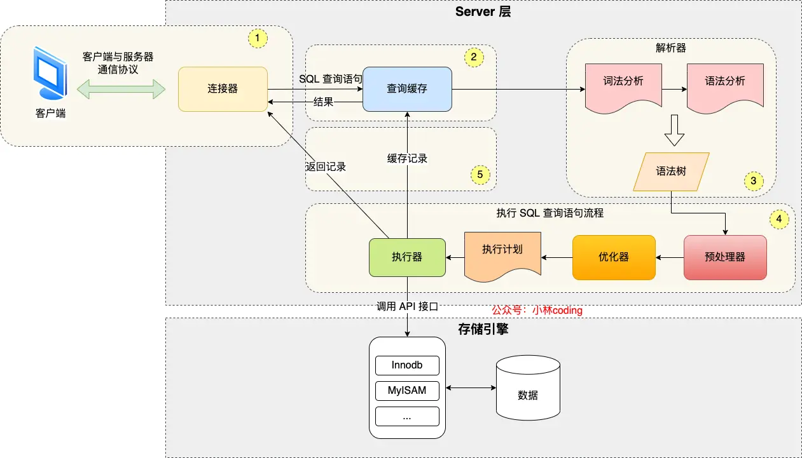

## MySQL架构


MySQL的架构分为两层，Server层和存储引擎层
- Server:  负责建立连接、分析和执行SQL。大部分核心功能都在这里实现，包括连接器，查询缓存，解析器，预处理器，优化器，执行器。另外，所有的内置函数(如日期、时间、数学、加密等)和跨存储引擎的功能(如存储过程，触发器，视图等)都在Server层实现
- 存储引擎层：负责数据的存储和提取。支持InnoDB，MyISAM，Memory等多个存储引擎，不同存储引擎共用一个Server层。最常用的是InnoDB，从MySQL5.5开始，InnoDB成为MySQL的默认存储引擎。索引数据结构就是由存储引擎层实现的，不同的存储引擎支持的索引类型不同，比如InnoDB支持的索引类型就是B+树，且默认使用，主键索引和二级索引默认使用B+索引

## 连接器

如果用cli连接数据库，普遍使用下面的命令
```bash
# -h 指定主机ip，本机则省略
# -u 指定用户名
# -p 指定密码，一般不直接填写而是之后填写
mysql -h$ip -u$user -p
```
MySQL基于TCP协议传输，连接需要先三次握手。
若MySQL没有启动会收到无法通过socket连接的错误
若正常运行，则完成TCP连接后，连接器会开始验证用户名和密码，若不正确则`Access Denied for user`错误。若无误，则连接器获取该用户权限并保存，后续此用户在该连接中的任何操作都会基于开始时读取到达权限。

- 查看当前客户端连接数 `show processlist`
- 未使用的连接称为空闲连接，最大空闲时长由`wai_timeout`控制，默认是八小时，超时则自动断开。
- 手动断开的命令为`kill connection id`，手动断开后客户端不会立即知晓，而是在发起下一个请求时收到报错`ERROR 2013 (HY000): Lost connection to MySQL server during query`
- MySQL最大连接数由max_connections参数控制，超出会拒绝连接
- MySQL连接和HTTP一样，由短链接和长连接
	- 短链接：连接后成功后执行一次sql就断开
	- 长连接：连接成功后执行多次sql后断开，减少了建连和断连过程，但占用内存增多(用于管理连接对象，如会话变量、临时表和表缓存，查询缓存，事务未提交的数据等)，如果占用内存太大可能还会被系统强制杀掉，导致MySQL服务异常重启。
	- 解决长连接占用内存问题方式
		- 定期断开长连接
		- 客户端主动重置连接：MySQL 5.7实现了`mysql_reset_connection`函数的接口，客户端执行完一个很大的操作后可以用这个重置连接以释放内存，不需要重连和重新验证，但连接恢复到刚创建的状态

## 查询缓存

- MySQL收到SQL语句后检查是否查询语句，若是，则在查询缓存中查看是否执行过该语句。若命中则直接返回，miss则继续执行并将结果存入查询缓存
- 但是查询缓存非常鸡肋，只要更新，查询缓存就会被删除，更新频繁的表几乎不可能命中。
- MySQL 8.0开始删除了查询缓存，之前的版本可以将query_cache_type设置成demand 来关闭查询缓存
- **这里的查询缓存是server层的，不是InnoDB存储引擎中的buffer pool

## 解析SQL

- 词法分析，解析器会切分字符串，并从中识别关键字
- 语法分析，语法解析器根据语法规则判断SQL语句是否合法，不合法则报错退出，合法则构建语法树。
- **表或字段是否存在并不由解析器判断**

## 执行SQL

### 预处理器 prepare

- 检查SQL中的表或字段是否存在
- 将select  \* 中的 \* 扩展为表上所有的列
### 优化器 optimize

- 制定SQL语句的查询方案，如选择成本更低的索引等
### 执行器 execute

- 执行器与存储引擎交互，交互是以记录为单位的，交互有三种类型

- 主键索引查询
```mysql
select * from product where id = 1;
```
	以这条查询为例，主键id是唯一的，所以优化器选择用访问类型为const进行查询，也就是用主键索引查询，那么执行器和存储引擎的执行流程是这样的：
		1. 执行器第一次查询，调用 read_first_record函数指针指向的函数，因为优化器选择的访问类型为const，这个函数指针被指向为InnoDB的接口，把条件id=1交给存储引擎，让存储引擎定位符合条件的第一条记录
		2. 存储引擎通过主键索引B+树结构定位到id=1的第一条记录，如果记录不存在，就向执行器抛出记录不存在的错误，若存在则返回记录
		3. 执行器读到记录后，判断记录是否符合条件，符合则发送给客户端，不符合则跳过
		4. 执行器查询的过程是一个while循环，所以还会查一次，但不是第一次查，所以调用read_record函数指针指向的函数，因为优化器选择的访问类型为const，这个函数指针被指向一个永远返回-1的函数，调用后就结束循环
- 全表扫描
```mysql
select * from product where name = 'iphone';
```
	查询时没有用到索引，索引优化器决定用访问类型ALL进行查询，此时流程如下
		1. 执行器第一次查询，用read_first_record，因为类型为all，所以函数指向全扫描的接口，存储引擎返回第一条记录
		2. 判断是否符合，不是则跳过；是则发送给客户端(Server每读取到一条符合要求的就会发送一次)
		3. while循环，调用read_record，直到扫描完所有的记录
- 索引下推
	索引下推能减少二级索引在查询时的回表操作，提高效率，因为将Server层部分负责的事交由存储引擎处理

```
select * from t_user  where age > 20 and reward = 100000;
```
	其中age 和 reward建立了联合索引。联合索引遇到范围查询就会停止匹配，也就是age字段能用到联合索引，但是reward无法利用索引
	如果不使用索引下推，那么执行器与存储引擎的执行流程是这样的
	1. Server调用存储引擎接口定位到满足条件的第一条二级索引记录，也就是定位到age > 20 的第一条记录
	2. 存储引擎根据二级索引的B+树快速定位到这条记录后获取主键值，然后进行回表操作，将完整记录返回给Server
	3. Server判断该记录的reward是否等于100000，如果成立则发送给客户端，否则跳过该记录
	4. 存储引擎索要下一条记录，存储引擎查找下一条，如此往复
	如果使用索引下推，则将reward交给存储引擎判断
	1. Server调用存储引擎的接口定位满足条件的第一条二级索引记录
	2. 存储引擎定位到后，先不执行回表操作，而是先判断该索引中包含的条件是否成立，不成立则跳过该二级索引。成立则返回Server
	3. Server判断是否满足其他条件，成立则发送给客户端，不满足则向存储引擎要下一条，如此往复