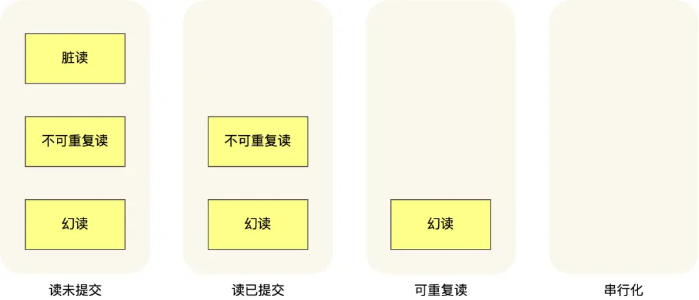
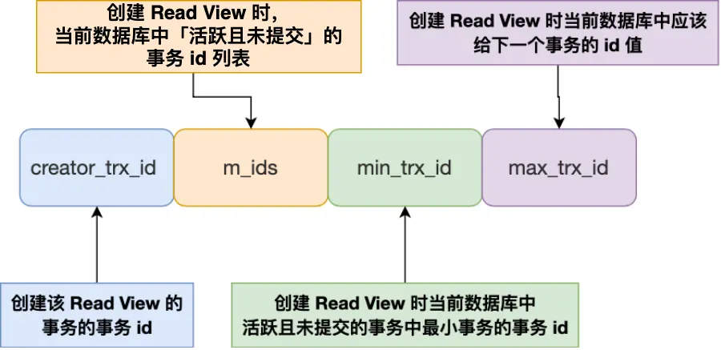

___

## 特性

- 原子性
	- 一个事务中的所有操作要么全部完成, 要么全部不完成, 不会在某个中间环节结束, 而且出现错误就会回滚到事务开始前的状态. (感觉这里说的不完全, 应该还包括不会被其他的操作打断)
	- 实现: undo log(回滚日志)和锁
- 一致性
	- 事务操作前后, 数据满足完整性约束, 数据库保持一致性状态
	- 其余三点总和保证了一致性
- 隔离性
	- 数据库允许多个并发事务同时对数据进行读写和修改的能力, 隔离性可以防止多个事务并发执行时由于交叉执行而导致的数据不一致.
	- 实现: MVCC(多版本并发控制)或者锁
- 持久性
	- 事务处理结束后, 对数据的修改是永久的
	- redo log(从做日志来保证的)

## 并发问题

- 脏读
	- 一个事务读到了另一个未提交事务修改过的数据. 即事务A操作数据后被事务B获取, 但事务A失败回滚, 导致B得到的数据是被修改过的不正确数据
- 不可重复读
	- 一个事务内多次读取同一个数据, 前后两次数据不一致. 即事务A读取数据后, 事务B操作数据, 事务A再读取时数据不一致
- 幻读
	- 一个事务内多次查询某个符合查询条件的记录数量, 前后数量不一致. 即事务A读取到符合条件的有N条, 然后B插入M条数据, 事务A再次读取时有N+M条, 数量不同

三种现象的严重性排序:
脏读 > 不可重复读 > 幻读

## 事务隔离级别

- 读未提交: 一个事务没有提交时, 变更就能被其他事务看到
	- 实现: 直接读取最新的数据就好
- 读提交: 一个事务提交后变更才能被其他事务看到
	- 和可重复读一致, 但创建时机不同, 读提交在每个语句执行前重新生成一个ReadView
- 可重复读(InnoDB默认隔离级别): 一个事务执行过程中看到的数据和启动时看到的数据是一致的(可重复读)
	- 通过Read View实现, 在启动事务时生成一个ReadView
- 串行化: 会对记录加上读写锁, 多个事务读写冲突时, 后访问的必须等前一个事务执行完才能继续
	- 实现: 加锁避免并行访问

隔离级别越高, 性能效率越低下, 隔离级别排序:
串行化 > 可重复读 > 读已提交 > 读未提交

不同的隔离级别可能发送的现象也不同

可重复读很大程度上解决了幻读现象(没彻底解决), 解决方案有如下两种
- 针对快照读(普通select): 通过MVCC方式解决了幻读, 可重复读隔离级别下, 事务执行过程中看到的数据一直和事务启动时是一致的, 即使其他事务插入数据也是查询不出来的
- 针对当前读(select for update): 通过next-key lock(记录锁+间隙锁)解决幻读, 因为当执行 select ... for update 语句的时候，会加上 next-key lock，如果有其他事务在 next-key lock 锁范围内插入了一条记录，那么这个插入语句就会被阻塞，无法成功插入，所以就很好了避免幻读问题。

**plus**

开始事务并不意味着启动事务, 在MySQL中有两种开启事务的命令, 分别是:
- begin/start transaction命令: 开始事务, 但直到执行第一条select语句才是事务真正启动的时机
- start transaction with consistent snapshot命令: 马上启动事务

## Read View

ReadView是InnoDB实现MVCC的关键机制, 决定了事务在读数据时能看到哪些版本的数据. 核心作用是某个时刻对数据库的快照, 用于判断某个数据行的某个版本对于当前事务是否可见, 核心逻辑是: 根据事务的启动时间、数据行的版本号以及活跃事务列表, 过滤掉不可见的旧版本或未提交的新版本数据

- m_ids: 创建ReadView时, 启动但未提交的事务列表
- min_trx_id: 创建ReadView时, 当前活跃事务中最小的事务, 即m_ids的最小值
- max_trx_id: 并不是m_ids的最大值, 而是创建ReadView时数据库将要分配给下一个事务的id(全局事务最大值+1)
- creator_trx_id: 创建该ReadView事务的事务id

**聚簇索引中的隐藏列**
- trx_id: 当一个事务对聚簇索引记录进行改动时, 会把该事务的事务id记录在trx_id隐藏列里
- roll_pointer: 每次对聚簇索引记录进行修改时, 会把旧版本的记录写入到undo日志中, roll_pointer则是作为一个指针指向旧版本的记录, 所有的旧版本以链表的形式组织

一个事务去访问记录时, 除了自己更新的记录总是可见外, 有如下几种情况
- 记录的trx_id小于ReadView的min_trx_id, 即在创建ReadView前以提交, 所以记录可见
- trx_id大于等于max_trx_id, 创建ReadView后启动事务, 不可见
- trx_id位于min_trx_id和max_trx_id之间, 若在mid_s中则不可见, 需要沿着undo log链找到可见的旧版本, 不在则可见

## 当前读

除了普通查询是快照读, 其余都是当前读
例如update, 如果另一个事务delete了该记录并提交了, 此时对历史记录更改就冲突了, 需要获取最新的数据

例如select..for update这种情况, 需要将多个行加锁就会用间隙锁, 其他事务想要操作这个间隙中的行时, 会生成一个插入意向锁同时进入等待状态, 直到加锁事务提交

可重复读级别下的幻读现象:
- 事务A普通查询row1, 不存在; 然后事务B插入了row1后提交; 事务A再更新row1, 由于B已经提交所以能看到, 再查找row1, 数量就不同了, 出现了幻读;
- 事务A普通查询condition1, 查到n条; 事务B插入m条满足事务A条件的后提交; 事务A再select condition1 for update 会查到n+m条
避免特殊场景下发生幻读的现象, 最好开启事务后就试用select...for update语句用间隙锁保护一下