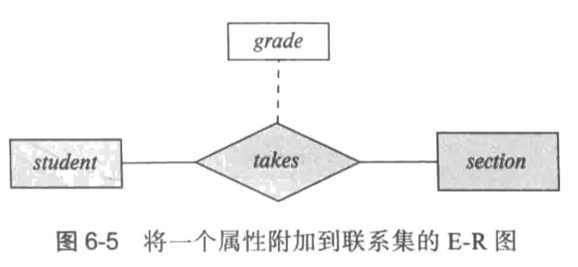

> 

## 实体 - 联系模型

三个基本概念
- 实体集(entity set)
	- 共享相同性质或属性的，具有相同类型的实体的集合
	- 实体集的外延：属于实体集的实体的实际集合
- 联系集(relationship set)
	- 联系：多个实体间的相互关联
	- E-R模式中的一个联系实例表示一种关联，用菱形表示，通过线条联系多个不同的实体集。
	- 描述性属性
	- 
- 属性
	- 域(domain): 属性的可取值集合
	- 简单和复合属性：
		- 简单：不能划分为子部分
		- 复合：能划分成若干子部分
	- 单值和多值属性：
		- 单值：单个实体该属性的值唯一
		- 多值：单个实体该属性的值可能有零或多个
	- 派生属性：这类属性的值从其他相关属性或实体派生得到。并不存储，而是在需要的时候计算出来
## 映射基数

映射基数表示一个是同能通过联系集关联的另一些实体的数量。在描述二元联系时最有用。
	- 一对一：A中实体至多与B中的一个实体关联，且B中的实体也至多与A中的一个实体关联
	- 一对多：A中实体与B中零或多个的实体相关联，B中的实体至多与A中的一个实体相关联
	- 多对一：A中的实体至多与B中的一个实体相关联，而B中的一个实体可以与A中任意数量实体相关联
	- 多对多：A中的实体与B中任意数量的实体相关联，B中的实体与A中任意数量实体相关联
通过线段表示基数约束时，箭头指向的是1。
通过数字表示基数约束时，每个端的数是另一端需要满足的。

## 主键

通过主键来区分给定实体集中的实体和联系集中的联系

- 实体集：一个实体的属性取值必须可以唯一标识该实体。
- 联系集：使用被关联的实体的主键组合(和基数映射相关)作为主键
- 弱实体集：弱实体集的存在依赖于另一个实体，称为其标识性实体集；使用标识实体集的主键以及称为分辨符属性的额外属性来标识弱实体，而不是将主码而弱实体关联。
	- 弱实体集用双边框的矩形描述，其分辨符加上虚下划线，关联弱实体集与强实体集的联系以双边框的菱形标识。双线说明弱实体集的全部参与

## E-R to 关系模式

- 强实体集
	- 直接转换成关系表
- 复杂属性
	- 复合属性：只保留叶子节点
	- 多值属性：转换成关系表，主键：pk+属性
	- 派生属性：不显式转换成关系表
- 弱实体集
	- 转换成关系表(主键: 对应对象的pk+分辨符组合而成)，有外键约束
	- 忽略强实体集和弱实体集间的联系
- 联系集
	- 多对多：转换成关系表
	- 多对一：将一的主键放入多的表中
	- 一对一：将任意方的主键放入另一方，部分参与用null
- 概化
	- 1.每层实体都转化成一个模式，除主键只有特有属性，共用一个主键
	- 2.只给底层创建模式，具有所有属性。这种方法难以给联系创建外键约束，如果重叠概化可能会出现不少的属性冗余
- 聚集的表示
	- 将聚集中所有的实体主键都包括，另外的实体正常处理
## 扩展的E-R特性

- 特化(specialization)
	- 空心箭头指向父类
- 概化(generalization)
	- 抽象出父类
- 属性继承：下层实体继承上层实体属性
- 聚集(Aggregation)
	- 将联系抽象为高层实体
	- 减少冗余联系