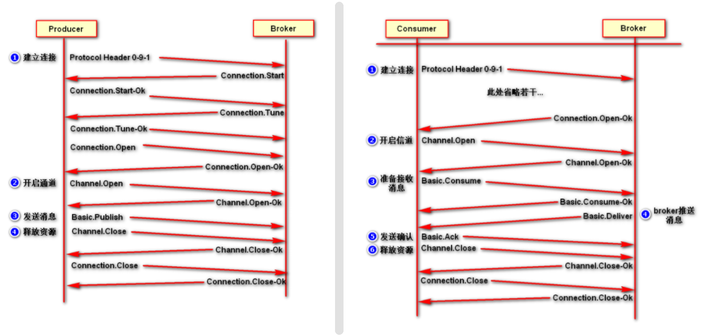

> [参考博客](https://blog.csdn.net/qq_45173404/article/details/121687489)
___

RabbitMQ 是一个消息中间件：它接受并转发消息。你可以把它当做一个快递站点，当你要发送一个包裹时，你把你的包裹放到快递站，快递员最终会把你的快递送到收件人那里，按照这种逻辑 RabbitMQ 是一个快递站，一个快递员帮你传递快件。RabbitMQ 与快递站的主要区别在于：它不处理快件而是接收，存储和转发消息数据。

## AMQP协议

`AMQP` 全称 “Advanced Message Queuing Protocol”，高级消息队列协议。它是应用层协议的一个开发标准，为面向消息的中间件设计。

下图是采用 AMQP 协议的生产者和消费者建立和释放连接的流程图：

## RabbitMQ架构

- broker: 就是Rabbit服务, 负责接受和分发消息, 实现AMQP实体服务
- virtual host: 处于多租户和安全因素设计, 把AMQP的基本组件划分到一个虚拟分组中, 类似于网络中的namespace概念. 当多个不同的用户使用同一个RabbitMQ server提供的服务时, 可以划分多个vhost, 每个用户在自己的vhost创建exchange或queue
- connection: 连接, 生产者/消费者与Broker之间的TCP网络连接
- channel: 网络信道, 如果每次访问RabbitMQ都简历一个Connection, 在消息量大时建立连接的开销非常大效率低. channel是在connection内部简历的逻辑连接, 如果应用程序支持多线程, 通常每个thread创建的单独的channel进行通讯, AMQP method包含了channel id 来识别channel, 不同channel间的操作是完全隔离的
- message: 消息, 服务于应用程序之间传送的数据, 有properties和body组成, properties可以对消息进行修饰如优先级, 延迟等; body则是消息体的内容
- virtual host: 虚拟节点, 用于逻辑隔离, 最上层的消息路由. 一个virtual host有多个exchange和queue, 同一个virtual host里不能有相同名字的exchange
- exchange: 交换机, message到达broker的第一站, 根据分发规则匹配查询表中的routing key, 分发消息到queue中去, 不具备消息存储功能, 常用类型有: direct, topic, fanout
- Bindings: exchange和queue之间的虚拟连接, binding可以包含routing key, binding信息被保存到exchange中的查询表中, 用作message的分发依据
- routing key: 一个路由规则, 用它来确定如何路由消息
- queue: 消息队列, 保存消息并将他们转发给消费者进行消费

## 四大核心概念

- 生产者：产生数据发送消息的程序是生产者。
- 交换机：交换机是 RabbitMQ 非常重要的一个部件，一方面它接收来自生产者的消息，另一方面它将消息推送到队列中。交换机必须确切知道如何处理它接收到的消息，是将这些消息推送到特定队列还是推送到多个队列，亦或者是把消息丢弃，这个是由交换机类型决定的。
- 队列：队列是 RabbitMQ 内部使用的一种数据结构，尽管消息流经 RabbitMQ 和应用程序，但它们只能存储在队列中。队列仅受主机的内存和磁盘限制的约束，本质上是一个大的消息缓冲区。许多生产者可以将消息发送到一个队列，许多消费者可以尝试从一个队列接收数据。
- 消费者：消费与接收具有相似的含义。消费者大多时候是一个等待接收消息的程序。请注意生产者，消费者和消息中间件很多时候并不在同一机器上。同一个应用程序既可以是生产者又是可以是消费者。

## RabbitMQ用户角色分类

- none：不能访问 management plugin
- management：查看自己相关节点信息
	- 列出自己可以通过AMQP登入的虚拟机
	- 查看自己的虚拟机节点virtual hosts的queues，exchanges和bindings信息
	- 查看和关闭自己的channels和connections
	- 查看有关自己的虚拟机节点virtual hosts的统计信息。包括其他用户在这个节点virtual hosts中的活动信息
- Policymaker
	- 包含management所有权跟
	- 查看和创建和删除自己的virtual hosts所属的policies和parameters信息
- Monitoring
	- 包含management所有权限
	- 罗列出所有的virtual hosts，包括不能登录的virtual hosts
	- 查看其他用户的connections和channels信息
	- 查看节点级别的数据如clustering和memory使用情况
	- 查看所有的virtual hosts的全局统计信息。
- Administrator
	- 最高权限
	- 可以创建和删除 virtual hosts
	- 可以查看，创建和删除users
	- 查看创建permissions
	- 关闭所有用户的connections

